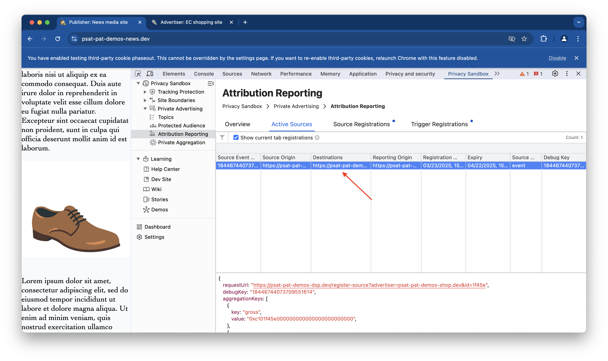

The Attribution Reporting API is a Privacy Sandbox proposal that enables advertisers to measure ad campaign performance while protecting user privacy. It replaces cross-site tracking with two report types: event-level and aggregate, associating ad interactions with conversions.

>[!NOTE]
>Advertisers and publishers that rely on ad tech platforms for conversion measurement don't need to use the API directly. You may be interested in understanding how Attribution Reporting works if your ad tech plans to integrate with this API.

## Key Functionalities:

### Active Sources

Displays sources that are **currently active** and being tracked for attribution. You’ll find a list of sources (like ads or campaigns) that have been registered and are still valid. Columns typically show information like Source Event ID, Status, Source Origin, Destination, etc. This is where you monitor ongoing attribution sources.

##### Understanding Active Sources:
- **Source Event ID:** A unique identifier for each source event.
- **Status:** Indicates whether a source is "Attributable," "Attributed," or "Expired."
- **Source Origin:** Source Origin: The website where the source event occurred.
- **Destination:** The website where conversions are expected.
- **Reporting Origin:** Where attribution reports are sent.
- **Registration Time:** When the source was registered.
- **Expiry:** When the source will no longer be tracked.
- **Source Type:** Categorizes the type of interaction (e.g., "navigation" for clicks, "event" for views).
- **Debug Key:** For internal troubleshooting.

### Source Registration

Focuses on the process and details of source registration. Here, you can see data on **newly** registered sources. This tab may show when and how sources are being registered for attribution purposes, including any errors or statuses during registration. Source Type can be one of the following:

### Understanding Source Registration:
- **Time:** When the source was registered (date and time).
- **Source Origin:** Where the source event originated (website address).
- **Reporting Origin:** Where attribution reports are sent (usually an ad platform).
- **Cleared Debug Key:** A unique ID for debugging source registrations.
- **Type:** The type of source event:
  - **navigation**: A click or link that leads to another page.
  - **event:** An in-page action like a button click or ad view.
- **Registration Status:**
  - **_Success_**: Source successfully stored.
  - **_Ignored_**: No matching OS destination.
  - **_Failure_**: Due to invalid JSON, missing destination, or invalid expiry.

### Trigger Registrations

Shows data related to triggers that have been registered. Triggers are events that lead to potential conversions (like a purchase after clicking an ad). This tab lists these triggers and the corresponding sources they are tied to. It’s crucial for understanding which actions are being tracked for conversions. Note that it happens on the "destination" site.

### Understanding Trigger Registrations:
 - **Time:** When the conversion (trigger) happened.
 - **Destination:** The website where the conversion occurred.
 - **Reporting Origin:** Where conversion reports are sent.
 - **Debug Key:** A unique ID for debugging trigger registrations.
 - **Event-Level Result:**
   - **_Success_**: Report stored
   - **_Ignored_**: No matching source.
   - **_Failure_**: Invalid data or duplicate key.
 - **Aggregatable Result:**
   - **_Success_**: Report stored.
   - **_Ignored_**: No matching source.
   - **_Failure_**: Invalid data.
 - **Registration JSON:** The detailed data (in JSON format) sent during trigger registration.

### References
- **Proposal**: [Public explanation for the proposed solution (WICG) &#10548;](https://github.com/WICG/attribution-reporting-api)
- **Public discussion**: [Public questions and feedback about the proposal &#10548;](https://github.com/WICG/attribution-reporting-api/issues)
- **Documentation**: [Developer documentation &#10548;](https://developers.google.com/privacy-sandbox/relevance/attribution-reporting)