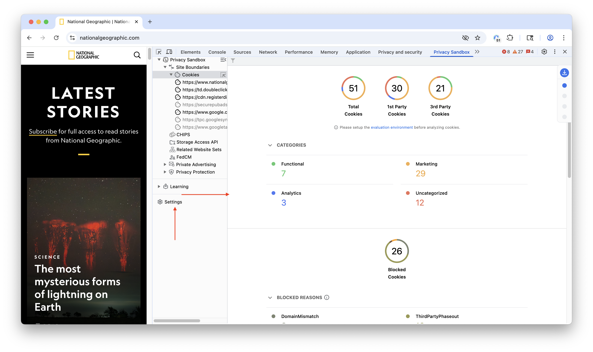
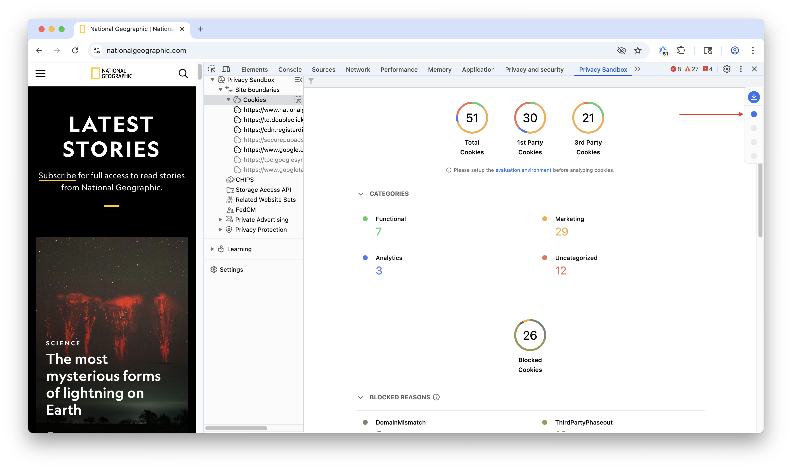
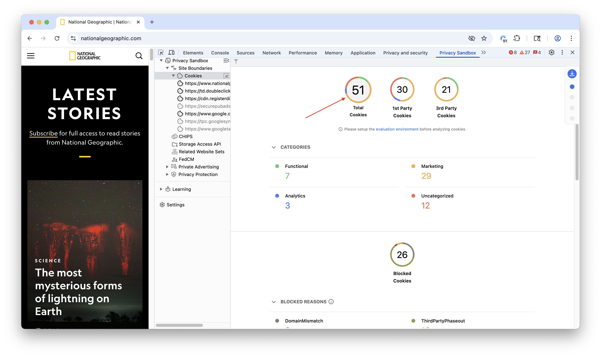
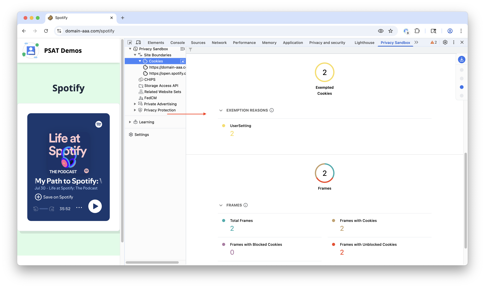
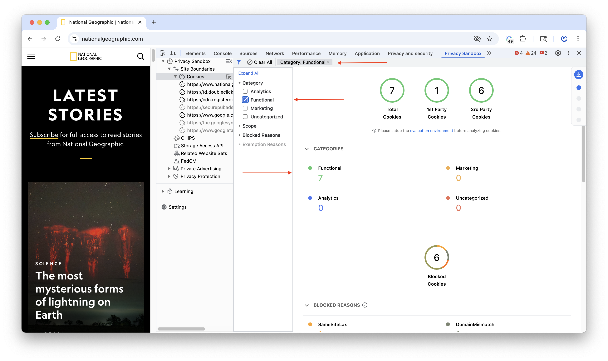

The first component in the PSAT corresponds to the **Cookie Analysis** area. You will notice an interactive landing page that provides insights into the cookies observed during your Browse sessions.

The purpose of PSAT's cookie landing page is to provide information and insights regarding the behavior and distribution of cookies on web pages while navigating across sites during browsing sessions.

The PSAT Cookie landing page has a navigation menu in the top-right corner for easy access to different sections.

The cookie insights page categorizes observed cookies on a given page (total, first-party, third-party).

The cookie landing page features interactive sections for cookie classification and blocked reasons. Clicking on a classification will navigate you to the corresponding section of the cookie table and automatically filter the results to display only the cookies associated with that selection.

PSAT leverages and contributes to the [Open Cookie Database &#10548;](https://github.com/jkwakman/Open-Cookie-Database), which is an open-source effort to describe and categorize cookies in the ecosystem. Using that DB, PSAT's provides a classification for some of the observed cookies, into the categories: Functional, Marketing, Analytics, and Uncategorized.

As PSAT evolves rapidly, the cookie landing page will incorporate more information and insights about cookie usage and behaviors.

## Cookie Exemptions

The Cookie Insights page will now display a dedicated section for “Cookie Exemptions,” similar to the existing “Blocked cookies” section. This section will list the exempt cookies and provide details about the reason for the exemption.

Some cookies are exempt from blocking for specific technical reasons or based on user actions, such as when a user explicitly allows third-party cookies. The PSAT leverages Chrome DevTools Protocol (CDP) to access this information and provide you with transparency.

PSAT has introduced a dedicated “Cookie Exemptions” section on the Cookie Lading page, displaying information about exempt cookies.

By knowing why certain cookies are exempt, you gain valuable context about how websites function and how your cookie preferences interact with those functions.

## Filtering Data

The data on the Cookies Insights page can be filtered. Enabling the filter at the top-left allows the user to change the context of the report, listing only data from a specific scope or cookie category.

Once the filter is applied, the report will only display the cookies that fit on those selected filters.