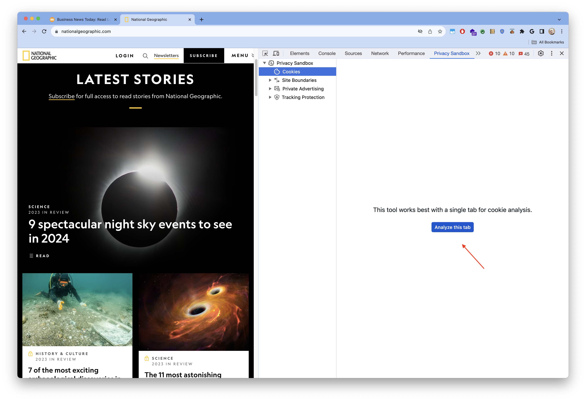
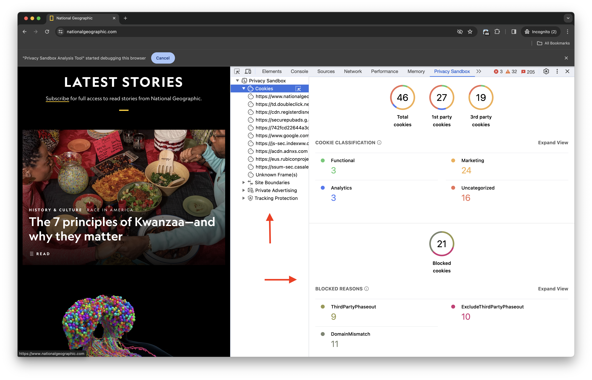
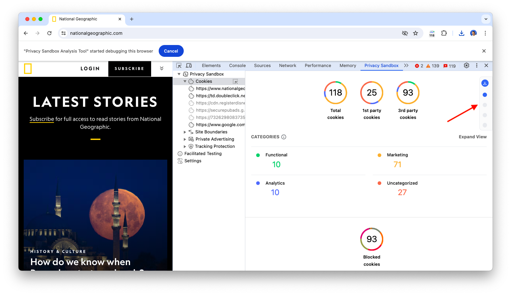
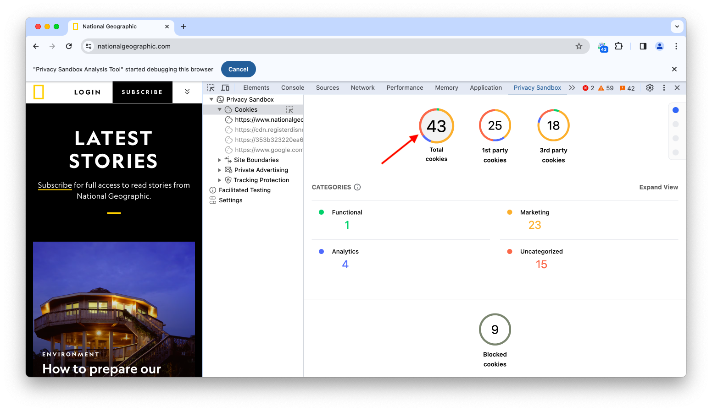
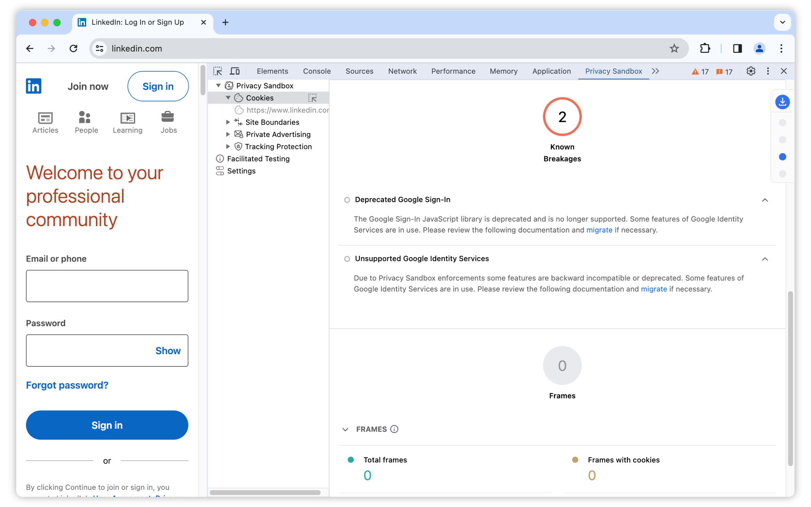

The first component in PSAT's Privacy Sandbox DevTools panel corresponds to the area of Cookie Analysis.

As discussed in the Evaluation Environment section, PSAT can be configured to avoid using too many resources by restricting the tool to only analyze a single tab at a time. If that configuration option is set, PSAT presents an `Analyze this tab` button to switch the focus of the tool to the current tab.

Once the PSAT's focus has been switched to the current tab, we get to the Cookies Landing Page:

The purpose of PSAT's cookie landing page is to provide information and insights regarding the behavior and distribution of cookies on web pages, while navigating across sites during browsing sessions.

The PSAT Cookie landing page has a navigation menu in the top-right corner for easy access to different sections.

Currently the cookie landing page provides a classification of observed cookies on a given page (total, first-party, third-party).

The cookie landing page features interactive sections for cookie classification and blocked reasons. Clicking on a classification will navigate you to the corresponding section of the cookie table and automatically filter the results to display only the cookies associated with that selection.

PSAT leverages and contributes to the [Open Cookie Database](https://github.com/jkwakman/Open-Cookie-Database), which is an open-source effort to describe and categorize cookies in the ecosystem. Using that DB, PSAT's provides a classification for some of the observed cookies, into the categories: Functional, Marketing, Analytics, and Uncategorized.

As PSAT continues to evolve rapidly, the cookie landing page will incorporate more information and insights about cookie usage and behaviors.

## Cookie Exemptions

The Cookie Insights page will now display a dedicated section for “Cookie Exemptions,” similar to the existing “Blocked cookies” section. This section will clearly list the exempt cookies and provide details about the exemption reason.

There are specific reasons why some cookies are exempt from blocking. These reasons are determined by technical necessities or user actions such as allow listing third-party cookies. The PSAT leverages Chrome DevTools Protocols (CDPs) to access this information and provide you with transparency.

PSAT has introduced a dedicated section for “Cookie Exemptions” on the Cookie Lading page, it will display information about exempt cookies.

By knowing why certain cookies are exempt, you gain valuable context about how websites function and how your cookie preferences interact with those functions.

## Detecting potential breakages

PSAT helps developers ensure a smooth transition through the deprecation of 3P cookies by identifying known breakages caused by deprecated libraries. Information about these breakages is available on the cookie landing page, with an expansion toggle, details of broken features, and possible migration guides.

PSAT currently detects the following libraries, you can test their working on respective [demos](https://domain-aaa.com/)

- Google Sign-In (GSI)
- Google Identity Services (GIS)
- Facebook Like
- Facebook Comment
- Disqus Comment
- Jetpack Comment
- Jetpack Like

The PSAT extension has the capability to adopt more such libraries, which could help identify more libraries that might cause issues in the future.
