PSAT Cookies table provides functionality similar to the cookies table in DevTools' Application panel, with some additional features for debugging scenarios in environments where unrestricted third-party cookies have been blocked.

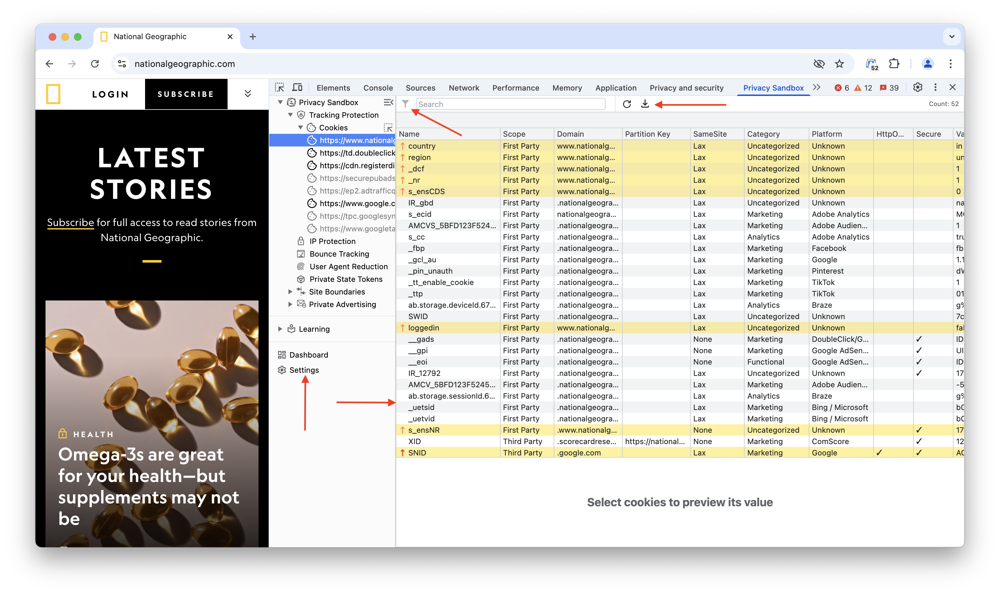

PSAT's cookies table is the starting point for analyzing and debugging cookie behavior in the search process for breakages.

## Frames

Frames are the sections of a web page that display content from independent sources, essentially acting like smaller windows within the main page.

This includes the main frame of the web page and any embedded frames, like iframes (inline frames), which can display additional content, such as advertisements, third-party widgets, or isolated sections of the webpage.

### Main Frame

The main frame is the primary window of the webpage, displaying the main content of the site. It is the top-level frame that contains all other frames and elements on the page.

### Embedded Frames

Embedded frames, These are nested frames within the main document that can load and display content independently of the main frame. They can be used to show ads, social media widgets, videos, or other content that is not part of the main page.

### Orphaned Cookies

An Orphaned cookie means the cookies exist in your browser's storage, but the frames that originally set them are no longer present in the DOM.

This typically happens when:

- The webpage might dynamically remove the frame after setting the cookie, potentially for efficiency or other reasons.
- If the frame is part of an external source and not reloaded with the main page, it gets removed from the DOM, leaving its cookies orphaned.

## Data Gathering

The purpose of PSAT is to help developers analyze the use of third-party cookies, as they get ready for changes in the Chrome browser, which will enable users to limit the use of unrestricted third-party cookies. To achieve this, the extension leverages the [Chrome DevTools Protocol &#10548;](https://chromedevtools.github.io/devtools-protocol/) to gather data regarding Cookies from network traffic.

To account for these delays, PSAT indicates when the corresponding cookies have been displayed for a given frame in the cookies table. Initially, all frames in the sidebar are grayed out, indicating that the data is not yet populated. Once the cookie data for a specific frame has been received and processed, the frame's appearance in the sidebar will change from being grayed out to its normal state. This serves as a visual indicator that the information for that frame has been processed.

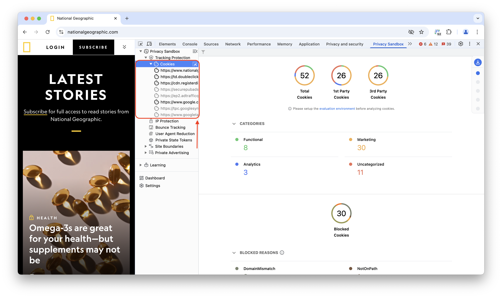

## Filtering

PSAT makes it easy to reduce the analysis scope by filtering observed cookies by the different dimensions that characterize them, which correspond to the columns in the cookie table.

The filtering capability is accessed via the little funnel icon in the top-left corner of PSAT's cookie table:

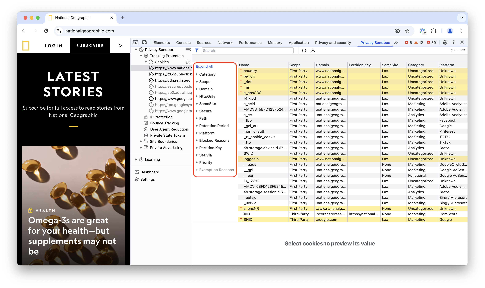

Clicking on the funnel icon, allows you to select from all the observed cookies,only those that meet certain criteria; e.g. Functional third-party cookies, which have the `SameSite` attribute set to `None`.

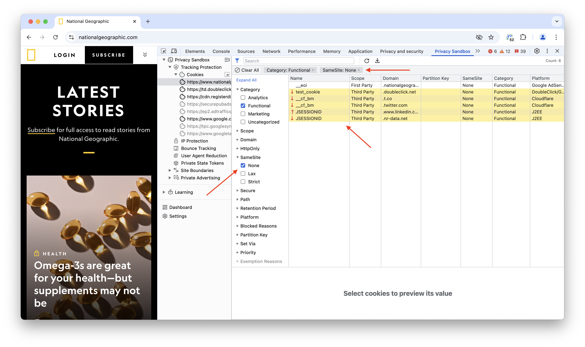

## Exporting Cookie Data to CSV

After exploring and analyzing the cookie information presented in the Cookie Table panel, developers can easily generate a CSV report containing all displayed data. This report will dynamically reflect any applied filters, ensuring the exported dataset aligns with the current view.

To initiate the export, simply click the download icon (downward-facing arrow) situated to the right of the search bar. This action triggers the immediate creation and download of a CSV file(www-your-domain-com-report.csv), providing a structured format for subsequent analysis, archiving, or integration with external tools.

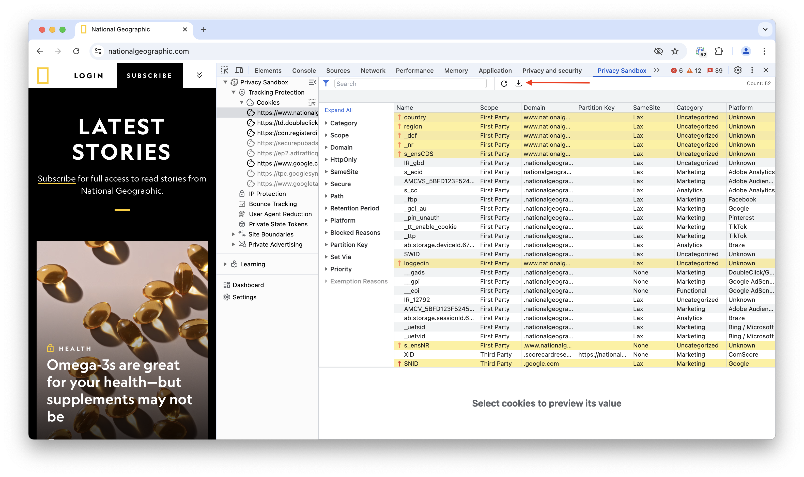

## Blocked Cookies

PSAT gathers information regarding the cookies and the corresponding reasons for the blocking. Blocked cookies are highlighted in yellow or have a warning icon in the Cookies table, depending on when they were blocked by response or request.

PSAT identifies cookie blocking with distinct icons for each scenario of requests and responses, helping users understand when and why a cookie was blocked under each specific scenario.

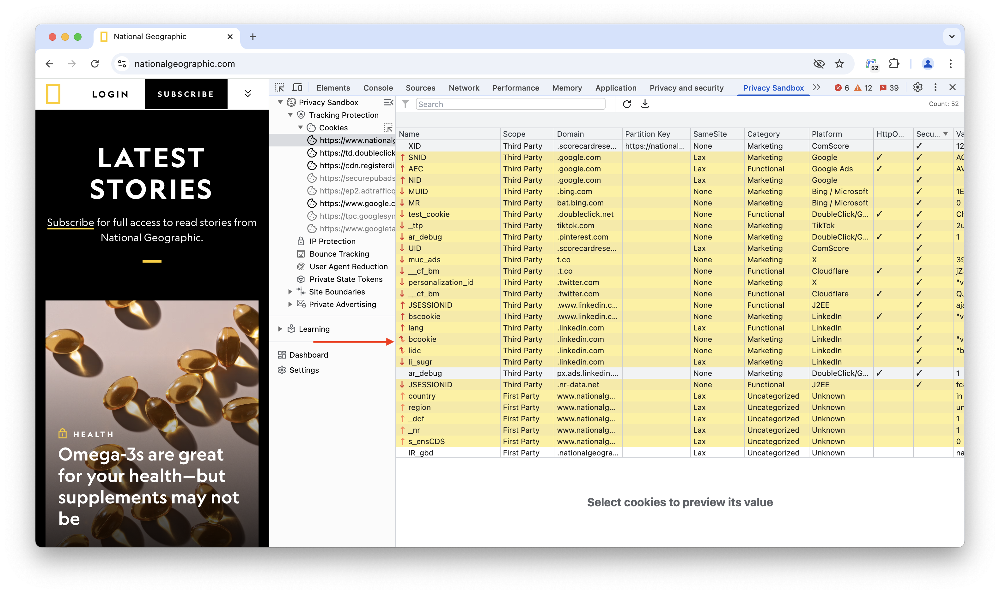

The following are the possible icons and their scenario.
| Icons | Scenario |
| ------------- | ------------- |
|  | The cookie was blocked in all responses. |
|  | The cookie was blocked in at least one of the responses. |
|  | The cookie was blocked in all requests.|
|  | The cookie was blocked in at least one of the requests.|
|  | The cookie was blocked in all the requests and responses. |
|  | The cookie was blocked in at least one of the requests and at least one of the responses. |
|  | This cookie was blocked in all requests and at least one of the responses. |
|  | The cookie was blocked in at least one of the requests and all the responses. |

When selecting a blocked cookie, PSAT shows the reasons why the cookie was blocked in the "Cookie Information" box.

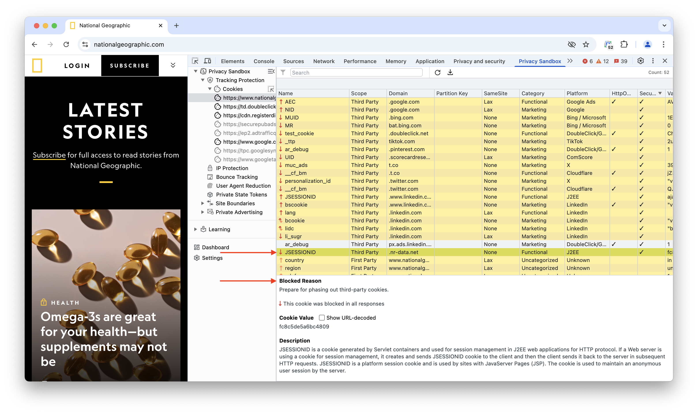

## Frame Overlays

Frame overlays make it easy to associate third-party cookies with embedded iframes. To use it:

1. Open DevTools and go to the Privacy Sandbox tab
1. Navigate to a web page
1. Click on PSAT's `Cookies` component on the right sidebar
1. Click on the icon on the side of the Cookies component to activate the functionality

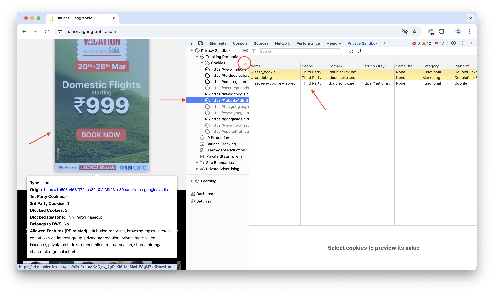

With `Frame Overlays` activated, we can directly correlate specific page components with the corresponding cookies set and manipulated by them. Specifically, you can:

1. Hover the mouse over the web page and observe how the underlying frames in the page get highlighted
1. For each highlighted frame, PSAT shows a popup window with relevant Privacy Sandbox information about the frame, such as the type of frame, the number of `1P` and `third-party` cookies that were set by the frame, whether the domain associated with the frame belongs to a `Related Websites Set` which includes also the top-level site, and the set of privacy-sandbox-related features available to the frame.
1. While hovering over a page frame, the corresponding frame is highlighted in PSAT's cookie's panel, and the cookies set by the frame are listed in the cookies table.

## Network Requests With a Given Cookie

PSAT empowers developers to efficiently pinpoint and examine network requests associated with specific cookies. This filtering capability reduces the time and effort required to diagnose cookie-related issues filtering requests related to a specific cookie.

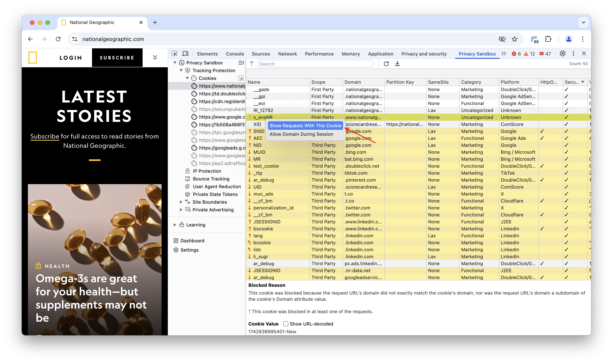

To utilize this feature, developers should first locate the desired cookie within the "Cookies Table" section in PSAT and right-click on the chosen cookie will reveal a context menu. Selecting the "Show Requests With This Cookie" option from this menu triggers a filter on the "Network" tab, presenting only the requests involving the specified cookie.

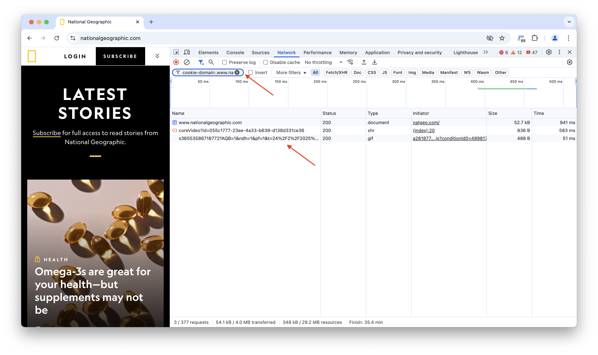

Upon activating this filter(by cookie name and domain), the Network tab becomes a real-time display of network traffic exclusively linked to the selected cookie, facilitating seamless analysis.

## Allow cookies for specific domains during browsing sessions

For debugging purposes, Chrome provides developers with the ability to unblock cookies from a specific domain for the duration of the current browsing session. This can be achieved by adding the domain pair in Chrome's settings, or directly from PSAT by right-clicking on the blocked cookie and selecting “Allow Domain During Session”. Once the domain is included on the allow list, Chrome will unblock all cookies from the same domain until the browsing session is over.

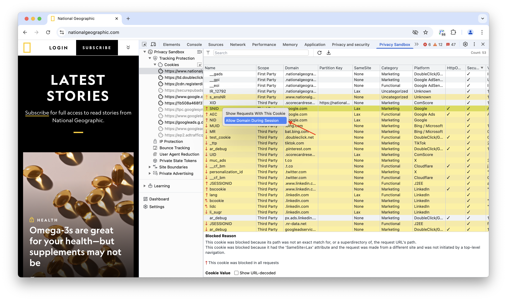

The cookies from the Allowed domain will be highlighted in green to specify those cookies are allowed by the users.

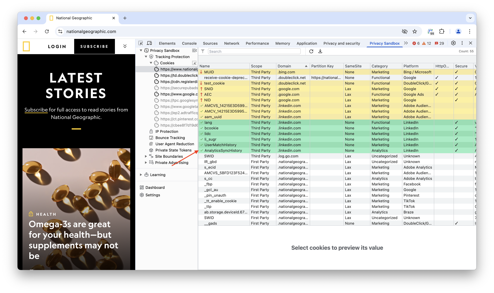

Once the cookie is included in the "Allowed List", the developer can remove it at any time, by right-clicking on the cookie that was Allowed previously and selecting "Remove Domain from Allow List".

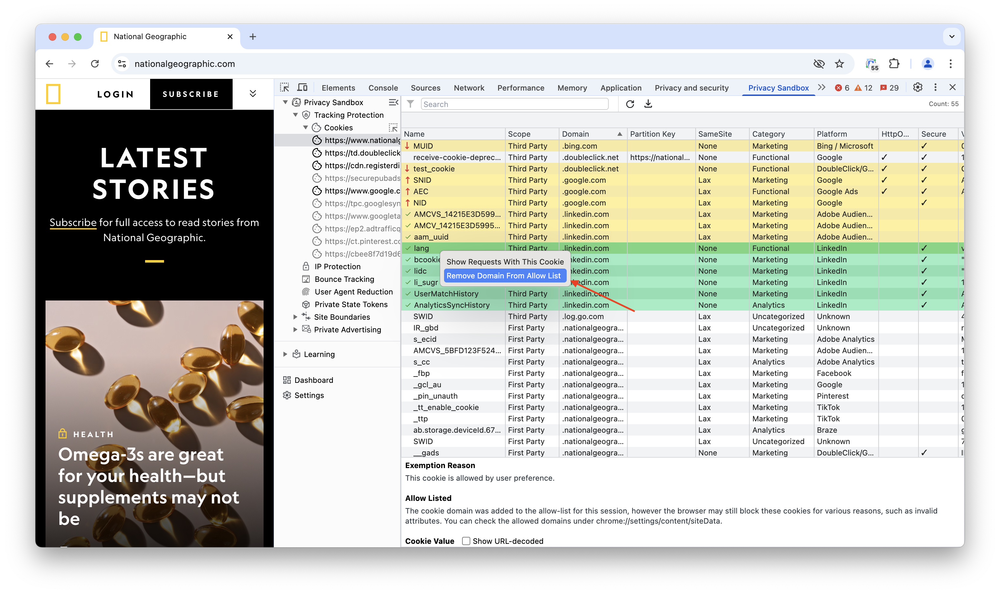
