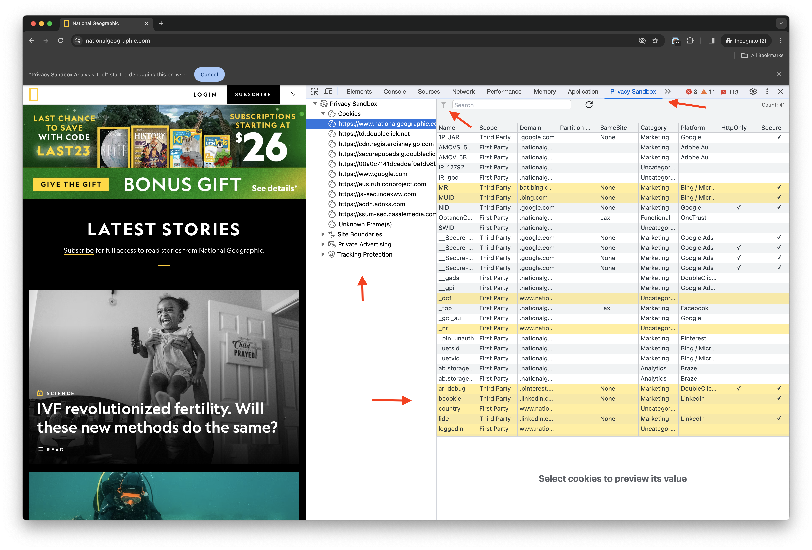
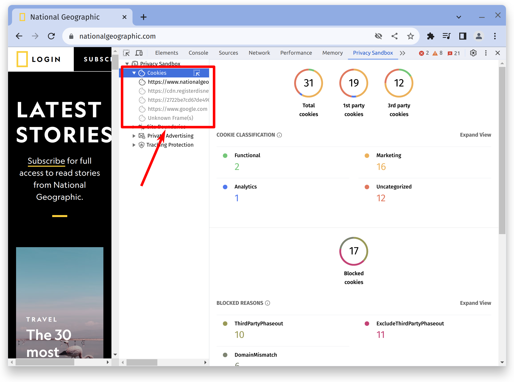
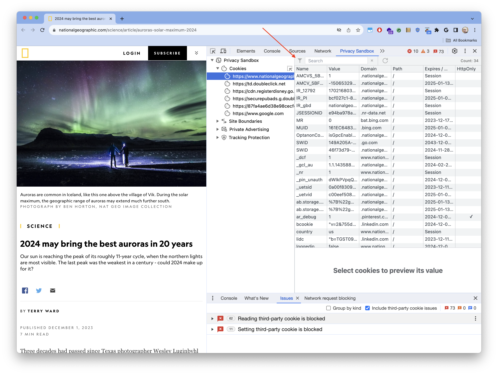
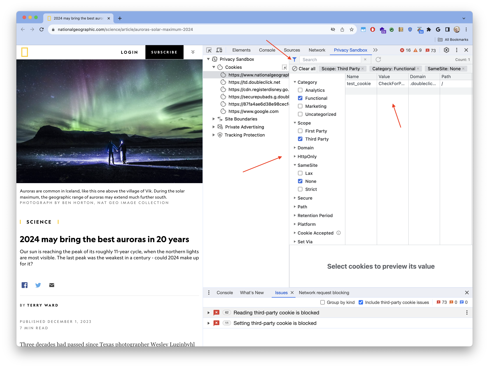

PSAT cookie's table provides functionality similar to the cookies table in DevTools' Application panel, with some additions tailored for debugging scenarios related to the deprecation of third-party cookies.

PSAT's cookies table is the starting point for analyzing and debugging the behavior of cookies in search

## Data Gathering

The purpose of PSAT is to help developers analyze the use of third-party cookies, as they get ready for changes in the Chrome browser, which will limit the use of unrestricted third-party cookies. To achieve this, the extension leverages the [Chrome DevTools Protocol](https://chromedevtools.github.io/devtools-protocol/) to gather data regarding Cookies from network traffic.

As of v0.4 PSAT data processing may experience delays causing the rendering of cookie information in the Cookies Table.

To account for these delays, PSAT indicates when it has displayed for a given frame in the cookies table, the corresponding cookies. Initially, all frames in the sidebar are grayed out, indicating that the data is not yet populated. Once the cookie data for a specific frame has been received and processed, the frame's appearance in the sidebar will change from being grayed out to its normal state. This serves as a visual indicator that the information for that frame has processed.

This issue is being addressed see issue [#380](https://github.com/GoogleChromeLabs/ps-analysis-tool/issues/380) and we will provide an update shortly.

## Filtering

PSAT makes it easy to reduce the analysis scope by filtering observed cookies by the different dimensions that characterize them, which correspond to the columns in the cookie table.

The filtering capability is accessed via the little funnel icon at the top-left corner of PSAT's cookie table:

Clicking on the funel icon, allows you to select from all the observed cookies,only those that meet certain criteria; e.g. Functional thrid-party cookies, which have the `SameSite` attribute set to `None`.

## Blocked Cookies

## Frame Overlays

Frame overlays make it easy to associate third-party cookies with embedded iframes. To use it:

1. Open DevTools and go to the Privacy Sadbox tab
1. Navigate to a web page
1. Click on PSAT's `Cookies` component on the right sidebar
1. Click on the icon on the side of the Cookies component to activate the functionality

With `Frame Overalys` activated we can directly correlate specific page components, with the correponding cookies set and manipulated by them. Specifically, you can:

1. Hover the mouse over the weg page and observe how the underlying frames in the page get highlighted
1. For each highlighted frame, PSAT shows a popup window with relevant Privacy Sandbox information about the frame, such as the type of frame, the number of `1P` and `3P` cookies that were set by the frame, whether or not the domain associated with the frame belogs to a `Related Websites Set` which includes also the top-level site, and the set of privacy-sandbox-related features available to the frame.
1. While hovering over a page frame, the corresponding frame is highlighted in PSAT's cookie's panel, and the cookies set by the frame are listed in the cookies table.

## Network Requests With a Given Cookie

PSAT does not implement yet the capability of transferring the focus from the cookies table to the network tab, filtering the network requests associated with a given cookie. Implementing such capability is not possible on Chrome extensions currently. But, PSAT makes it easier to get to those requests, by generating the query strings to be used on DevTools' Network panel.

To gather the query string for a given cookie, right click on it, and select the only option shown in the context menu.

After doing that, the query string is copied in to the clipboard. Then go to the Network tab, and paste the value in the filtering box.

