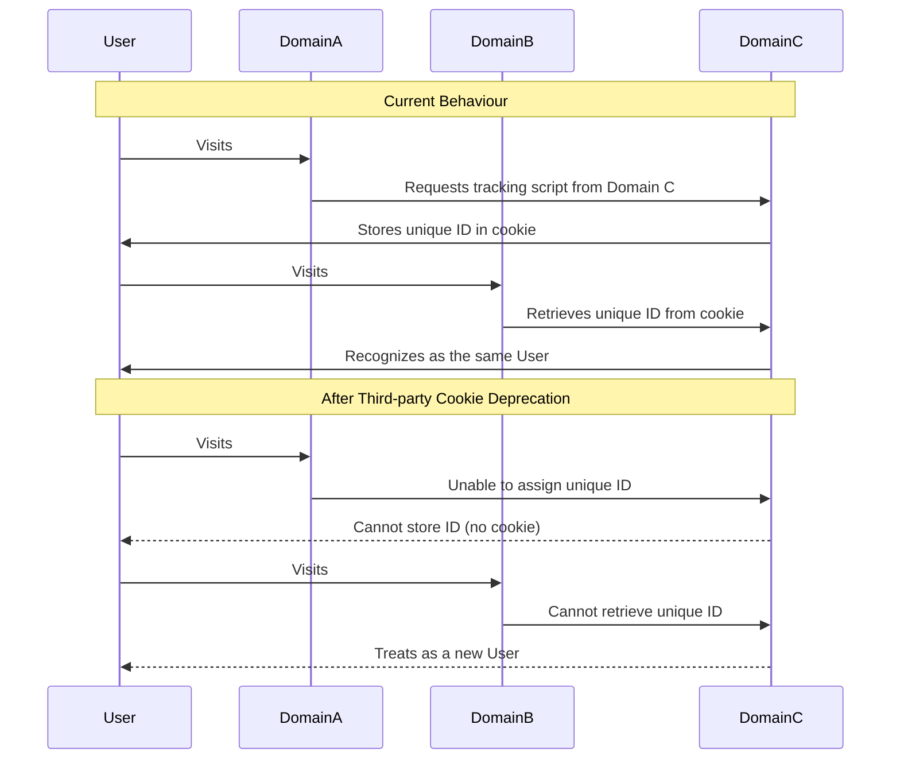
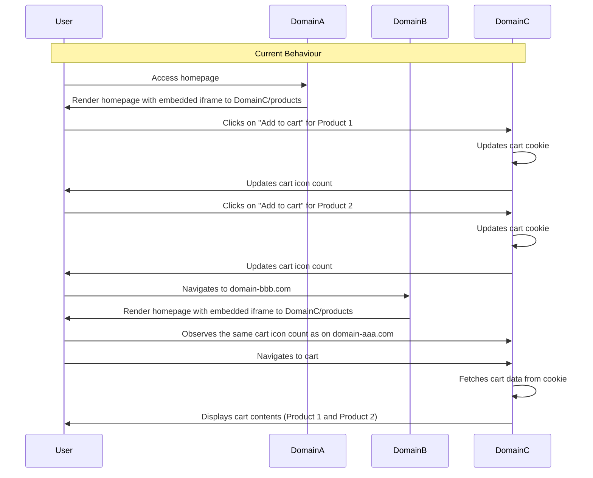
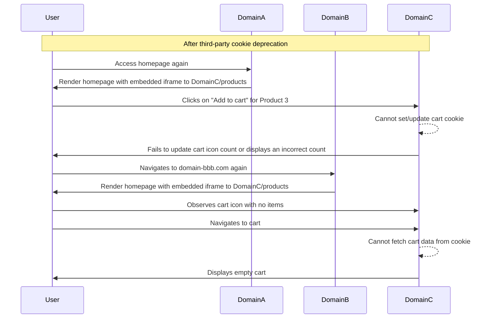
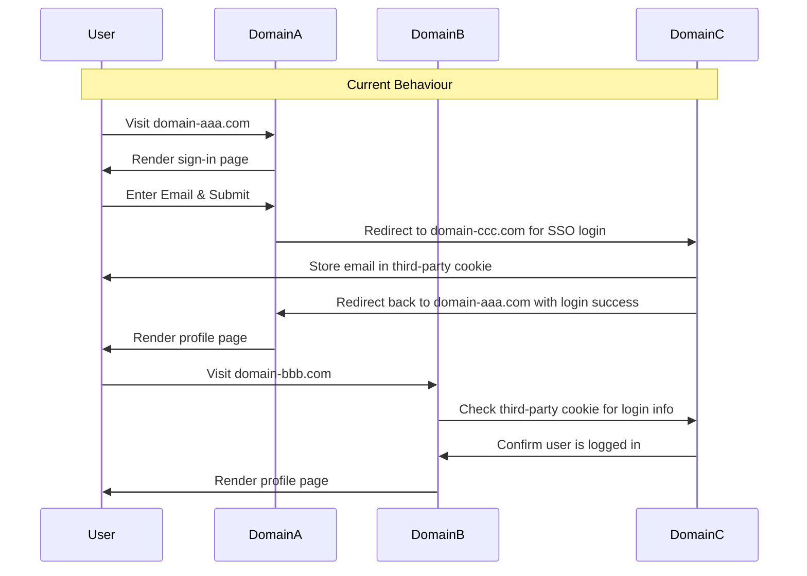
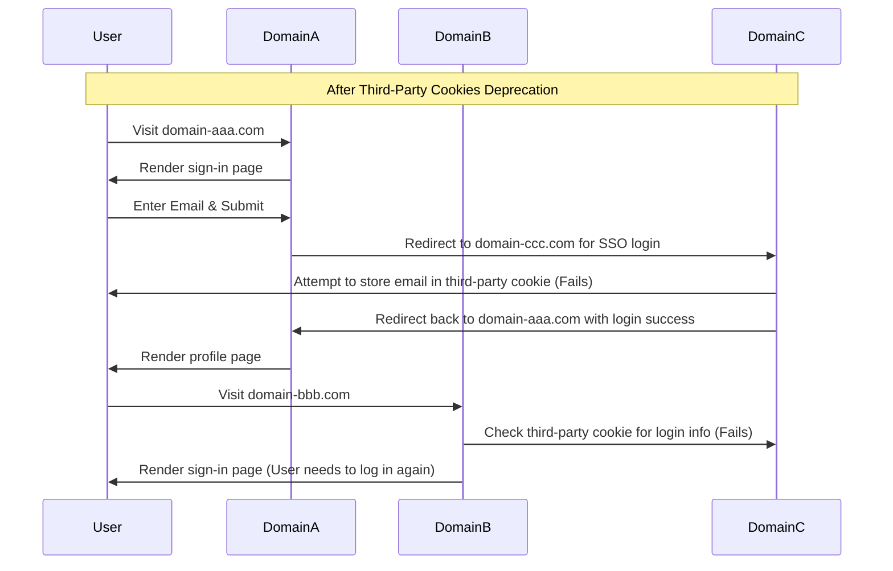
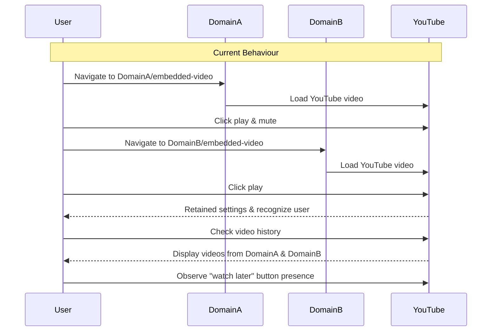
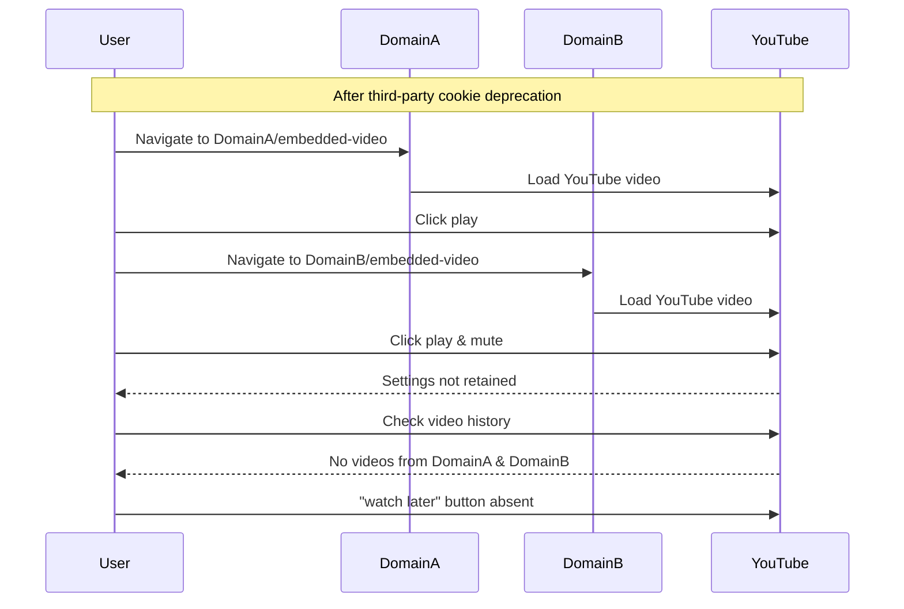

This section describes the analysis/debugging of Critical User Journeys (CUJs) which are commonly implemented in sites across verticals. Each of these CUJs represents a testing scenario to be checked for potential 3PCD breakages.

## **Analytics Tracking**

This scenario encompasses a website use of analytics providers (e.g. Google Analytics, others) for tracking user behavior. We want to verify user activity/events on 3P analytics service platforms are being captured properly. The goal of this demo is to show details that are part of this scenario, and show you how to analyze the behavior and determine if there are failures.

### **How the Demo Works**

In this demo, we have two distinct sites running on [domain A](https://domain-aaa.com/analytics) and [domain B](https://domain-bbb.com/analytics) respectively, both of which are using an analytics service delivered from Domain C, which uses the third-party cookies.

When a visitor accesses site A, an analytics service hosted on domain C assigns a unique identifier to that visitor. This identifier tracks any subsequent visits by the same individual. Should this visitor later browse site B, which also utilizes the analytics service served from domain C, they will be identified using the third-party cookie that was set during their initial visit to site A. This cross-domain identification is possible because the third-party cookie from domain C remains consistent and can be accessed irrespective of whether the visitor is on site A or site B.

After Third-Party Cookies Deprecation, when a user visits site A the analytics service from domain C will no longer be able to store the cookie in the user’s browser, and therefore the user will not be tracked upon his visit to site B.

The following sequence diagram shows these behaviors before and after third-party cookie deprecation.

### **Debugging the Scenario**

1. **Setup Testing Environment**
    1. Set up your testing environment (as described [here](https://github.com/GoogleChromeLabs/ps-analysis-tool/wiki/B.-Evaluation-Environment) with two instances of Google Chrome browser: one simulating third-party cookie deprecation (Chrome Private) and the other using the default settings (Chrome Open).

2. **Open Developer Tools in both instances**
    1. On both browsers, open Chrome DevTools (on Mac: Cmd-Option-i, Linux: Ctrl-Shift-i)
    2. It is important to open DevTools first, to ensure capturing all the network interactions as the demo pages load

3. **Adjust Network Tab Settings**
    1. In the network tab, enable “Preserve Log” and “Disable Cache” in both instances of Google Chrome.
    2. This asks the browser to persist the information on network requests, so that we can go back to them if needed as we analyze our scenarios

4. **Navigate and interact with the website**
    1. Open the site https://domain-aaa.com/analytics in both instances
    2. Click the button “Click Me”.
    3. This mimics the actions that cause the analytics tracker to record eventdata on cookies.

5. **Analyze the Cookies in the Application Tab**
    1. Go to the “Application” tab in the DevTools in the default Chrome instance and the instance simulating third-party cookie deprecation.
    2. Navigate to the “Cookies” section and select the frame [domain-aaa.com](http://domain-aaa.com/) to view the cookies in both instances of Google Chrome

    3. Note the cookies present from domains other than [domain-aaa.com](http://domain-aaa.com/), in our case it will be [domain-ccc.com](http://domain-ccc.com/) in both instances of Chrome.

6. **Compare the cookies**
    1. Identify the cookie that is set in Chrome Open but absent in Chrome Private.
    2. Identify the network request that sets the cookie in the Chrome Open instance, and track that request in the Chrome Private instance

7. **Navigate to the other domain**
    1. Open the site https://domain-bbb.com/analytics in both instances
    2. Click the button “Click Me”.
    3. Proceed with Step 5 and 6 to determine why Domain B was able to identify the visitor in one instance and it could not when simulating third-party cookie deprecation.

At this point, we debugged the scenario which is common for implementations of analytics providers, and learned how to detect potential failures. This demo can be extrapolated to other analytics providers, which also use cookies as the state mechanism to implement their capabilities.

If you are a 3P provider, or if you are checking if the 3P analytics providers on your site are working, then you can map the process outlined in this demo to your scenario.

## **E-commerce: Cross-domain Shopping Cart**

This scenario goes through the workings of an e-commerce setup that leverages a third-party service for cart management across multiple domains. The goal of the demo is to illustrate how third-party cookies are used to maintain cart continuity across different first-party domains, and provide a detailed overview of how to analyze this kind of scenario and determine if there are potential failures.

### **How the Demo Works**

This demo encompasses two distinct e-commerce sites hosted on [domain A](https://domain-aaa.com/ecommerce) and [domain B](http://domain-bbb.com/ecommerce), both using a third-party e-commerce service hosted on [domain C](http://domain-ccc.com/).

When a visitor shops on domain A, items added to the cart are stored by the third-party e-commerce service on domain C using a third-party cookie. This cookie acts as a memory bank for the cart items, irrespective of which first-party domain the visitor is on. Therefore, if the visitor subsequently navigates to domain B, the items they added to the cart on domain A are still visible in their cart.

This behavior will be affected by the deprecation of third-party cookies. When a visitor shops on domain A, domain C's service will not be able to store the cart information using a third-party cookie, and therefore cart information from domain A cannot be carried over.

The following sequence diagram shows the cart behavior with cookies enabled:

And this one, shows the behavior of the scenario when third-party are not available:

We can observe in the diagrams how blocked cookies will ruin the shopping experience for the user across multiple domains. Read on to learn how we debug this kind of scenario.

### **Debugging the Scenario**

1. **Setup Testing Environment**
    1. Set up your testing environment (as described [here](https://github.com/GoogleChromeLabs/ps-analysis-tool/wiki/B.-Evaluation-Environment) with two instances of Google Chrome browser: one simulating third-party cookie deprecation (Chrome Private) and the other using the default settings (Chrome Open).

2. **Open Developer Tools**
    1. On both browsers, open Chrome DevTools (on Mac: Cmd-Option-i, Linux: Ctrl-Shift-i)
    2. It is important to open DevTools first, to ensure capturing all the network interactions as the demo pages load

3. **Adjust Network Tab Settings**
    1. On both browsers, go to the network tab and enable "Preserve Log" and "Disable Cache" in both instances of Google Chrome.
    2. This asks the browser to persist the information on network requests so that we can go back to them if needed as we analyze our scenarios

4. **Navigate to the first domain**
    1. On both browsers, open the site [https://domain-aaa.com/ecommerce](https://domain-aaa.com/ecommerce).
    2. Interact with the products and add them to the cart.
    3. This mimics what you would do while online shopping on any site.

5. **Analyze the Cookies in the Application Tab**
    1. Go to the "Application" tab in the DevTools in both Chrome instances.
    2. Navigate to the "Cookies" section and select the frame ([domain-aaa.com](http://domain-aaa.com/) to view the cookies set for that domain.
    3. Note the cookies present from domains apart from [domain-aaa.com](http://domain-aaa.com/). In our scenario, particularly note cookies from [domain-ccc.com](http://domain-ccc.com/).

6. **Compare the behavior of the cookies**
    1. Identify the cookie that is set in Chrome Open but absent in Chrome Private.
    2. On Chrome Open, right-click on the identified cookie and select “Show Requests with this Cookie” from the context menu to access information about the network request that initiated the cookie-setting in the default Chrome instance. Take note of the
    3. On Chrome Private, the same cookie identified will not be present (blocked).
    4. Go to the Network tab and search for “[domain-ccc.com](https://domain-ccc.com/)”, and click on the network request named “add-to-cart”
    5. Click on the Cookies tab, and nothing will be shown, as the cookie was blocked by Chrome Private. On Chrome Open, if configured via settings to block 3P cookies, you will observe the cookies that domain C attempted to set, highlighted indicating that the operation was rejected.

7. **Navigate to the second domain**
    1. Open the site [domain-bbb.com/ecommerce](https://domain-bbb.com/ecommerce) in both Chrome instances.
    2. Observe the cart contents and the count icon.
    3. Return to the "Application" tab in both Chrome instances and navigate to the "Cookies" section, this time selecting the frame [domain-bbb.com](http://domain-bbb.com/).
    4. Make note of cookies, especially those from [domain-ccc.com](https://domain-ccc.com/).
    5. Compare the cookies between the two instances similarly as in Step 6 to understand discrepancies, if any.

By this stage, you've debugged the sequence that represents the behavior of many e-commerce and analytics solutions relying on third-party cookies, and gaining a clear insight into how third-party cookies function (and the implications when they don't) equips you to address potential issues as an e-commerce website operator.

If you are a 3P provider, or if you are checking if the 3P e-commerce providers on your site are working, then you can map the process outlined in this demo to your scenario.

## **Single Sign-On (SSO) Services**

This scenario demonstrates how a third-party Single Sign-On (SSO) service enables users to log in seamlessly across multiple websites, using third-party cookies to maintain their logged-in state. Our goal is to demonstrate the process by focusing on the details of how data flows through third-party cookies. We will evaluate the SSO functionality and identify any possible issues or problems.

### **How the Demo Works**

This demo showcases two separate sites operating on [domain A](https://domain-aaa.com/single-sign-on) and [domain B](https://domain-bbb.com/single-sign-on). Both these sites rely on an SSO service located on [domain C](https://domain-ccc.com/), which utilizes third-party cookies for its operation.

When a user accesses [domain A](http://domain-aaa.com/single-sign-on) and logs in using their email, they are redirected to the SSO service on [domain C](http://domain-ccc.com/). This service then sets a third-party cookie containing the user's email, marking them as logged in. As the user later navigates to [domain B](http://domain-bbb.com/single-sign-on), this site communicates with [domain C](http://domain-ccc.com/), checking the presence and validity of the third-party cookie to ascertain the user's logged-in status.

Thanks to the third-party cookie set by [domain C](http://domain-ccc.com/), both domain A and domain B can recognize and maintain the user's logged-in state seamlessly. The user does not have to log in again on domain B, as the SSO service on domain C confirms their status through the third-party cookie.

However, post Third-Party Cookies Deprecation, the behavior will change. When the user first visits domain A and logs in, the domain C cannot set a third-party cookie. Consequently, when the user transitions to domain B, the site won't recognize the user's logged-in status as the third-party cookie is absent. This absence disrupts the seamless cross-domain login experience previously facilitated by third-party cookies.

The following sequence diagram depicts this behavior before the deprecation of third-party cookies:

And this sequence diagram depicts the behavior after the deprecation of third-party cookies:

### **Debugging the Scenario**

1. **Setup Testing Environment**
    1. Set up your testing environment (as described [[here](#evaluation-environment)].
2. **Open Developer Tools in both Chrome instances**
3. **Adjust Network Tab Settings**
    1. In the network tab, enable "Preserve Log" and "Disable Cache" in both instances of Google Chrome.
4. **Visit the First Domain**
    1. Open the site [domain-aaa.com/single-sign-on](https://domain-aaa.com/single-sign-on) in both instances.
    2. Input your email and initiate the Single Sign-On process.
5. **Analyze the Cookies in the Application Tab**
    1. Go to the “Application” tab in the DevTools for both the default browser instance and the one simulating third-party cookie deprecation.
    2. Navigate to the “Cookies” section and select the frame ([domain-aaa.com](https://domain-aaa.com/) to view the cookies.
    3. Note the presence of the cookie from [domain-ccc.com](https://domain-ccc.com/) associated with our SSO service in both Chrome instances.
6. **Compare the Cookies**
    1. Examine the cookies set in the default browser instance and compare them with the ones in the instance simulating third-party cookie deprecation.
    2. Identify which cookies, if any, are missing from the latter instance.
7. **Navigate to the Other Domain**
    1. Open [domain-bbb.com/single-sign-on](https://domain-bbb.com/single-sign-on) in both instances.
    2. Observe the user's logged-in status.
    3. Go back to the “Application” tab in the DevTools, and under the “Cookies” section, now select the frame [domain-bbb.com](http://domain-bbb.com/)
    4. Check for the presence of the cookie from [domain-ccc.com](http://domain-ccc.com/) in both instances of the browser.
    5. Identify discrepancies between the two instances regarding login status and the presence of the third-party cookie.

By now, you should have a clearer understanding of how third-party cookies are used for Single Sign-On (SSO) processes across multiple domains. If you're working on implementing or testing an SSO service, this debugging scenario can be quite useful. It can help developers and testers validate their SSO implementations and prepare them for any upcoming third-party cookie deprecation. By following the process outlined in this demo, you can easily map it to your specific use case.

## **Embedded Content**

▶️ [Screencast](https://youtu.be/gHh1B3QqKXg?si=83uI5p47rt1tgX1D) 

This scenario goes through the workings of embedded content platforms, such as video streaming, which operate across multiple top-level domains utilizing third-party cookies and local storage for retaining user session and preferences. The primary objective of this demo is to provide details on how to analyze this kind of scenario and determine if there are potential breakages.

### **How the Demo Works**

This demo encompasses two independent websites on [domain A](http://domain-aaa.com/embedded-video) and [domain B](http://domain-bbb.com/embedded-video). Both host embedded video content through a third-party streaming service residing on [YouTube.com](http://youtube.com/).

When a user engages with a video on domain A and adjusts certain playback preferences, these are recorded by the third-party streaming service on YouTube via third-party cookies (i.e. for user session) and local storage (i.e. for preferences). These storage mechanisms allow YouTube embeds to maintain consistency, no matter which first-party domain the user navigates to. As a result, when the user transitions to domain B, the preferences set on domain A, such as volume level or playback speed, persist.

This seamless experience breaks with the deprecation of third-party cookies. When a user adjusts video settings on domain A, YouTube's service will not be able to remember those preferences using a third-party cookie or local storage. Consequently, as the user navigates to domain B, the customized settings from domain A will not be replicated, leading to a disjointed user experience.

The following sequence diagram illustrates the behavior of embedded content as described above, when cookies are available:

And the following sequence diagram illustrates the behavior of the embedded content when third-party cookie deprecation changes are in place:

### **Debugging the Scenario**

1. **Setup Testing Environment**
    1. Prepare your testing environment (as described [here](https://github.com/GoogleChromeLabs/ps-analysis-tool/wiki/B.-Evaluation-Environment). Ensure you have two distinct instances of Google Chrome:
        - **Chrome Private**: Simulating third-party cookie deprecation.
        - **Chrome Open**: Running on default settings.
    2. In both instances, navigate to [YouTube.com](http://youtube.com/) and log in using any account available to you.
2. **Open Developer Tools**
    1. Launch Chrome DevTools in both browsers. For Mac users, press **Cmd-Option-i** and for Linux users, press **Ctrl-Shift-i**.
    2. It's crucial to initialize DevTools before browsing to capture all network interactions as pages load.
3. **Adjust Network Tab Settings**
    1. In the network tab of both browsers, activate the "Preserve Log" and "Disable Cache" options.
    2. These settings ensure the persistence of network request logs for post-analysis.
4. **Navigate to the embedded video site:**
    1. In **Chrome Private**, access https://domain-aaa.com/embedded-video.
    2. Initiate the YouTube video player by pressing play and ensure the video streams seamlessly.
    3. In a new tab (with DevTools active), visit https://domain-bbb.com/embedded-video.
    4. Play the video. Alter a setting (e.g., muting the audio) and observe if preferences from the previous site (domain A) persist.
    5. If the preferences are not consistently maintained across navigation, proceed to the next steps to investigate the reasons.
    6. In **Chrome Open**, follow the aforementioned sub-steps.
5. **Inspect Network Activity**:
    1. In **Chrome Private**, filter out the network traffic associated with the YouTube player using the search function in the Network tab.
    2. Click on the request beginning with “player?key=XXXXXXX”.
    3. Access the “Cookies” tab for this specific request and activate “show filtered out request cookies”.
    4. In **ChromeOpen**, repeat these sub-steps. Notice that in this instance, the cookies are transmitted to the third-party site, unlike **Chrome Private**.
6. **Check YouTube History**:
    1. In **Chrome Private**, review your YouTube viewing history.
    2. Note that videos from domains A and B *shouldn't* be listed as YouTube can't identify the user due to missing session cookies (as we figured out in step 5).
    3. In **Chrome Open**, repeat the review process. This time, videos from both domains *should* be cataloged since the session is identifiable.
7. **Inspect Local Storage**:
    1. Use developer tools to inspect local storage associated with the YouTube frame in both browser instances.
    2. For **Chrome Open**, the settings must be consistent across all tabs for [youtube.com](http://youtube.com/).
    3. Contrastingly, in **Chrome Private**, the local storage reveals not just the origin ([youtube.com](http://youtube.com/) but the top-level site (domain A or B) as well, causing potential discrepancies in user experiences.
8. **Analyze Additional Breakages**:
    1. In the **Chrome Open** instance, a "watch later" option should be visible. Its absence in the **Chrome Private** instance hints that YouTube cannot identify the logged-in user.

By now, you've thoroughly explored and debugged the scenario that illustrates how embedded content, like YouTube videos, relies on third-party cookies and/or storage APIs (e.g. localStorage)  to provide a seamless user experience. You have gained an understanding of the intricacies of how third-party cookies operate, and the challenges that arise when they're deprecated. You can apply a similar approach to investigate potential breakages on any embedded content on your site.  If you are an embedded content provider or are evaluating the effectiveness of such third-party content integrations on your platform, you can tailor the methodology from this demo to fit your specific situation.

## **Further Scenarios**

At this point, we have pursued in depth analyses of several CUJs commonly found across a wide range of sites, and it is likely that your site has at least one of them. There are many other scenarios commonly found across the web ecosystem. This methodology will continue expanding on the set of considered scenarios as we create examples and run analyses on them. These scenarios include:

### **Creating an Account**

This scenario focuses on the process of account creation, which is a critical feature for many websites. Given the reliance on third-party cookies, both sign-up and sign-in flows are susceptible to disruptions. To ensure comprehensive testing, all available sign-up providers, such as Google, Facebook, Twitter, and Apple, should be examined. Additionally, the conventional email sign-in method should not be overlooked. Once signed in, it's crucial to log out and attempt the sign-in process once more to validate consistency and reliability.

### **Third-party Authentication**

Many websites incorporate third-party OAuth services like Google and Facebook for streamlined user authentication. Testing this kind of scenario encompasses thoroughly evaluating the third-party login mechanism, including things like:

1. Ensuring that upon pressing the "Login" button (say, "Login with Google"), an authentication popup emerges or a redirection to the third-party service happens seamlessly.
2. Observing the authentication behavior when loading the site on Chrome Private, leveraging the "Network" tab within developer tools to oversee all network requests during the authentication phase.
3. After successfully granting permissions and navigating through the login sequence, confirm that users are smoothly redirected back to the originating website.
4. Moving across different web pages or even refreshing the site should not alter the user's authenticated state, ensuring sustained connectivity.

### **Personalization/Recommendations (e.g., Amazon Recommendations)**

Personalization or recommendation services aim to curate and tailor user experiences on websites by suggesting content, products, or other items based on individual user behaviors, preferences, and histories. Such services can significantly enhance user engagement, increase conversion rates, and foster loyalty. For example, on e-commerce platforms like Amazon, when a user browses through products, the platform provides recommendations based on the user's past interactions, viewing patterns, and purchases.

If a user explores an Amazon product on a third-party site with an Amazon affiliate link, a third-party cookie might track this interaction. When the user later visits Amazon, they could be presented with recommendations related to this previously-viewed product.

### **Content Delivery Networks (CDNs)**

A Content Delivery Network (CDN) is a system of distributed servers that work together to deliver content (like web pages, images, videos, scripts, and more) to users based on their geographic locations. By caching and storing content at multiple locations around the world, CDNs help reduce the distance between the user and the content, thus speeding up content delivery and ensuring high availability and performance.

Third-party cookies can be used to track user behavior across multiple sites that use the same CDN. This aggregated data can help CDN providers make informed decisions about content caching, server optimizations, and traffic management.

CDNs can tailor the delivery of content based on user profiles, preferences, or behaviors stored in third-party cookies. For instance, a CDN can deliver region-specific content or ads based on a user's browsing history.

In some scenarios, CDNs may rely on third-party cookies to determine if a user has access to specific content, especially in ecosystems where authentication is managed by a third party.

# **Reporting Breakages**

We have outlined a general, yet useful, methodology to approach the analysis of sites searching for potential breakages due to the deprecation of 3P cookies and upcoming changes to Web Storage APIs. By applying this methodology to your specific use cases, you can unearth potential issues and get ready for a successful transition to a more private web.