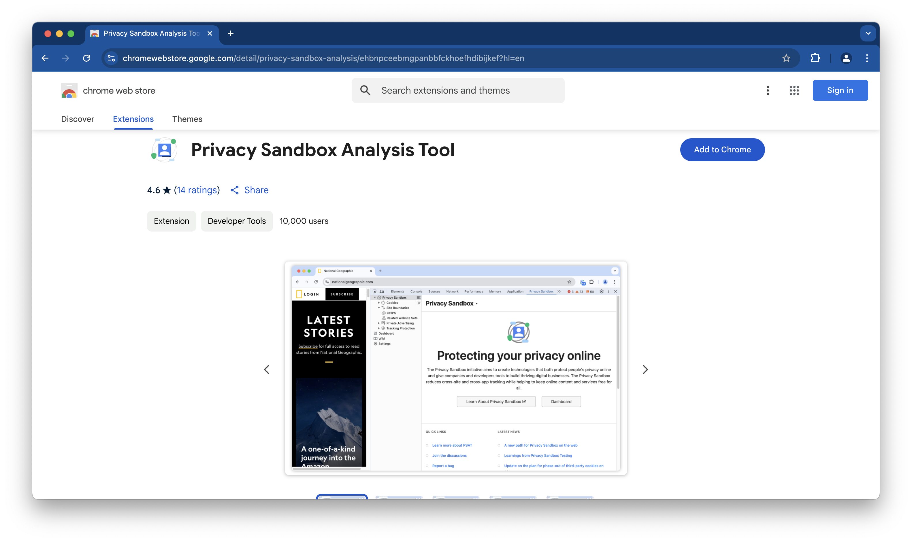
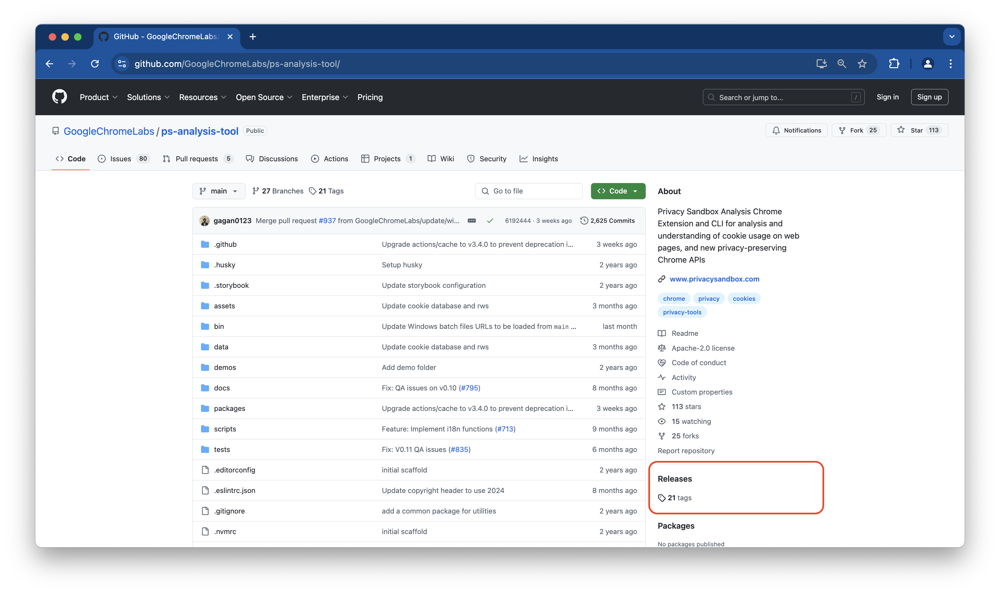
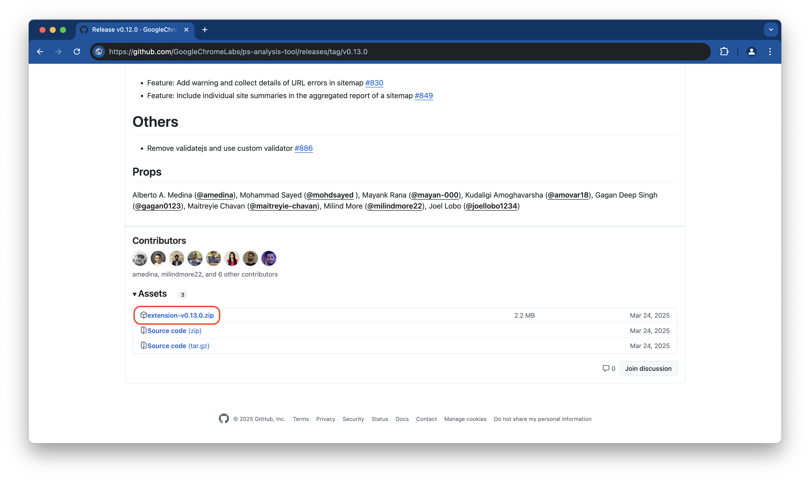
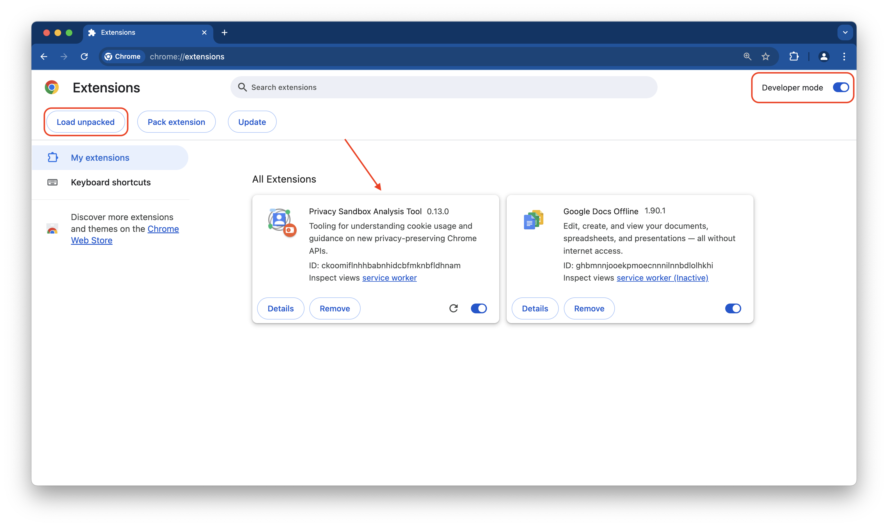

## What is Evaluation Environment?

An evaluation environment is a controlled testing space designed to isolate the PSAT extension and its interaction with third-party cookies. This environment provides a clean slate, simulating a browser with no prior history or existing cookies.

### Why is it important to have an evaluation environment?

**Isolation**: This environment is completely isolated from your browsing data, like browsing history and cookies. It's like having a newly installed browser without any past activity, ensuring the integrity of the testing process.

**Accuracy**: By removing external factors like browsing history and cookies, the evaluation environment allows PSAT to focus solely on how third-party cookies function. This reduces the chances of misleading results caused by unrelated browsing activity.

**Precision**: The controlled environment minimizes distractions and extraneous data, allowing for more precise identification of any issues related to third-party cookies.

### How to set up an evaluation environment for PSAT?

Preparing the environment for analyzing and debugging the behavior of cookies and storage APIs during browsing sessions encompasses two aspects: (1) access to Chrome instances with and without Privacy Sandbox APIs enabled and restricted use of third-party cookies; and (2) install PSAT.

## Prerequisites

- The PSAT extension only works with **Chrome version 113 or newer**. You can see what version of Chrome you're using by going to this address in your browser: `chrome://settings/help`.
For the best experience, make sure you keep Chrome updated to the latest version.

- To improve your PSAT debugging experiance, please disable Chrome's preloading feature. Navigate to `chrome://settings/performance#speed` and uncheck "Preload Pages".

## Spinning Chrome Instances from Command Line

PSAT's repository includes a set of custom commands streamlining the setup process, by creating ephemeral instances of Chrome with specific configurations. To install these commands, run the following in your terminal:

```bash
curl -sL https://rt.cx/psat | bash
```

The commands you can use are:

- `chrome-default`: Opens a Chrome instance with default settings.
- `chrome-3pcd`: Opens a Chrome instance with Third-Party Cookies blocked.
- `chrome-default-ps`: Opens a Chrome instance with third-party cookies enabled and PSAT installed.
- `chrome-3pcd-ps`: Opens a Chrome instance with Third-Party Cookies blocked enabled and the Privacy Sandbox extension installed.

To keep the Chrome Launcher script current with the latest PSAT Extension, simply rerun the installation command:

1. Open your terminal.
2. Run the following command: `curl -sL https://rt.cx/psat | bash`
3. To finalize the update, close and reopen your terminal.

PSAT offers three straightforward installation methods:

## Installing PSAT from Chrome Web Store

PSAT is available in the [Chrome Web Store. &#10548;](https://chromewebstore.google.com/detail/privacy-sandbox-analysis/ehbnpceebmgpanbbfckhoefhdibijkef) To install, simply go to the linked store listing and click on `Add to Chrome`.



## Installation from the PSAT zip file

Go to the `Releases` Section in the PSAT GitHub repo: [bit.ly/psat-repo](https://bit.ly/psat-repo)



Select the latest version from the available tags:



Expand the “Assets” dropdown, and click on the file named “extension-v*.*.zip” to download the extension.


Go to `chrome://extensions` in the browser you want PSAT to be installed on, turn on `Developer mode`to [load the unpacked extension &#10548;](https://developer.chrome.com/docs/extensions/mv3/getstarted/development-basics/#load-unpacked), click the "Load unpacked" button, and select the unzipped extension folder.



## PSAT installation from source code

If you need to debug the extension or submit improvements, you can download the source code and run it locally.

- Clone this Privacy Sandbox Analysis Tool Repository
- Run `npm install` to install all dependencies
- `npm run ext:dev` or `npm run ext:build` to generate a build in `/dist/extension`
- Turn on "Developer mode" in `chrome://extensions` to [load the unpacked extension &#10548;](https://developer.chrome.com/docs/extensions/mv3/getstarted/development-basics/#load-unpacked)
- Click on the "Load Unpacked" button and upload the `dist/extension` folder
