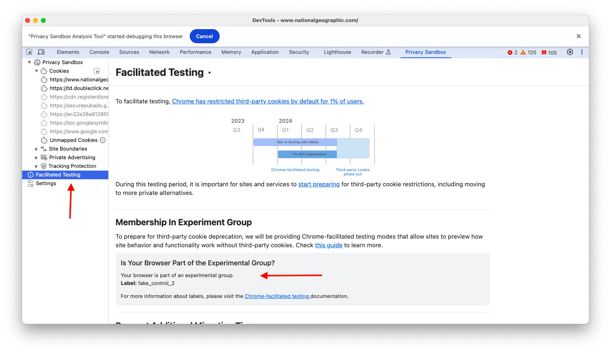

Chrome Facilitated Testing is a valuable tool for a smoother transition to a more private web. By testing and adapting now, websites and different vendor providers can ensure they're prepared for functioning properly when third-party cookies are blocked.

Facilitated Testing offers two key modes to simulate a world without third-party cookies:

### Mode A: Labeled Browsers

This mode lets testers identify specific Chrome users as part of a test group or a control group. By analyzing website behavior in each group, testers can see how their platform functions with and without cookies.

### Mode B: Disabling Cookies for 1% of Traffic

This mode provides a real-world preview. Chrome actually disables third-party cookies for a small percentage of its users. This allows testers to see how a larger audience might experience the web without these cookies.

You can learn more about different modes and labels from the [official guide](https://developers.google.com/privacy-sandbox/relevance/setup/web/chrome-facilitated-testing) of Facilitated Testing.

The PSAT extension now includes a dedicated "Facilitated Testing" menu within the sidebar. This menu provides access to helpful guides and resources to learn more about facilitated testing and how it might impact your browsing experience.

### Identifying Facilitated Testing Participation

The PSAT extension can help you determine if you're currently part of a facilitated testing group. Here's how:

Navigate to Chrome settings by visiting `chrome://settings/cookies` in your address bar.

If the PSAT extension detects you're part of a facilitated testing group, you'll be automatically redirected to the `chrome://settings/trackingProtection` page.

The redirection to the `chrome://settings/trackingProtection` page indicates your participation in a facilitated testing group that might be impacted by changes related to third-party cookies.
