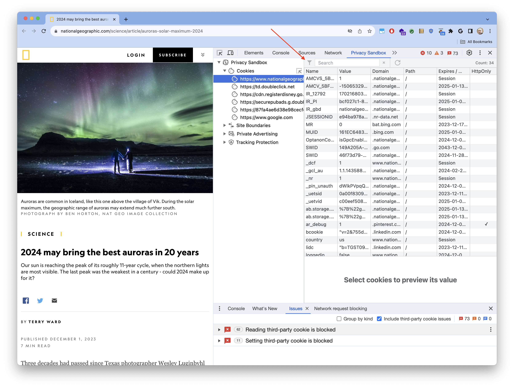
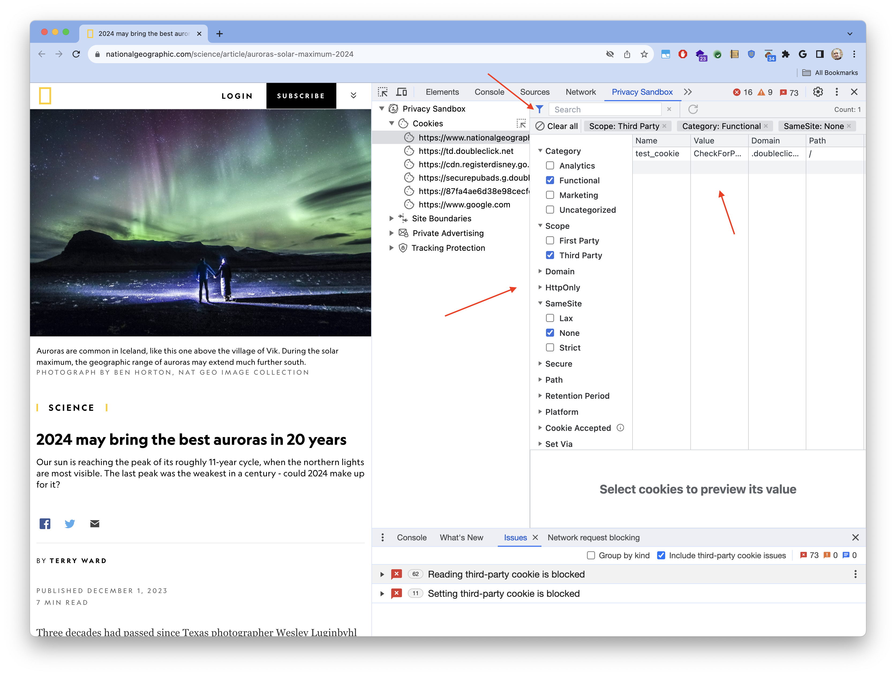

PSAT makes it easy to reduce the analysis scope by filtering observed cookies by the different dimensions that characterize them, which correspond to the columns in the cookie table.

The filtering capability is accessed via the little funnel icon at the top-left corner of PSAT's cookie table:

Clicking on the funel icon, allows you to select from all the observed cookies,only those that meet certain criteria; e.g. Functional thrid-party cookies, which have the `SameSite` attribute set to `None`.

