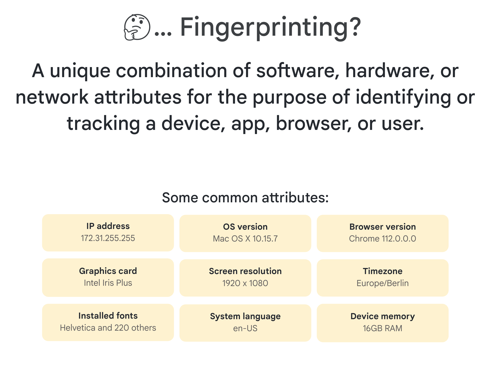

Fingerprinting means trying to identify a user when they return to your website, or identifying the same user across different websites. Many characteristics may differ between your setup and someone else's. For example, you may be using a different type of device and a different browser, have a different screen size, and have different fonts installed. If I have the font "Dejavu Sans" installed and you do not, then any website can tell the difference between you and me by checking for that font. This is how fingerprinting works; you build up a collection of these data points, and each provides more ways to distinguish between users.

