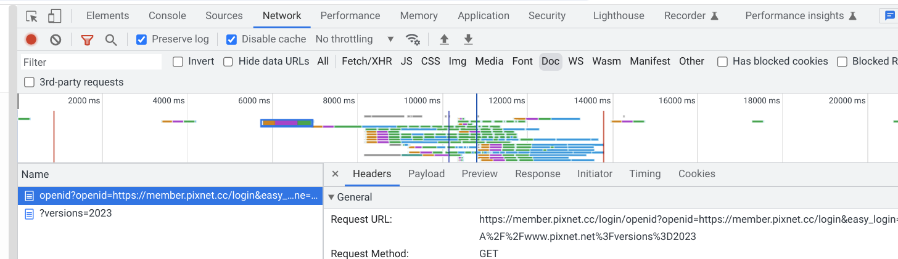

Analyzing websites for potential breakages is not a trivial process, as there are many factors to consider and lots of information to be grasped. This section describes various factors that can be considered during a site analysis.

## **Authentication**

Some functionality of a site can be tested without authentication and/or login requirements, while others require users to have an account of some sort and be properly authenticated. Both scenarios must be analyzed.

## **Desktop/Mobile**

Tests/analysis must be performed on both desktop and mobile, if and only if the mobile version of the site is entirely different.

## **Top–level navigation**

Quite often, top-level navigation happens _invisibly_ to you when you only look at the URL bar, e.g. through server-side 301 redirects.

To see top-level navigation without the added noise of other requests. Toggle the “Doc” filter in the network panel as shown below, then look at the origin of the request URL to see if it is cross-site with the one that is in the URL bar.

## **JS/Network errors**

Lack of 3PC access can very frequently cause errors to be thrown in DevTools. One example is the bug “Nintendo - sign-in doesn't work”, where a 3P request to [accounts.nintendo.com](http://accounts.nintendo.com/) throws a 403 without the right cookies attached.

## **Partitioned storage**

A reported bug on “S-Bahn München status page” reported by https://www.s-bahn-muenchen.de/fahren/betriebslage, where lack of partitioned storage throws an error on the `localStorage` getter. Through the JS exception chain, we can actually see the origin of the file that ran this code, and derive that this could be the 3rd party in this case.

## **Cross-site requests in the network tab**

Sometimes sites send 3P network requests without the right cookies, but those requests don’t fail. They could just return a 200 because the user not being logged in isn’t considered an error state for them. Here, it’s helpful to search the network DevTools panel for “3rd-party requests” only by checking the corresponding checkbox. There might be a lot of noise here, e.g., calls to ads servers, but also some useful information. This is especially useful if you have some repeatable way of triggering the breakage on the site, e.g., by clicking on a login button or similar. Unless the site is using JS-based cookie access through `document.cookie`, there should be an outgoing network request at that moment.

## **Authenticated embeds**

Sometimes embedded iframes can appear to be part of the 1P experience on the website. To detect them, it can be helpful to use the DOM inspector in DevTools (starting with the UI that isn’t loading or is showing an error to the user) to figure out if it’s really an iframe. Then, the source of that iframe is likely the 3P that is involved and it’s often an “auth embeds” use case that can be solved with `requestStorageAccess`, or even CHIPS if there’s no top-level navigation.

An example of this is Mindbody Inc. which serves embedded iframes for website owners to allow their customers to book appointments. This iframe looks a lot like it’s part of the website, but reveals itself in the inspector.

## **Checking for known breakages: GSI v2**

GSI v2 is a legacy library from Google Identity that is integrated with plenty of sites and, unfortunately, relies on cross-site cookies to work. This is a very common source of failure and is especially likely when the user-facing breakage is “can not log in”. There are some tips for identifying whether GSI v2 is in use here.

## **DOM Storage usage**

Some sites are not trying to use cookies, but instead `LocalStorage` or Quota Storage like `IndexedDB`. These can often be spotted by observing exceptions being thrown, see "Look at JS/Network errors".
