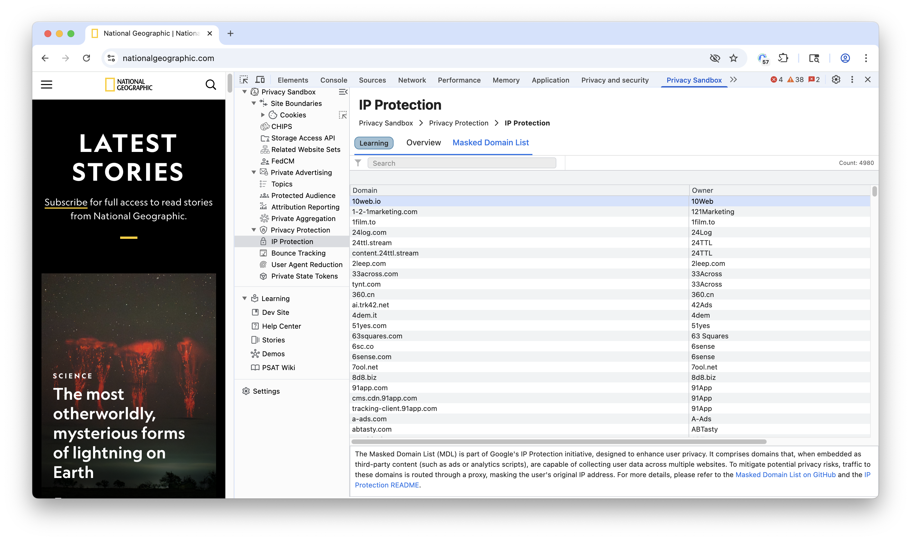

Chrome's IP Protection is a new privacy feature for Incognito mode designed to limit cross-site tracking by hiding a user's real IP address from specific third-party domains. This protection will be enabled for signed-in Chrome users

## How It Works

To balance privacy with web functionality, IP Protection uses a two-hop proxy system for qualifying traffic:

- *First Proxy (run by Google):* Sees the user's original IP address but not the final destination website.

- *Second Proxy (run by external CDNs):* Sees the destination website but only receives traffic from Google's proxy, not the user's original IP.

### Masked Domains
Masked Domains are a specific list of domains (known as the Masked Domain List or MDL) for which IP masking is applied. This list is curated to include domains that are likely to be involved in cross-site tracking, such as those serving ads, performing analytics, or collecting user data for marketing.

To balance privacy with web usability, IP Protection doesn't proxy all internet traffic. Instead, it uses a list-based approach centered on Masked Domains. 

You can check all the masked domains in PSAT extension by navigating to the "Masked Domains" under IP protection section, You can also search and filter the domains in the list.

### Resources

- Google Chrome's IP Protection Proposal: [GitHub - GoogleChrome/ip-protection](https://github.com/GoogleChrome/ip-protection)
- The Masked Domain List: [Masked Domain List](https://github.com/GoogleChrome/ip-protection/blob/main/Masked-Domain-List.md)
- Privacy Sandbox IP Protection Overview: [IP Protection Overview](https://privacysandbox.google.com/protections/ip-protection)
