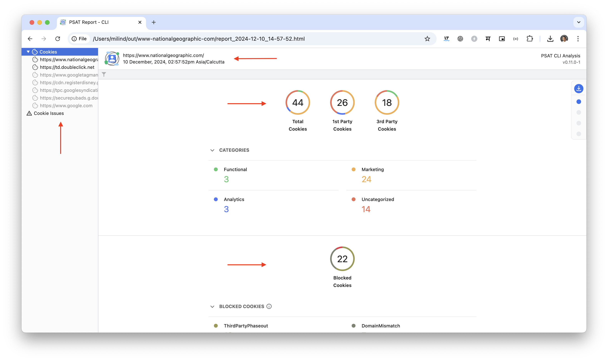
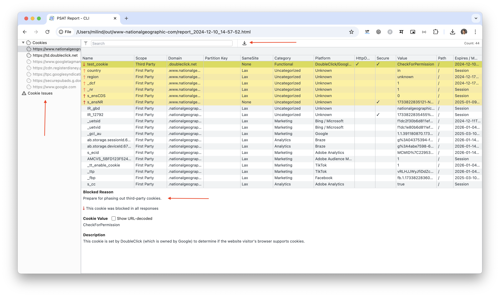
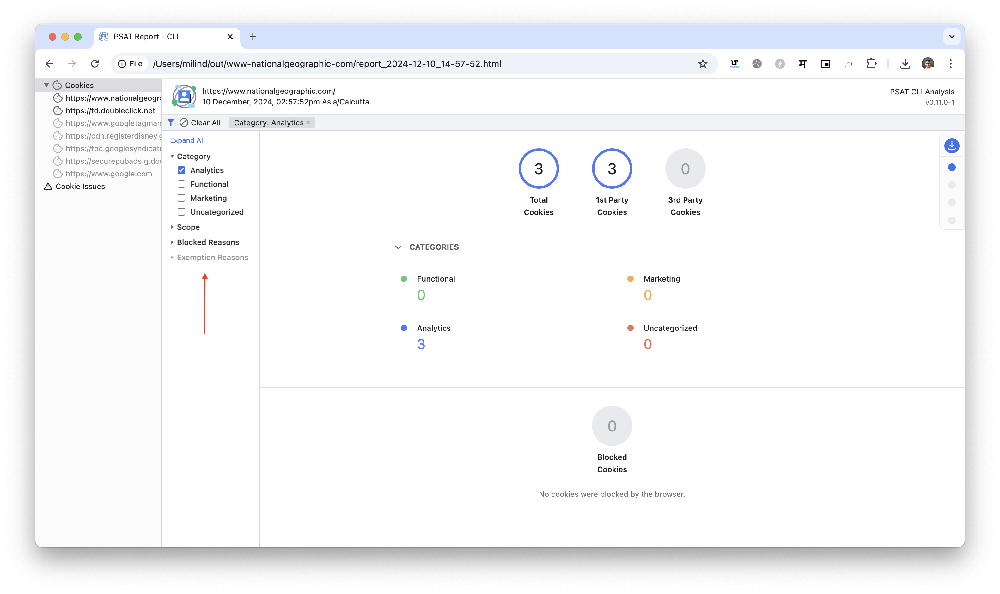
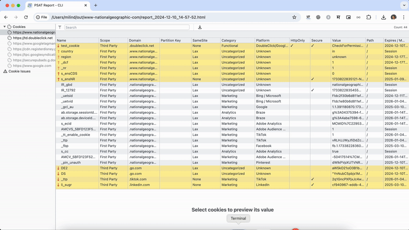
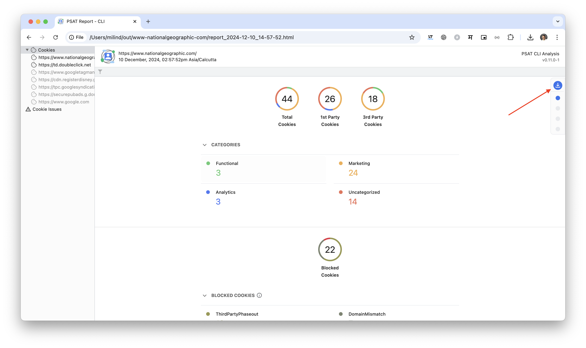

## Introduction

The PSAT CLI (Privacy Sandbox Analysis Tool Command Line Interface) is a tool particularly useful for identifying third-party cookies on your applications and identifying breakages caused by them. With the reports generated by the PSAT CLI, developers can summarize cookie information for a single website or a set of websites. This is the first step to transitioning to a privacy-preserving web, mapping those scenarios, and replacing them with the Privacy Sandbox APIs. 

### Why you should use PSAT CLI
PSAT analyzes a website's cookies and explains their purpose. It also identifies cookies with issues and provides network request information, which can help determine if third-party cookie restrictions impact those cookies. Key features of the PSAT CLI include::

 - **Automated Cookie Filtering:** Automatically filters cookies with issues to speed up debugging.

- **Report Generation:** This function generates reports in CSV, JSON, and HTML formats, which can be used to share analysis, integrate with CI/CD (continuous integration and continuous deployment) pipelines, or create visualizations.

- **Third-Party Technology Analysis:** This process identifies third-party platforms and services used on a website and determines whether they use third-party cookies.

- **GDPR Banner Handling:** The CLI can automatically accept GDPR banners, allowing an automated analysis without interruption. Developers can disable this feature or provide a JSON file with selectors to customize how the CLI handles specific GDPR banners.

Developers can install the PSAT CLI globally as a Node package or clone and build it locally. The PSAT CLI offers various options to customize analysis, such as specifying the output directory, setting the waiting time after page loads, and enabling verbose or quiet mode. We will analyze all those options in the report’s options section. 

### PSAT CLI vs. Extension

The PSAT CLI and Extension cater to different use cases. The CLI is a powerful tool for comprehensive, automated analysis of cookie usage, especially for large websites or multiple websites, and integrates well into development workflows. The extension provides a more convenient way to analyze cookie usage while browsing, and might be more suitable for quick checks or specific user flow analysis.

#### Factors affecting Analysis
- **Environment:** The CLI operates in a browser environment where third-party cookies are disabled, while the extension relies on Chrome's third-party cookie settings. This difference can lead to variations in website behavior and, consequently, in the results obtained.

 - **Duration of Analysis:** The CLI analyzes a website for a shorter duration (20 seconds by default), which might not be sufficient to capture all cookies, especially those loaded by scripts or functionalities that take longer to execute. In contrast, the extension has a longer analysis period until all the requests are served, as it operates within the browser during active browsing.

 - **User Interaction:** The CLI doesn't simulate user interactions such as clicking or scrolling potentially missing cookies that load only after specific user actions. The extension can capture cookies triggered by user interactions.

 - **Scope of Analysis:** The CLI excels in comprehensive site analysis by processing entire sitemaps or CSV files containing lists of URLs. It's suitable for evaluating the cookie usage of large websites or multiple websites. The extension is more convenient for analyzing individual pages or a smaller set of pages during browsing.

 - **Reporting and Output:** Both the CLI and the extension generate reports on cookie usage. The CLI offers more comprehensive reporting, including options to export data in CSV, JSON, and HTML formats. It also provides a local dashboard similar to the extension's panel, but might not include all the details. The extension's reporting features might be more streamlined for quick insights during browsing.

- **Automation and Integration:** The CLI is designed for automation and integration into CI/CD  (continuous integration and continuous deployment) pipelines. Its command-line interface and ability to output data in machine-readable formats make it suitable for automated testing and analysis workflows. The extension, being a browser extension, might not offer the same level of automation capabilities.

## Installation

### Prerequisites
The latest stable Node.js version 18 or later is required for optimal performance of the PSAT CLI. You can install it manually via [nodejs.org](https://nodejs.org/) or use NVM to easily manage different Node.js versions. The official NVM [documentation](https://github.com/nvm-sh/nvm?tab=readme-ov-file#intro) provides detailed installation instructions.

#### What is NVM?
NVM stands for Node Version Manager. It's a handy tool that lets you manage different versions of Node.js on your computer. It works for individual users and activates within your terminal session.

#### How to install NVM:

You have two options to install NVM:

1. Use `curl`:

```bash
curl -o- https://raw.githubusercontent.com/nvm-sh/nvm/v0.40.1/install.sh | bash
```
2. Use `wget`:
```bash
wget -qO- https://raw.githubusercontent.com/nvm-sh/nvm/v0.40.1/install.sh | bash
```
These commands download a script and run it automatically. The script sets up nvm in a hidden folder within your user directory (typically `.nvm`) and modifies your shell configuration file (like `.bash_profile` or `.zshrc`) to activate NVM functionality.

#### What happens behind the scenes?
The script sets an environment variable (`NVM_DIR`) that points to the NVM installation location. It then checks if a specific file (`nvm.sh`) exists there. If it does, the script loads that file, which enables NVM commands within your current terminal session.

How to switch between Node versions 18.

```bash
nvm install node 18
```
Switch to the newly installed node version.

```bash
nvm use 18
```
If you face any issues, refer to the official nvm and npm documentation for specific guidance and troubleshooting.

### Installing PSAT CLI

After installing and switching to Node.JS version 18, install PSAT CLI globally. **Open a terminal ( Mac and Linux ) or a command line( Windows ).**

**Install the package:** Run the following command:

```bash
npm i -g @google-psat/cli
```
Once you have successfully installed the PSAT CLI, check the installation by using the help CLI option.

```bash
psat --help
```
If the installation is successful, it will display the CLI version of the PSAT CLI options.

Additionally, developers and advanced users can clone the PSAT [repository](https://github.com/GoogleChromeLabs/ps-analysis-tool) and build the PSAT CLI locally as per the instructions given in the [wiki](https://github.com/GoogleChromeLabs/ps-analysis-tool/wiki/PSAT-Command-Line-Interface#clone-and-build-locally).

## Running Analysis

After installing PSAT CLI, we are ready to run our audits. With the CLI ready, we have some alternatives to run an analysis using a single URL, or a batch of URLs via sitemap, and CSV files. Those two types will come out in a single file, where we can analyze the data in an interactive report.

#### Analyzing a single URL
To analyze a single URL, provide `-u` or `--url` parameter

```bash
psat -u https://example.com
```

A report HTML file will be generated, and its path displayed in the terminal. Open this file in a browser to view the report.

#### Analyzing a remote URL batch

The PSAT CLI's power becomes evident when analyzing batches of URLs using sitemaps or CSV files.  For analyzing a sitemap or CSV hosted on a server, provide the `-s` or `--source-url` parameter:

```bash
psat -s https://www.example.com/sitemap.xml
```
When running the analysis, the CLI prompts for the number of URLs to analyze, then generates an aggregated report.


### Analyzing files locally

Analyzing local sitemap or CSV files is also supported. This is useful for generating aggregated reports or quickly testing a development environment. Provide the local file path with `-f` or `--file` parameter for analysis.

```bash
psat -f local-env/sitemap.xml
```
The analysis process is similar to the remote URL batch analysis, prompting for the number of URLs to analyze.  The path to the generated report will be displayed in the terminal.

### Analysis Options

Before we dive into the reports, let's check out some of our analysis options with the CLI. Some useful options are to disable the headless analysis, and check how the CLI is loading your pages, or generate a report in a different language. You can check out the full list in the wiki [CLI Options section](https://github.com/GoogleChromeLabs/ps-analysis-tool/wiki/PSAT-Command-Line-Interface#cli-options).

To use the analysis options, place the parameters after the URL:

```bash
psat -u https://example.com --locale pt-BR
```

### Understanding reports
Reports are organized into folders named like “site-domain-report-type” with a timestamp, allowing you to maintain a history of analyses. The initial report page provides insights into cookie usage on the analyzed page.

### Cookie Insights Page



Let’s break down the cookie's insight reports into three main parts: the header, sidebar, and main page. The header report contains crucial information to identify the report, such as the domain and date of the report. On the right side of the header is the PSAT CLI version. The Cookie Insights page presents information on cookie categorization, blocked cookies, cookie exemptions, known breakages, and frames. Access these sections via the menu at the top-right of the page.

The sidebar allowed users to navigate between the aggregated reports and individual frames and filter all cookies with issues. Navigation can be done via the sidebar or by clicking on the numbers on the Cookies Insights Page. 

When clicked, all the numbers related to cookie usage work as filters, and the user will be redirected to the cookies table page. We are talking more about that in the following section, isolating the number of cookies from one specific category or blocking reason. The following section is the Cookie Table, accessed on the left sidebar.

### Cookies Table



At the Cookies Table, the user will access all information about the cookies on the audited URL. The cookie table is organized into sections; the top part of the table with all cookies lists pieces of information such as scope, origin domain, and cookie category. When the user clicks on an individual cookie, more information will be displayed in the cookie details section under the cookie table. Blocked reasons, such as when the cookie was blocked, and a description of why this cookie was set in the first place, will be listed. 

### Filtering data

Another superpower of PSAT CLI is the ability to filter data across the Cookies Insights page and Cookies table. In both cases, the filter can be accessed by clicking on the funnel icon in the top-left corner. 



The filters will adapt based on the scope of the view. For example, on the Cookies Insight page, Category, Scope, Blocked Reasons, and Exemption Reasons are the filters available. For the Cookies Table, more filter options are available to the user.

Let's imagine a specific case in which you want to identify the **third-party cookies** with the property **SameSite** having value **None**. To do so, we can jump to the cookie table. Open the filter and select the **Scope** and **SameSite** filters, and all the cookies with both properties will be shown.



## Sharing Reports

The PSAT CLI generates reports that can be shared with colleagues. You can choose the format that best suits your needs, such as plain text CSV files, structured JSON data files, or summarized HTML reports.

### Download Reports (report formats)

When you complete the analysis, you will receive a path to the file report.html at the end of the analysis. Copy and enter the path into your browser.

The report.html file provides a summary of the PSAT analysis in HTML format. This file is similar to the “Cookies' insight page,” which likely refers to a section of the PSAT dashboard or a similar report view.

You can download the report as a zip file from the floating navigation in the top-right corner of the PSAT CLI dashboard.



### Files in reports

The generated .zip file contains the following report files:

  - **cookies-issues.csv:** This file contains a list of all the cookies that have been blocked, either in request or response.

  - **cookies.csv:** This file contains a list of all the cookies that are created by the site, either by first-party or third-party frames.

  - **report.csv:** This file contains an overall report of the cookies and their count based on various categories, domains, blocked cookies, etc. A CSV or sitemap analysis will result in both an aggregated cookie report and a site-specific report, organized in separate directories.

  - **report.json:** This file contains data for cookie data in a JSON format.

  - **report.html:** This file contains the resume of the report in HTML format, similar to the Cookies' insight page

## Conclusion
In conclusion, the PSAT CLI emerges as an indispensable tool in the developer's arsenal, simplifying the complex task of navigating the transition to a privacy-first web. Its ability to automate cookie analysis, generate insightful reports, and seamlessly integrate into development workflows empowers developers to address privacy concerns and ensure compliance proactively. By embracing the PSAT CLI, developers can confidently stride towards a future where user privacy and seamless browsing experiences coexist harmoniously.

#### Reference : 
  - https://privacysandbox.com/
  - https://developers.google.com/privacy-sandbox
  - https://github.com/GoogleChromeLabs/ps-analysis-tool/wiki
  - https://www.npmjs.com/package/@google-psat/cli
