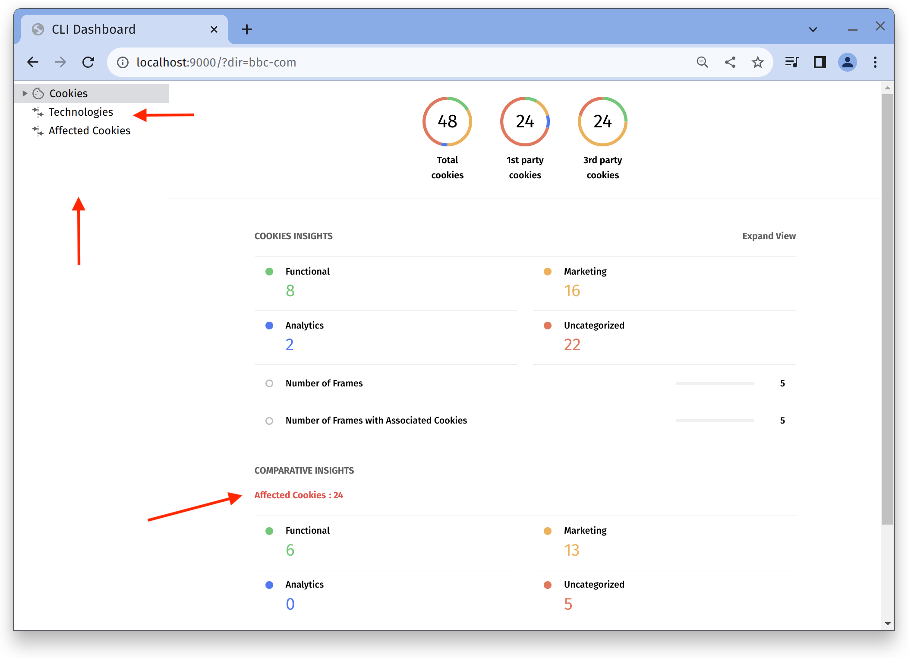

The PSAT CLI is an alternative way to run analyses on your website. You can use a terminal to scan a given URL, or an entire sitemap to create a more extensive report. The CLI creates a local site showing similar information as PSAT's extension.

To use PSAT's CLI, follow these steps:

- Clone this Privacy Sandbox Analysis Tool Repository
- Run `npm install` to install all dependencies
- `npm run cli:build` to generate a build in `/dist/cli`.
- Run the CLI by providing a URL, sitemap url, CSV file of URL set or a path to sitemap file as input.
  - E.g. to analyze specific URL: `npm run cli -- -u https://bbc.com`.
  - E.g. to analyze all URLs from sitemap: `npm run cli -- -s https://example.com/sitemap_index.xml`.
  - E.g. to analyze set of URLs through CSV file: `npm run cli -- -c /path/to/urlset.csv`.
  - E.g. to analyze specific XML sitemap file: `npm run cli -- -p /path/to/sitemap.xml`.
  - Please note that the dependency (Wappalyzer), which analyzes page technologies, may require permission to use its instance of Chromium. If this happens, you have the option to skip the technology analysis by using the `nt` flag for the uninterrupted analysis of cookies.
  - E.g. `npm run cli -- -u https://bbc.com -nt`.

The PSAT CLI provides access to functionality similar to the PSAT Extension, and makes it accessible through the command line. The CLI enables the following use cases:

- Aggregated analysis of the full site (i.e. sitemap.xml)
- Site evaluation pre-analysis ⇒ Guidance on scope and prioritization
- CLI for CI: Integrate the PSAT CLI into your CI pipeline and detect potential areas of issues related to 3PCD
- Testing for breakages by executing two access runs, with and without cookies being blocked, and providing a “cookie differential” analysis
