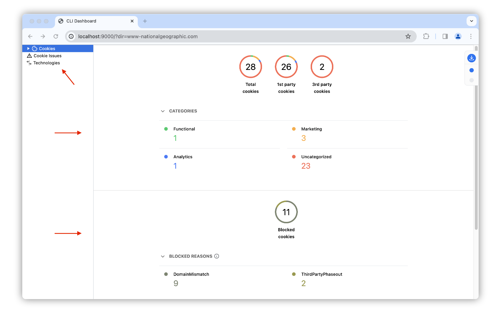
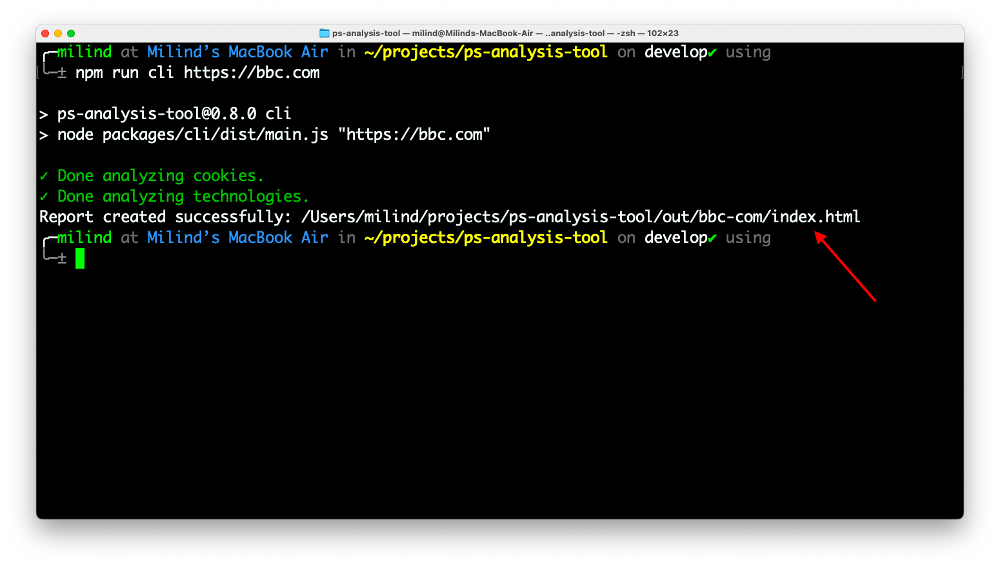
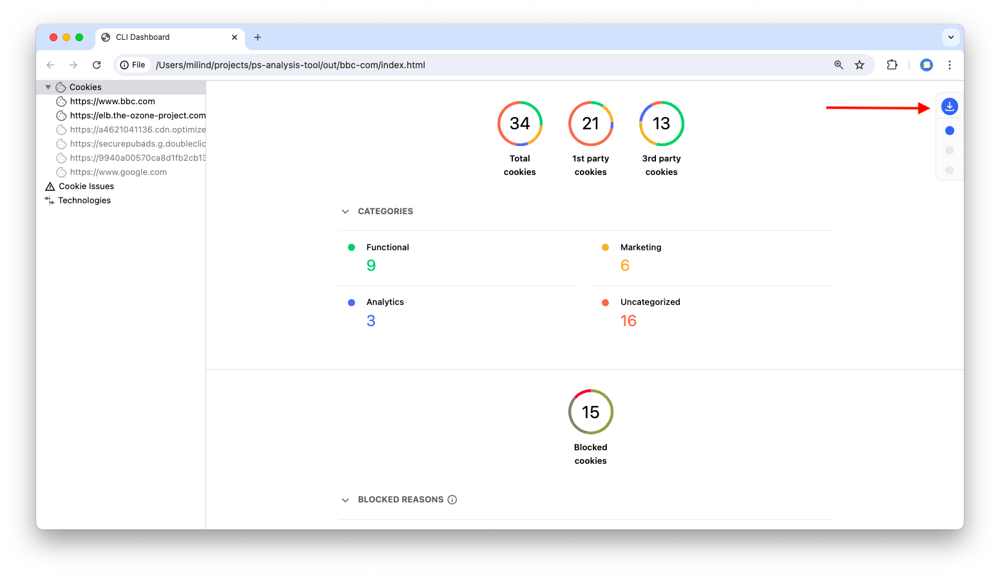

The PSAT CLI is an alternative way to run analysis on your website. You can use a terminal to scan a given URL or an entire sitemap to create a more extensive report. The CLI creates a local site showing information similar to PSAT's extension.



The sidebar section can help you navigate through various reports. The main section will help you identify all the cookies that are being used by a site.

Within the CLI Dashboard, you'll find the following sections: "Categories" and "Blocked Reasons.". Under "Blocked reasons", the cookies impacted by third-party cookie deprecation will be listed under the "ThirdPartyPhaseout" label. Additionally, a "technologies report" offers an in-depth technical website analysis.

### Prerequisites
For the best performance of the PSAT CLI, it's recommended to use **Node.js version 18.1 or later.** To easily manage different Node.js versions, we recommend using a nvm (node version manager).

### Getting Started with PSAT CLI

To leverage the PSAT CLI's capabilities, you can either choose to install it as a node module or clone the repository and build it locally.

#### Install as a Node Module

To install the [PSAT CLI as a node module](https://www.npmjs.com/package/@google-psat/cli), follow these steps:

1. **Install the PSAT CLI:** Run `npm i -g @google-psat/cli` to install the PSAT CLI globally.
2. **Run the CLI Audit:** Execute `psat https://example.com` followed by the URL you want to analyze.
3. **Help Command:** Use the `psat --help` command to view all available options.

The PSAT CLI is now installed, and it's ready to use. You can learn more about CLI options from the node module [README](https://github.com/GoogleChromeLabs/ps-analysis-tool/blob/main/packages/cli/README.md). The CLI will generate a report and store it in the `/out/` directory by default.

#### Clone and Build Locally

To install the PSAT CLI locally, follow these steps:

1. **Clone the Privacy Sandbox Analysis Tool Repository.**
2. **Install Dependencies:** Run `npm install` to set up all required dependencies.
3. **Build Generation:** Execute `npm run build-cli` to create a build located at `/dist/cli`.
4. **Running the CLI:** Start the analysis by specifying a URL, a sitemap URL, a CSV file of the URL set, or a path to a sitemap file.

The CLI provides the following options as a source to create a report:

  - Analyze a specific URL: `npm run cli https://example.com` or `npm run cli -- -u https://example.com`.
  - Analyze URLs from a sitemap: `npm run cli -- -s https://example.com/sitemap_index.xml`.
  - Analyze URLs from a CSV file: `npm run cli -- -c /path/to/urlset.csv`.
  - Analyze a specific XML sitemap file: `npm run cli -- -p /path/to/sitemap.xml`.

To customize and change the behavior of the analysis of those reports, the CLI also supports options:

  - Make PSAT reports available in different languages for user convenience: `npm run cli -- -u https://example.com -l ja`.
  - Limit the number of URLs to analyze from a specific sitemap or CSV: `npm run cli -- -p /path/to/sitemap.xml -ul 10`
  - Export the report to a specific folder without creating a dashboard URL: `npm run cli -- -u https://example.com -d <path-to-dir>` or `npm run cli -- -u https://example.com --out-dir <path-to-dir>`.
  - **Note:** Wappalyzer, used for page technology analysis, may request permission for its Chromium instance. To bypass technology analysis, use the `nt` flag: `npm run cli -- -u https://example.com -nt`.
  - Accept the GDPR banner if present on the site: `npm run cli -- -u https://example.com -ab`.

> [!IMPORTANT]
> When using a URL with multiple parameters joined by ampersands (&), surround the entire URL with double quotes (") to avoid errors, the quote ensures that it treats entire URL as string. For example: `npm run cli -- -u "https://example.com?param1=value1&param2=value2"`.

### CLI Use Cases

The PSAT CLI is not just a command-line version of the PSAT Extension; it's a versatile tool enabling various use cases:

- **Comprehensive Site Analysis:** Aggregated evaluation of entire sites (via sitemap.xml).
- **Pre-analysis Site Evaluation:** Offers guidance on scope and prioritization for site evaluation.
- **Integration into CI Pipeline:** Seamlessly incorporate PSAT CLI in CI pipelines to detect issues related to third-party cookie deprecation (3PCD).
- **Cookie Differential Analysis:** Compare site functionality with and without cookies to identify potential breakages.
- List the Blocked cookies' reasons to guide developers in solving those issues.
- Help developers by allowing them to download detailed reports.

### CLI Options

For a detailed understanding of the CLI options, you can use the `npm run cli -- --help` command:

```bash
$ npm run cli -- --help

> ps-analysis-tool@0.8.0 cli
> node dist/cli/index.js --help

Usage: main [options] [website-url]

CLI to test a URL for third-party cookies
Arguments:
  website-url                 The URL of website you want to analyse

Options:
  -V, --version               output the version number
  -u, --url <value>           URL of a site
  -s, --sitemap-url <value>   URL of a sitemap
  -c, --csv-path <value>      Path to a CSV file with a set of URLs.
  -p, --sitemap-path <value>  Path to a sitemap saved in the file system
  -l, --locale <value>        Locale to use for the CLI, supported: en, hi, es, ja, ko, pt-BR
  -ul, --url-limit <value>    No of URLs to analyze
  -nh, --no-headless          Flag for running puppeteer in non-headless mode
  -np, --no-prompts           Flags for skipping all prompts. Default options will be used
  -nt, --no-technology        Flags for skipping technology analysis.
  -d, --out-dir <value>       Directory path where the analysis data will be stored
  -ab, --accept-banner        This will accept the GDPR banner if present.
  -h, --help                  display help for command
```

### CLI Output

PSAT offers a Command-line Interface (CLI) for users to interact with its functionalities. When users run PSAT commands through the CLI, they receive outputs in various formats depending on the parameters they use in the specific commands they've executed.

The following are two major outputs:

#### PSAT Dashboard

The PSAT dashboard is a locally run HTML application that processes the results from a JSON file for analysis and gives cookies results. It is served in the `/out/` directory; you can open it in any browser to get an interactive dashboard, just like the PSAT extensions panel. Due to the limitations mentioned in the discrepancy section, the PSAT CLI dashboard does not include all details.



#### Export Files
You can export analysis data as CSV or JSON files. These file formats store the data in a structured way that allows you to import it into other software tools like spreadsheets or data analysis programs. This allows for further customization and analysis of the PSAT results beyond what the dashboards might offer.



>[!NOTE]
>When exporting files without a specified output directory (using the `out-dir` flag), relative paths are used. If the path doesn't exist, it will be created.

The exported reports contain the following files:

- **cookies-issues.csv** : The file contains a list of all the cookies that have been blocked, either in request or response.
- **cookies.csv** : The file contains a list of all the cookies that are created by the site, either by first-party or third-party frames.
- **report.csv** : The file contains an overall report of the cookies and their count based on various categories, domains, blocked cookies, etc.
- **report.json** : The file contains data for technological analysis and cookie data in a JSON format.
- **report.html** : The file contains the resume of the report in HTML format, similar to the Cookies' insight page.
- **technologies.csv** : the file contains only the technological analysis data of the site.

### GDPR
The PSAT CLI can accept the GDPR banner if it is present on the site with the help of CLI options `-ab` this feature is useful when analyzing websites that require user consent to access cookies. By accepting the GDPR banner, the CLI can analyze the site without any interruptions, providing a comprehensive report on the cookies used.

PSAT identifies the common code libraries that power those cookie banners. If it recognizes one, it can automatically click "accept" for you, so you can get a detailed cookie report without having to interact with the site.

If PSAT doesn't automatically accept your site's GDPR banner, please [report](https://github.com/GoogleChromeLabs/ps-analysis-tool/issues/new?assignees=&labels=&projects=&template=feature-request.md&title=) the specific library that's causing the issue. The PSAT team can then add it to their detection list for a smoother experience in the future.

### Discrepancy between CLI and extension
The PSAT browser extension and the CLI tool both capture valuable insights, but they operate in different environments, leading to potential discrepancies. Understanding these differences will help you make informed decisions about choosing the appropriate tool based on the testing objectives and desired testing depth.

The following are three key reasons for discrepancies:

#### 1. Environment

The CLI tool utilizes a browser with the third-party cookie phase-out enabled. While the extension relies on Chrome settings for third-party cookies. This difference in environment can lead to discrepancies in website behavior, contributing to discrepancies.

#### 2. Duration

The CLI tool adopts a concise approach by launching a website and monitoring it for a brief period of 10 seconds. This short duration may not capture the complete set of cookies if certain scripts or functionalities take longer to load or execute, which may cause discrepancies.

#### 3. User Interactions

Unlike the PSAT extension, the CLI tool does not emulate user interactions during website monitoring. The lack of user interactions may impact how websites handle cookies, as certain cookies may load after user actions.
