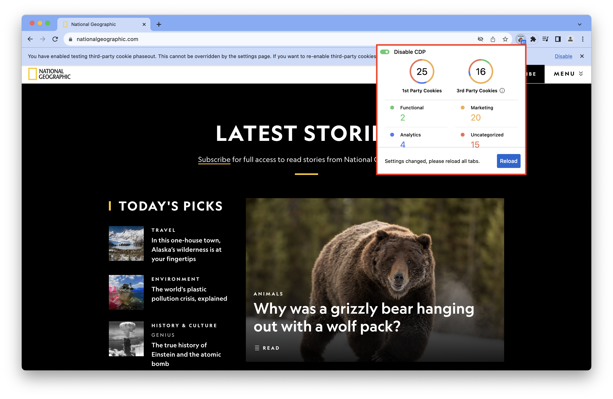

PSAT's extension icon provides a glimpse of the number and types of cookies being set up and manipulated by the current web page loaded in the browser.

To check the values shown in PSAT extension's popup:
1. Visit the website you want to analyze.
2. Locate the PSAT extension icon on the right side of the browser toolbar and click on it.
3. You can enable or disable Chrome DevTools Protocol (CDP) directly from the popup using the toggle switch. Enabling CDP will require you to reload all tabs for its data to be captured. ([reference](https://github.com/GoogleChromeLabs/ps-analysis-tool/wiki/PSAT-Settings-and-Permissions#enabling-chrome-devtools-protocol-in-psat))
4. If the current tab is not being analyzed, click the 'Analyze this tab' button to start the analysis.
5. PSAT popup will present a summary of cookies categorized by first-party and third-party, as well as their purpose.

Note: If you are visiting an internal Chrome URL such as `chrome://settings/` or `chrome://version/`, the popup will indicate that there are no cookies to analyze on this page.
