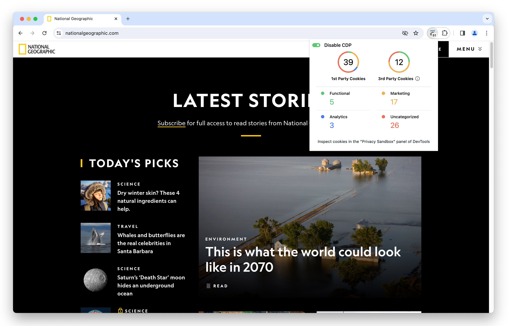

PSAT's extension icon provides the capability of getting a glimpse of the number and type of cookies being set up and manipulated by the current web page loaded in the browser.

To check the values shown in PSAT's extension popup:

1. Access the URL that you want to analyze
1. Locate the PSAT extension icon on the right side of the browser toolbar and click on it.
1. Initiate the analysis process by clicking the "Analyze this tab" button.
1. PSAT will present a detailed list of all cookies encountered in the specific URL Address.
