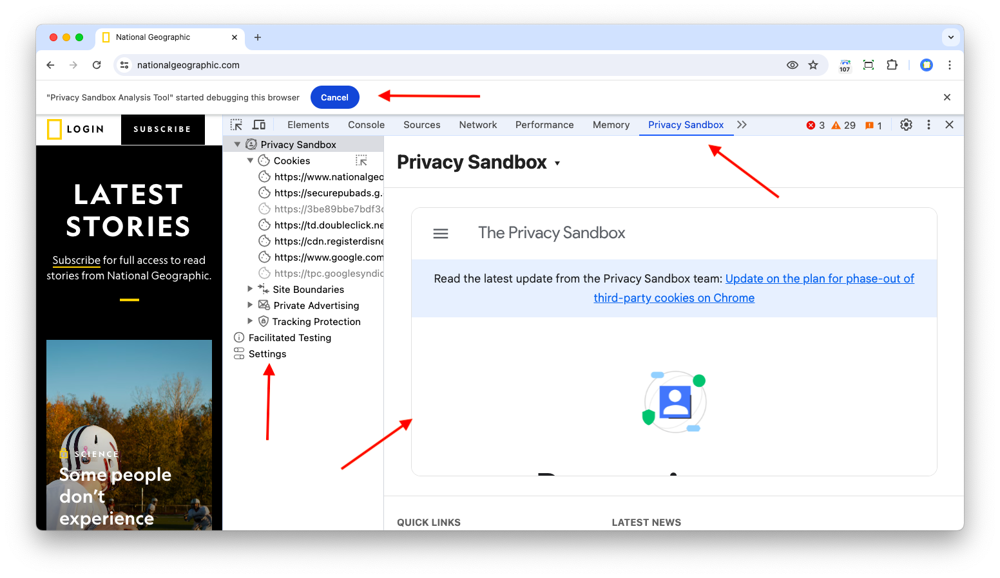
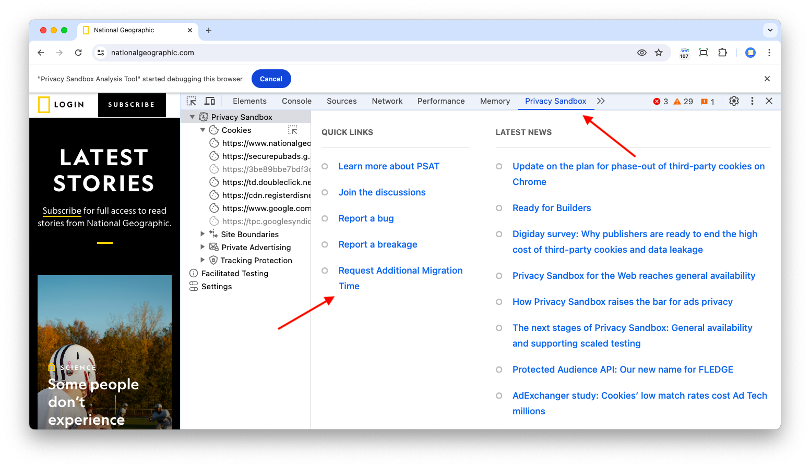

DevTools provides a wide range of capabilities enabling the analysis and debugging of every functional aspect of web development, including cookies and storage APIs. PSAT complements DevTools with additional features to help the analysis of websites in enviroments with blocked use of unrestricted third-party cookies, breakage detection in such environments, and adopting new privacy-preserving building blocks (i.e. Chrome APIs).

To access the Privacy Sandbox panel, access the URL you want to analyze, open Chrome DevTools, and navigate to the "Privacy Sandbox" panel.

PSAT features and capabilities aim at supporting developers to transition smoothly towards a more private web, by shedding light on cookie usage, and the new building blocks available for implementing privacy-preserving solutions for features and capabilities of websites and apps. PSAT's landing page in DevTools reflects this goal:

On the left, we have a collapsible sidebar from which you can access the [settings page](https://github.com/GoogleChromeLabs/ps-analysis-tool/wiki/PSAT-Settings-and-Permissions), Facilitated Testing, and four sections corresponding to the main technical components of Privacy Sandbox: Cookies, Site Boundaries, Private Advertising, and Tracking Protection. Each section corresponds to a feature area of PSAT, which is being developed progressively.

And on the right, is the landing page for the Privacy Sandbox DevTools panel, which provides access to information and insights. At the bottom of the page, it provides links to learn more about Privacy Sandbox, report bugs and breakages, join the discussion and support forums, and request additional time for migration. It also provides links to the latest Privacy Sandbox news extracted from the Privacy Sandbox site's RSS feed.

