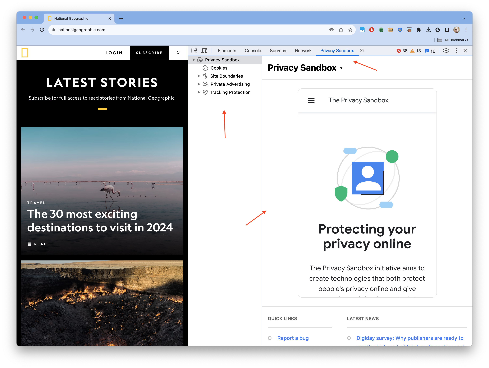
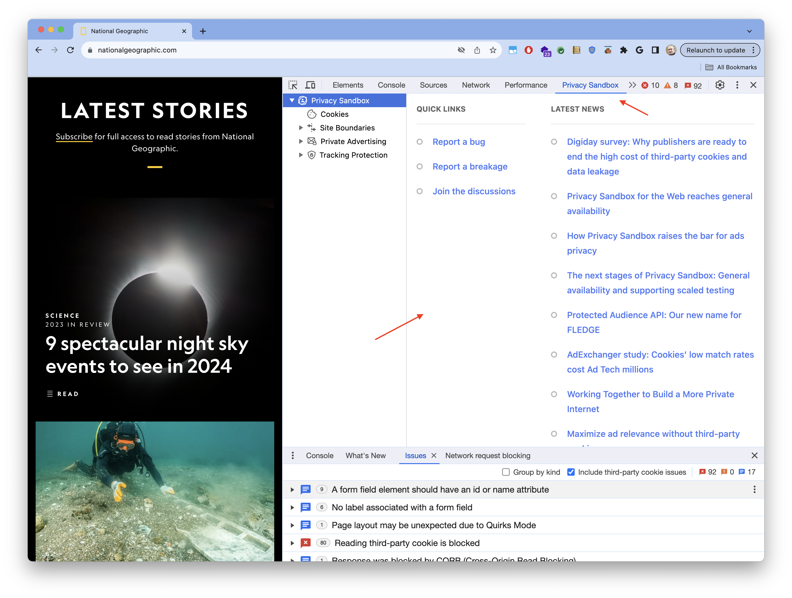

DevTools provides a very large set of powerful capabilities enabling the understanding and debugging of every functional aspect of web development, including cookies and all storage APIs. PSAT expands DevTools with additional features to support tackling the deprecation of unrestricted 3P cookies, and the adoption of new privacy-preserving building blocks (i.e. Chrome APIs).

To access PSAT, access the URL that you want to analyze, open Chrome DevTools, and navigate to the "Private Sandbox" panel.

PSAT features and capabilities aim at supporting developers transition smoothly towards a more private web, by shedding light on cookie usage, and the new building blocks available for implementing privacy-preserving solutions for features and capabilities of websites and apps. PSAT's landing page in DevTools reflects this goal:

On the left there are four sections corresponding to the main technical components of Privacy Sandbox: Cookies, Site Boundaries, Private Advertising, and Tracking Protection. Each of these sections corresponds to a feature area of PSAT, which are being developed progressively.

And on the right, the landing page for the Privacy Sandbox DevTools panel, which provides access to information and insights. Currently it embeds the PrivacySandbox.com website in the top part, and at the bottom it provides links to report bugs and breakages, to join the discussion and support forums, as latest Privacy Sandbox news extracted from Privacy Sandbox site's RSS feed.

