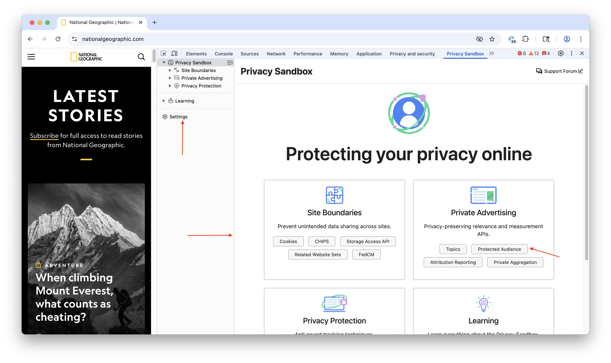
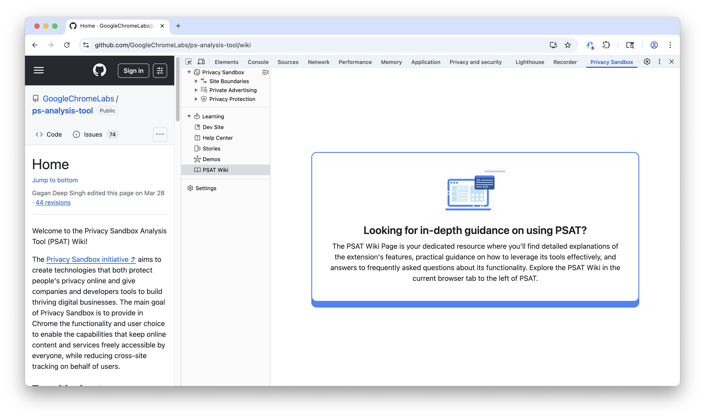
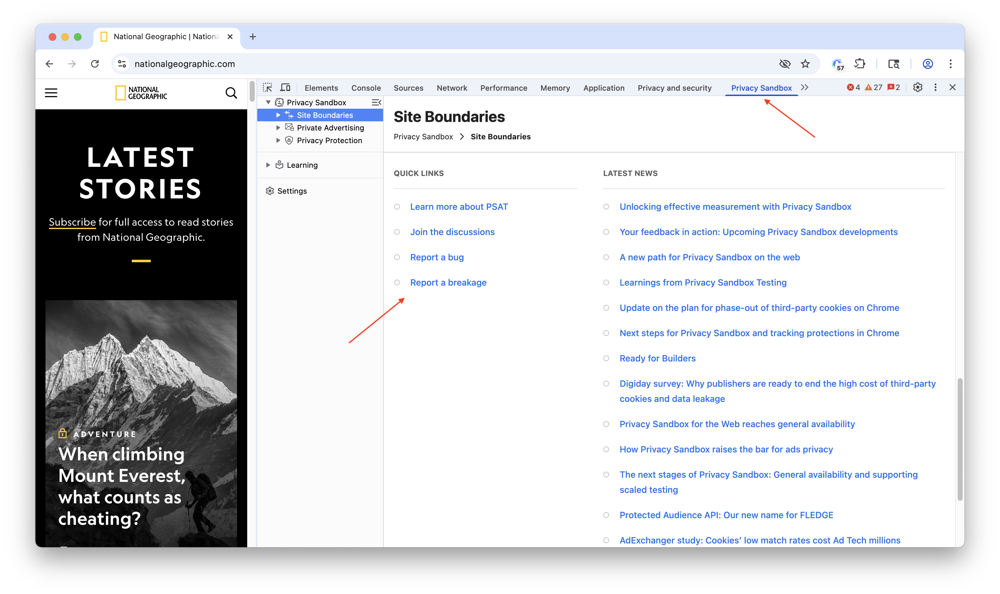
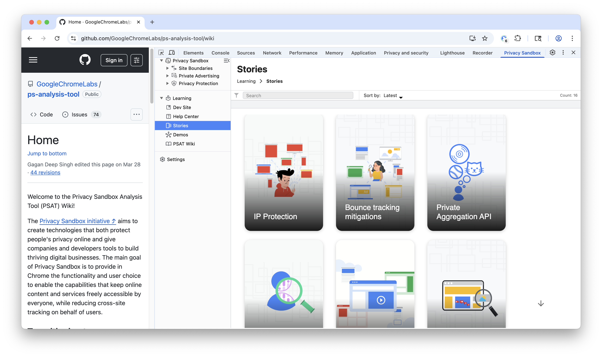

DevTools provides a wide range of capabilities, enabling the analysis and debugging of every functional aspect of web development, including cookies and storage APIs. PSAT complements DevTools with additional features to help the analysis of websites in environments with blocked use of unrestricted third-party cookies, breakage detection in such environments, and adopting new privacy-preserving building blocks (i.e. Chrome APIs).

To access the Privacy Sandbox panel, access the URL you want to analyze, open Chrome DevTools, and navigate to the "Privacy Sandbox" panel.

PSAT features and capabilities support developers in transitioning smoothly towards a more private web by shedding light on cookie usage and the new building blocks available for implementing privacy-preserving solutions for features and capabilities of websites and apps. PSAT's landing page in DevTools reflects this goal:

On the left, we have a collapsible sidebar from which you can access the [settings page](https://github.com/GoogleChromeLabs/ps-analysis-tool/wiki/PSAT-Settings-and-Permissions), Wiki, Dashboard, and four sections corresponding to the main technical components of Privacy Sandbox: Cookies, Site Boundaries, Private Advertising, and Tracking Protection. Each section corresponds to a feature area of PSAT, which is being developed progressively.

After the sidebar, the PSAT landing page provides centralized access to the PSAT Dashboard and its core features. Users can navigate to the dashboard directly from the sidebar or the landing page itself. This page features a comprehensive overview of all sections and their functionalities, alongside valuable resources such as Wiki links, product demos, support forums, and the latest news regarding the Privacy Sandbox initiative.

At the bottom of the individual landing page such as Site Boundaries, Private Advertising, Privacy Protection, it provides links to learn more about Privacy Sandbox, report bugs and breakages, join the discussion and support forums, and request additional time for migration. It also provides links to the latest Privacy Sandbox news extracted from the Privacy Sandbox site's RSS feed.

## Wiki

The Wiki, accessible directly within the PSAT Extension, covers everything you need to know about the extension and the audit process for creating privacy-preserving web applications. You can also view wiki pages from the Wiki menu, which seamlessly integrates into the extension for easy access to documentation.

## Stories

The PSAT Stories section offers interactive narratives showcasing PSAT's capabilities with engaging visualizations. Find concise overviews of the Privacy Sandbox APIs and their implementation. Explore the stories by filtering by category and tag, or by searching by title. Access the full story by clicking on the story.

