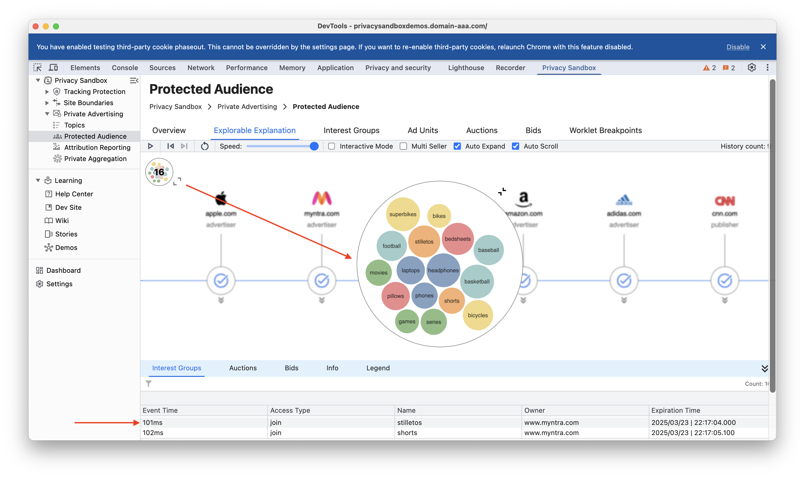

The Protected Audience EE (Explorable Explanations) is a comprehensive tool designed to help users understand the intricacies of online advertising and user data collection. This document provides an in-depth look at the various components and functionalities of the Protected Audience demo, offering insights into how user interests are gathered, processed, and utilized in the context of targeted advertising.

The demo is structured to simulate a user's online journey, showcasing the interactions between different types of websites (nodes) and the dynamic processes involved in ad auctions. By exploring this demo, users can gain a clearer understanding of the mechanisms behind interest-based advertising and the role of various platforms in this ecosystem.

This guide will walk you through the key concepts, user controls, and different modes of the demo, ensuring you have a thorough grasp of how the Protected Audience EE operates and how it can be used to analyze and visualize user data collection and ad targeting processes.

### Understanding key concepts:

- **Nodes**: Each "node" within the visualization represents a distinct website or online platform.

- **Types:**

  - **Advertiser Nodes:** These websites are designed to gather information about user interests. When a user visits an advertiser node, the website collects data about their browsing behavior, such as the pages they view, the content they interact with, and the products they search for. This collected data is then categorized into "interest groups."

  - **Publisher Nodes:** These websites aim to display relevant advertisements to their visitors. To achieve this, they access the "interest groups" previously collected by advertiser nodes. This allows them to tailor the ads shown to each user based on their individual interests.

- **Colored Circles**

  - **Representation:** The colored circles visually depict the “interest groups” associated with each node.

  - **Accumulation:** When a user visits a particular website (node), the interests gathered from that interaction are represented by the colored circles. These circles then “accumulate” in the top-left corner of the visualization, providing a visual representation of the user's growing interest profile.

  - **Significance:** The accumulation of colored circles demonstrates how user interests are gradually built up as they navigate across different websites. This dynamic visualization helps to understand how user data is collected and utilized in the context of targeted advertising.

- **The Footer Panel**
  - **Information Hub:** The footer panel serves as a central hub for detailed information related to the entire process.

  Below are key information sections that can be observed:

  - **Interest Groups:** Displays the specific interests collected from each website visited.

  - **Auctions:** Provides insights into the real-time ad auctions that occur, including details such as:
    - Participating bidders (Demand-Side Platforms - DSPs)
    - Bid amounts
    - Winning bid

   - **Events:** Presents a chronological timeline of all events occurring within the visualization, including website visits, interest collection, and ad auctions.

- **User Controls:**

  - **Speed Control:** Allows users to adjust the speed at which the events unfold in the visualization.

  - **Pause/Play:** Enables users to pause the visualization at any point to examine specific events in more detail.

  - **Filtering:** Provides the ability to filter the displayed information, allowing users to focus on specific events or types of data.

  - **Forward/Backward:** Enables users to step through the visualization one step at a time, either forward or backward.

  - **Mode Switching:**
    - **Automated Mode:** The demo automatically progresses through events, collecting user interest groups at advertiser nodes and conducting auctions at publisher nodes.

    - **Interactive Mode:** Users can manually navigate through nodes. They have greater control over the navigation, allowing them to explore specific nodes or events in more depth.

 - **Auto-expand Demos:** Enables users to view more detailed information about specific events, such as the internal workings of an ad auction.

- **Reset:** Allows users to reset the demo to its initial state, enabling them to start a new exploration or test different scenarios.

### How Protected Audience Demo Works

The Protected Audience demo, by default, operates in auto mode. In this mode:

- **User Interaction:** The demo simulates a user's online journey, represented by a user icon.

- **Interest Collection:** As the user visits advertising websites, the demo simulates the collection of user interests (interest groups) and stores them locally in the user's browser.

- **Publisher Visit:** When the user visits a publisher website with available ad space:

   - **SSP Activation:** The Supply-Side Platform (SSP) on the publisher website accesses the user's stored interest groups.

   - **DSP Interaction:** The SSP connects with various Demand-Side Platforms (DSPs) and shares the user's interests.

   - **Bid Search:** Each DSP searches for relevant advertisers within their network based on the provided user interests.

   - **Ad Auction:** An ad auction takes place where DSPs submit bids for the available ad space.

   - **Ad Display:** The ad from the winning bidder is displayed on the publisher website.

- **Continuous Interest Collection:** The process continues as the user visits more advertising websites, leading to the collection of additional interests and a more refined user profile.

#### Demo Modes

The Protected Audience API can be explored through two distinct modes:

  - **Auto Play:**
    - The demo automatically progresses through a sequence of nodes, representing website visits.

    - On advertiser nodes, user interests are collected and stored.

    - On publisher nodes, an ad auction is conducted based on the collected user interests.

  - **Interactive Mode**
    - Users have greater control over the demo's progression.
    - They can manually navigate through nodes, exploring specific websites and observing how user interests are collected and how ad auctions are triggered.

> [!NOTE]
> The Interset groups, Ad unit, Auction, and bids tabs use the Privacy Sandbox Ads relevance and measurement APIs which need to be enabled from chrome flags, we recommend setting [evaluation environments](https://github.com/GoogleChromeLabs/ps-analysis-tool/wiki/Evaluation-Environment), and using and chrome launcher commands `chrome-pat-ps` to simulate the required environment.
