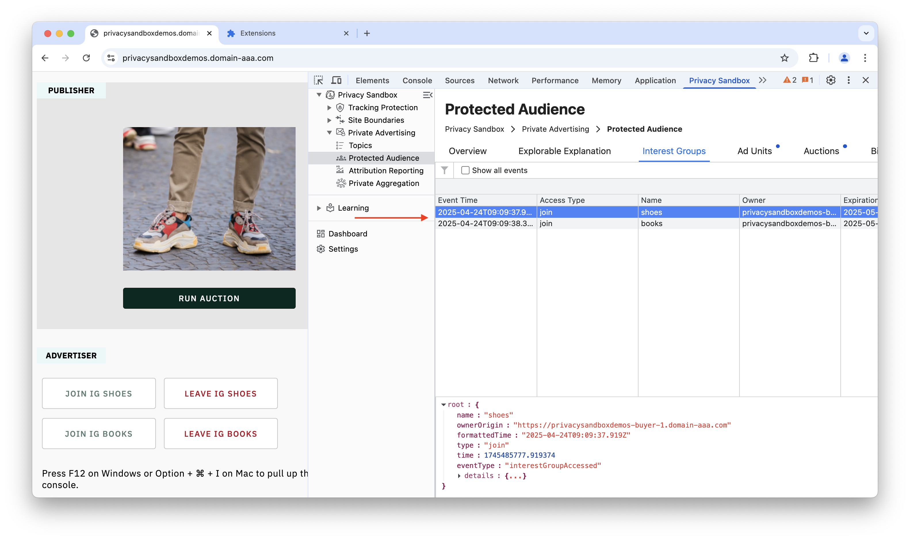
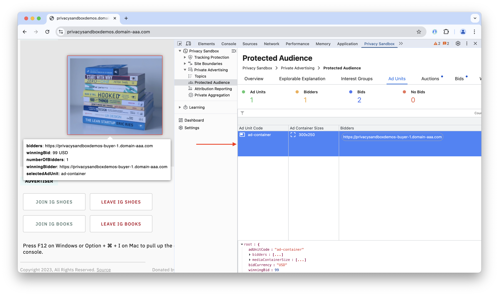
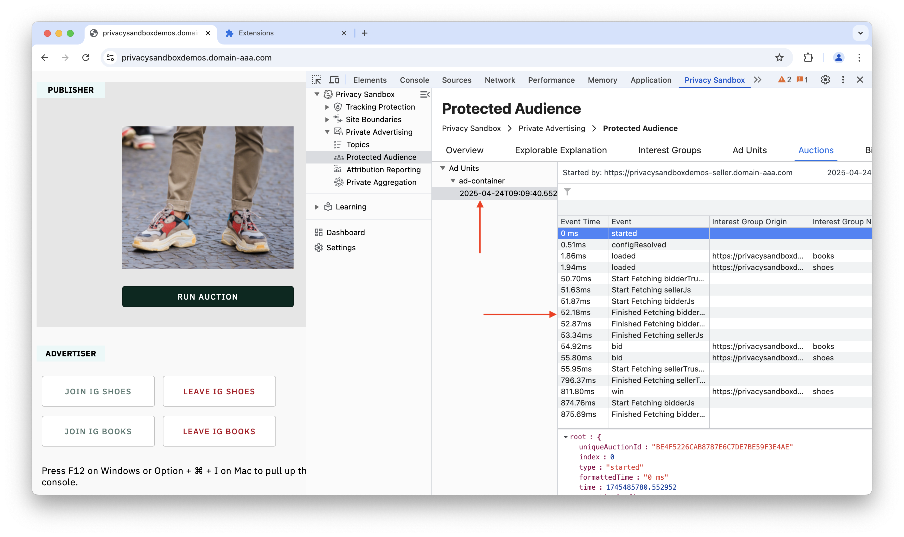
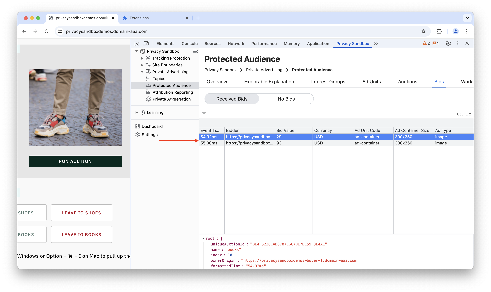

The Protected Audience API is a privacy-preserving technology that allows advertisers to show relevant ads without tracking user behavior across different websites. This approach enhances user privacy by eliminating the need for third-party cookies and preventing cross-site tracking.

The API works by creating "interest groups" based on a user's interactions with a website. These interest groups are stored locally on the user's device, not on a central server. When the user visits a participating site, an on-device ad auction is run within the browser to select a relevant ad based on the stored interest groups. This entire process happens locally, ensuring user data is not shared with third parties.

### Key Features

-   **Interest Groups**: Websites can request the browser to add a user to an interest group, such as "sports enthusiasts," based on their on-site activity.
-   **On-Device Ad Selection**: The ad auction runs directly on the user's device, selecting ads from the stored interest groups without sharing personal data with advertisers.
-   **Enhanced Privacy**: By keeping interest groups on-device and preventing cross-site data sharing, the API provides a strong foundation for user privacy.
-   **User Transparency**: Users can view and manage their interest groups through their browser settings, allowing them to opt out of interest-based advertising.

### Benefits

-   **Enhanced Privacy**: Eliminates third-party cookies and cross-site tracking to protect user privacy.
-   **Relevant Advertising**: Enables advertisers to show targeted ads based on interests without compromising user privacy.
-   **User Control**: Gives users direct control over their interest groups and advertising preferences.

## Interest Groups

An interest group is a collection of users who share a common interest, similar to a remarketing list. Each interest group has an owner, which is typically an advertiser or an ad tech platform. This functionality allows advertisers to target users who have previously shown interest in their products or services without relying on third-party cookies.

When a user performs an action on a website (e.g., views a specific product), the site can ask the browser to add the user to a relevant interest group. The browser stores this information locally. When the user later visits a publisher site that uses the Protected Audience API, this stored information can be used in an on-device auction.

The **Interest Groups** tab in the PSAT extension lists all the interest groups that have been added to your browser as you browse different sites.



This tab provides useful information for each group, including the event time, access type, name, owner, and expiration time. You can also filter the list by any of these categories for easier analysis.

## Ad Units

### Prebid Ad Units

The PSAT extension is an essential tool for publishers and ad operations professionals working with Prebid. It offers a transparent window into the complex world of header bidding, directly in your browser. When you visit a website with Prebid-enabled ads, the **Ad Units** tab populates with a wealth of actionable data.

[SCREENSHOT]

Here, you will instantly see all configured ad unit codes, their sizes, and the active bidders competing for them. For focused analysis, you can filter the view by a specific bidder.

### Protected Audience API Ad Units

The Protected Audience API allows publishers to conduct on-device ad auctions within the user's browser. When a user visits a website with an ad unit configured for the Protected Audience API, the browser runs an auction to determine which ad to display.



This tab displays a list of ad units configured for Protected Audience auctions, showing the ad unit code, container size, and participating bidders. You can click on an ad unit to focus on it and view detailed information in a popup. The list can also be filtered by specific bidders.

## Auctions

### Prebid Auctions

A Prebid auction is a process, managed by the Prebid.js library, that allows a website's ad space to be offered to many advertisers simultaneously in a competitive, real-time marketplace.

[SCREENSHOT]

The **Auctions** tab in the PSAT extension provides a granular, real-time log of the entire Prebid auction lifecycle. You can track every ad unit from initialization to completion, monitoring key events like bid requests and wins. Powerful filtering options also allow you to instantly sort the data by event type, specific bidders, or bid CPM to quickly debug and analyze auction performance.

### Protected Audience API Auctions

A Protected Audience API auction is a process where a publisher makes ad space available for bidding, and advertisers compete to have their ad displayed. This entire process happens within the user's browser to preserve privacy.

The **Auctions** tab provides detailed information for each ad unit and every event, helping users better understand the on-device auction process.



The auction events are listed as the auction progresses, with detailed information including event time, name, interest group origin, bid amount, currency, and component seller. You can also filter the auction events by any of these parameters. When you click a specific ad unit or auction event, you can view the raw JSON data in a footer panel.

## Bids

### Prebid Bids

A bid is a formal offer from an advertiser (a "bidder") to purchase a specific ad impression. These bids are the fundamental currency of the Prebid auction, allowing publishers to offer their inventory to multiple bidders simultaneously to maximize revenue.

[SCREENSHOT]

In the extension's **Bids** tab, you can view detailed information for each bid, including the event time, bidder name, bid value (CPM), currency, ad unit code, and ad size. You can also identify bidders who did not participate in the auction and filter the results for easier analysis.

### Protected Audience API Bids

In the Protected Audience API, bids are how advertisers express interest in showing an ad within a privacy-preserving, on-device auction.



The Bids section is divided into two subsections: Received Bids and No Bids.

-   **Received Bids**: This section lists all successful bids along with information such as event time, bid value, currency, ad unit, and media type. You can filter this list by any of these parameters.
-   **No Bids**: This section lists all bidders who were eligible to bid but did not submit a bid in the auction.

[SCREENSHOT]

---

## Prebid Utilities

Prebid Utilities are the fundamental concepts and tools within the Prebid.js ecosystem that AdOps professionals and developers use to configure, debug, and manage header bidding.

### Config

This refers to the central configuration object in Prebid.js, managed primarily through the `pbjs.setConfig()` function. It controls the overall behavior of the Prebid auction.

#### General Configuration (`pbjs.setConfig`)

This single, powerful function sets a wide range of auction options. Key configurations include:
-   **`priceGranularity`**: Defines the increments of bid prices (e.g., "`0.10 increments"), which is crucial for how bids are passed to the ad server.
-   **`bidderTimeout`**: Sets the maximum time (in milliseconds) Prebid will wait for bidders to respond before closing the auction.
-   **`enableSendAllBids`**: By default, Prebid sends only the winning bid to the ad server. Setting this to `true` sends all bids, which is useful for analytics.
-   **`debug`**: When set to `true`, it enables verbose logging in the browser's console.
-   **`bidderSequence`**: By default, bid requests are sent asynchronously. This setting allows you to specify a `sequential` order, though this is rarely used as it can reduce the benefits of a parallel auction.

*Example:*
```javascript
pbjs.setConfig({
  priceGranularity: "medium",
  bidderTimeout: 700,
  debug: true
});
```

#### Bidder Settings (`pbjs.bidderSettings`)

This object allows you to define rules that apply to all bidders or to a specific bidder, providing a powerful way to customize behavior without changing ad units.

*Example (Adjusting a specific bidder's bids up by 10%):*
```javascript
pbjs.bidderSettings = {
  appnexus: {
    bidCpmAdjustment: function(bidCpm) {
      return bidCpm * 1.1;
    }
  }
};
```

#### User ID & User Sync Configuration

This refers to how User ID modules are configured within `setConfig`. These modules fetch user identifiers from various identity providers (like Unified ID 2.0, ID5, etc.) to improve user matching in a post-cookie world. The `userSync` object within `setConfig` controls how and when Prebid.js synchronizes these user IDs with demand partners.

*Example:*
```javascript
pbjs.setConfig({
  userSync: {
    userIds: [{
      name: "id5Id",
      params: { partner: 1234 },
      storage: {
        type: "cookie",
        name: "id5id.1234",
        expires: 90
      }
    }]
  }
});
```

#### Server-to-Server Configuration (`s2sConfig`)

This object configures Server-to-Server (S2S) header bidding, where the auction runs on an external Prebid Server instead of in the user's browser. This reduces the workload on the client-side. The config includes the server's endpoint URL, a timeout, and a list of S2S bidders.

#### Installed Modules

Prebid.js is modular. You can check which modules (e.g., bidder adapters, user ID modules) are currently installed using `pbjs.getConfig('modules')`. This is useful for debugging to ensure all necessary components are loaded.

### Events

The **Events Log** is a dedicated tab that serves as a diagnostic tool by providing a clean, searchable, and sortable list of all warnings and errors that occur during a Prebid auction. It features a prominent count of total issues for a quick health check and allows users to efficiently find and analyze specific problems to debug the auction process.

### Timeline

The **Timeline** is a diagnostic feature that provides a sequential, visual breakdown of events. For Prebid, this would show the entire auction lifecycle, from request to render. For the Protected Audience API, it visualizes the on-device auction, including script execution and reporting.

### Tools

This tab offers centralized features that give you direct control over the auction on a live webpage. Key features often include:
-   **Shortcut to GAM Console**: Provides a direct link to the associated Google Ad Manager (GAM) console.
-   **Bid CPM Override**: A powerful testing utility that allows you to manually change the CPM value of any bid to simulate a win and test ad server configurations.

### UserID

This refers to the **UserID Module** framework within Prebid, which allows publishers to integrate various identity solutions. In a world without third-party cookies, these modules are critical for fetching user identifiers from providers like Unified ID 2.0, RampID, and ID5, allowing bidders to recognize users and bid more accurately.

### Namespace

In JavaScript, a namespace is a global variable that holds a library's functions and data to avoid conflicts with other scripts. For Prebid.js, the default namespace is **`pbjs`**. All Prebid commands start with this prefix (e.g., `pbjs.addAdUnits`, `pbjs.requestBids`).

### Version

This is the version number of the Prebid.js library running on the page. You can check the version by typing **`pbjs.version`** into the browser console. This is a crucial first step in debugging, as outdated versions can cause many problems.

## Worklet Breakpoints

The **Worklet Breakpoints** tab enables you to set breakpoints directly within the Protected Audience API's worklet code, facilitating deeper debugging of the on-device auction process. You can also use standard event listener breakpoints in DevTools to pause execution after an ad auction event has occurred.

You can set breakpoints for the following events:

-   Bidder Phase Start
-   Bidder Reporting Phase Start
-   Seller Scoring Phase Start
-   Seller Reporting Phase Start

> [!NOTE]
> Currently, the PSAT breakpoints are informational, guiding users on where to set breakpoints manually using Chrome DevTools. They are planned to become fully functional in a future PSAT release.

### References

-   [Google's Privacy Sandbox](https://privacysandbox.com/)
-   [Protected Audience API Documentation](https://developer.chrome.com/docs/privacy-sandbox/protected-audience/)
-   [WebKit's Blog on Privacy-Preserving Advertising](https://webkit.org/blog/12345/privacy-preserving-advertising/)
-   [Mozilla's Privacy-First Advertising Stance](https://www.mozilla.org/en-US/privacy/advertising/)
-   [W3C Privacy Advertising Technology Community Group](https://www.w3.org/groups/wg/paw/)