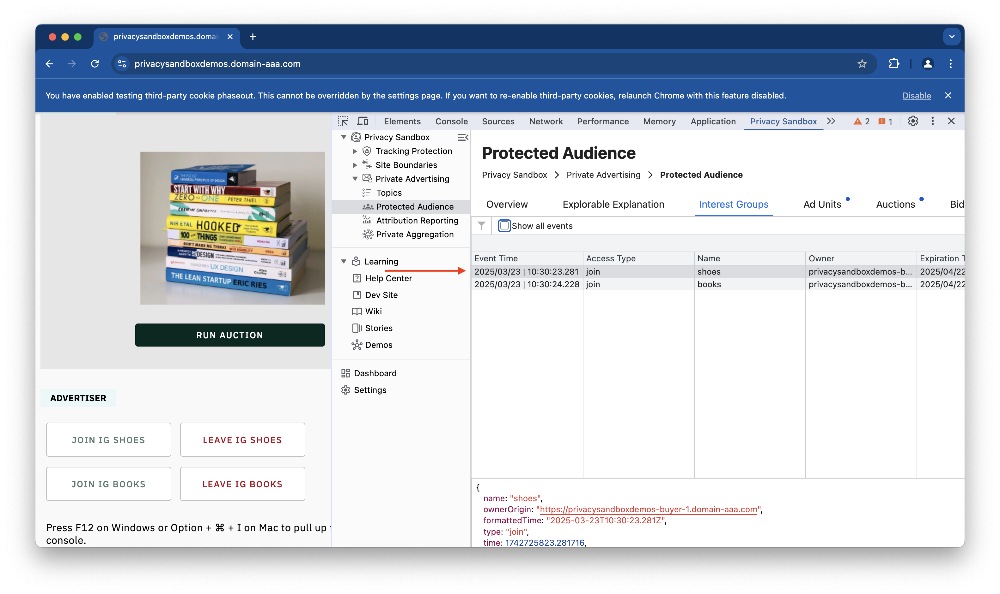
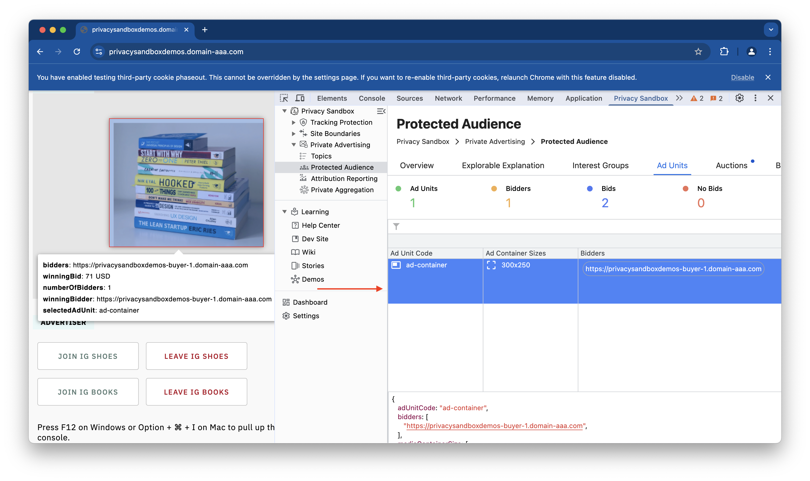
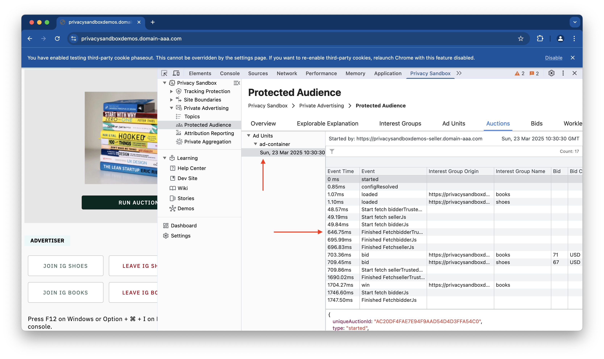
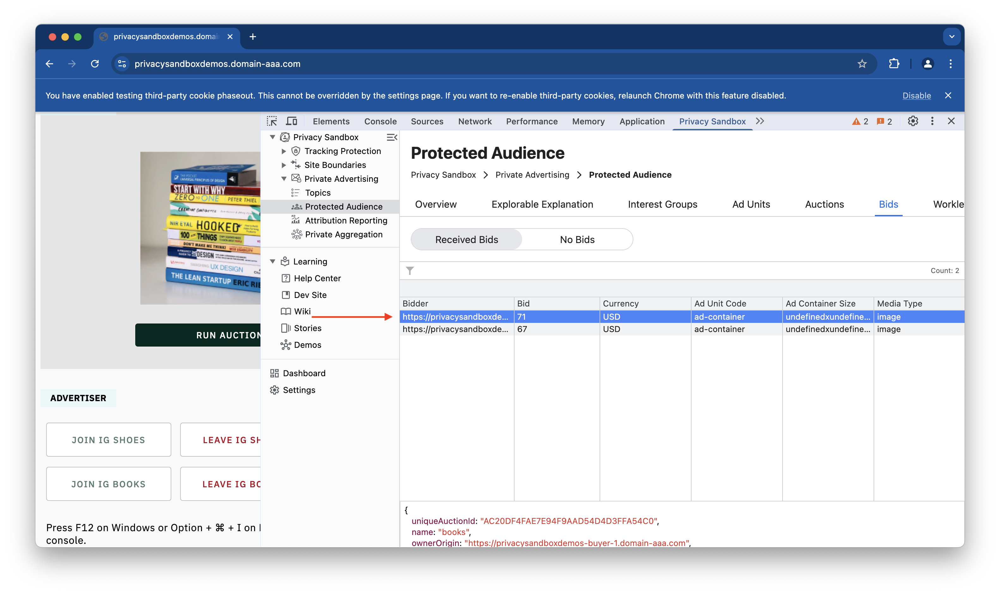

The Protected Audience API is a privacy-preserving technology that allows advertisers to show targeted ads without tracking user behavior across different websites. This approach eliminates the need for third-party cookies and prevents cross-site tracking, enhancing user privacy.

The Protected Audience API works by creating “interest groups” based on user interactions with specific websites or content. These interest groups are stored on the user's device, not on a central server. When a user visits a website that participates in the API, the browser checks for relevant interest groups and selects ads accordingly. This process happens locally, without sharing user data with third parties, thus enhancing privacy.

### Key Features
- **Interest Groups**: Websites can add users to interest groups based on their interactions. For example, if a user frequently visits a sports website, they might be added to a "sports" interest group.

- **Ad Selection**: When a user visits a participating website, the browser selects ads from the interest groups stored on the user's device. This selection is done without sharing user data with advertisers or third parties.

- **Privacy**: The API is designed to protect user privacy by keeping interest groups on the user's device and not sharing personal data with advertisers.

- **Transparency**: Users can view and manage their interest groups through browser settings, allowing them to opt-out of interest-based advertising if they choose.

### Benefits
- **Enhanced Privacy**: By eliminating third-party cookies and cross-site tracking, the Protected Audience API enhances user privacy.

- **Targeted Advertising**: Advertisers can still show relevant ads to users based on their interests without compromising privacy.

- **User Control**: Users have control over their interest groups and can manage their preferences easily.

## Interest Groups

An interest group is a collection of users who share a common interest, similar to a remarketing list, each interest group has an owner, which is typically an advertiser, publisher, or ad tech platform.

Interest groups allow advertisers to target ads to users who have previously shown interest in their products or services, without relying on third-party cookies

When a user visits a website, the website can ask the user's browser to add the user to an interest group. 

The browser stores this information locally on the user's device. When the user visits a website that participates in the Protected Audience API, that stored information can be analyzed by the Interest group tab.

It will list out interest groups as you perform actions on specific elements, for example, if you click on e-commerce site and clicked/searched for a shoe, it will trigger an action that will add an interest group in your browser

The tab shows that list of interest groups along with useful information such as event time, access type, name, owner, and expiration time. You can also filter based on the similar categories.

## Ad Units

The Protected Audience API allows publishers to conduct on-device ad auctions in the user's browser. This means that when a user visits a website with an ad unit that's configured to use the Protected Audience API, the browser will run an auction to determine which ad to display.

The tab shows a list of ad units along with Ad unit Code, container size, bidders, you can also click on ad unit to focus and get detailed information in a popup. We can also filter ad units based on bidders.

## Auctions

An auction is a process where an ad space seller (like a website publisher) makes ad space available for bidding, and advertisers (buyers) compete to have their ad displayed.
This all happens within the user's browser, preserving privacy.

The Auctions tab gives detailed information for each Ad Unit and for every event, so users can understand the auction process better.

The detailed information includes event time, name, interest group origin, interest group name, bid amount, bid currency, and component seller.

The auctions are listed for each cycle and the auction events are listed as the auction make progresses. 

You can also filter the auction process for particular event, interest group owner, group name, bid (amount), bid currency and component seller.

When you click and peculiar Ad Unit or auction event, you can view raw data in JSON format at footer panel. 

## Bids

In the Protected Audience API, bids are a crucial component of the ad auction process. bids in the Protected Audience API are the way advertisers express their interest in showing an ad to a user within a privacy-preserving, on-device auction environment.

The Bids section contains two subsections, Received Bids and No Bids

The first section of Received Bids show list of bidders along with information such as bid, currency, Ad Unit, Ad Container Size, Media Type. You can also filter using the bidder using the same information.

The second section Received Bids show list of bidders along with information of no bid.

## Worklet Breakpoints

The Worklet Breakpoints tab will enable you to set breakpoints directly within the Protected Audience API's worklet code, facilitating debugging and a deeper understanding of the auction process. Additionally, you will be able to use event listener breakpoints (located in the DevTools Sources tab under Event Listener) to pause execution within the event handler code after an ad auction event has occurred.

You will be able to set breakpoints for following events:

- Bidder Phase start
- Bidder Reporting Phase Start
- Seller Scoring Phase Start
- Seller Reporting Phase Start

> [!NOTE]
> These PSAT breakpoints are currently just for informational purposes, guiding users to set them using the DevTools interface. They are planned to become fully functional in future PSAT releases.

### References
- [Google's Privacy Sandbox](https://privacysandbox.com/)
- [Protected Audience API](https://developer.chrome.com/docs/privacy-sandbox/protected-audience/)
- [WebKit's Privacy-Preserving Advertising](https://webkit.org/blog/12345/privacy-preserving-advertising/)
- [Mozilla's Privacy-First Advertising](https://www.mozilla.org/en-US/privacy/advertising/)
- [W3C's Privacy and Advertising Working Group](https://www.w3.org/groups/wg/paw/)