The Protected Audience API is a privacy-preserving technology that allows advertisers to show targeted ads without tracking user behavior across different websites. This approach eliminates the need for third-party cookies and prevents cross-site tracking, enhancing user privacy.

The Protected Audience API works by creating “interest groups” based on user interactions with specific websites or content. These interest groups are stored on the user's device, not on a central server. When a user visits a website that participates in the API, the browser checks for relevant interest groups and selects ads accordingly. This process happens locally, without sharing user data with third parties, thus enhancing privacy.

### Key Features
- **Interest Groups**: Websites can add users to interest groups based on their interactions. For example, if a user frequently visits a sports website, they might be added to a "sports" interest group.

- **Ad Selection**: When a user visits a participating website, the browser selects ads from the interest groups stored on the user's device. This selection is done without sharing user data with advertisers or third parties.

- **Privacy**: The API is designed to protect user privacy by keeping interest groups on the user's device and not sharing personal data with advertisers.

- **Transparency**: Users can view and manage their interest groups through browser settings, allowing them to opt-out of interest-based advertising if they choose.

### Benefits
- **Enhanced Privacy**: By eliminating third-party cookies and cross-site tracking, the Protected Audience API enhances user privacy.

- **Targeted Advertising**: Advertisers can still show relevant ads to users based on their interests without compromising privacy.

- **User Control**: Users have control over their interest groups and can manage their preferences easily.

## Interest Groups

An interest group is a collection of users who share a common interest, similar to a remarketing list, each interest group has an owner, which is typically an advertiser, publisher, or ad tech platform.

Interest groups allow advertisers to target ads to users who have previously shown interest in their products or services, without relying on third-party cookies

When a user visits a website, the website can ask the user's browser to add the user to an interest group. 

The browser stores this information locally on the user's device. When the user visits a website that participates in the Protected Audience API, that stored information can be analyzed by the Interest group tab.

It will list out interest groups as you perform actions on specific elements, for example, if you click on e-commerce site and clicked/searched for a shoe, it will trigger an action that will add an interest group in your browser

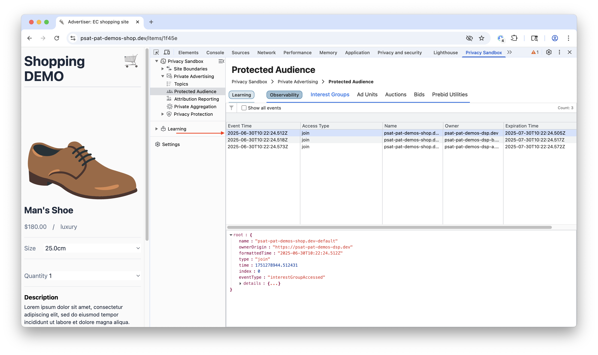

The tab shows that list of interest groups along with useful information such as event time, access type, name, owner, and expiration time. You can also filter based on the similar categories.

## Ad Units

### Prebid

The PSAT extension is an essential tool for publishers and ad operations professionals working with Prebid. It offers a transparent window into the complex world of header bidding, directly in your browser. When you visit a website with Prebid-enabled ads, the **Ad Units** tab populates with a wealth of actionable data.

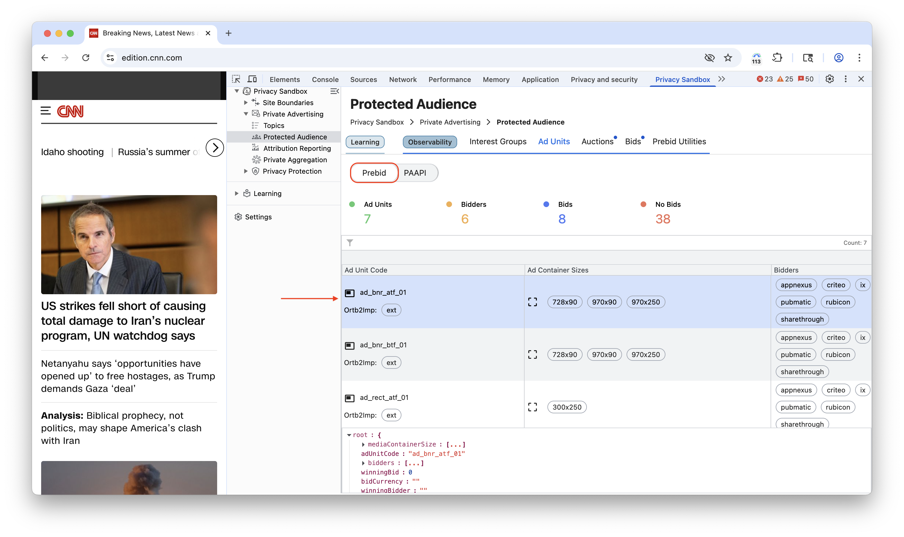

Here, you will instantly see all configured ad unit codes, their sizes, and the active bidders competing for them. For focused analysis, you can filter the view by specific bidders.

### PAAPI

The Protected Audience API allows publishers to conduct on-device ad auctions in the user's browser. This means that when a user visits a website with an ad unit that's configured to use the Protected Audience API, the browser will run an auction to determine which ad to display.

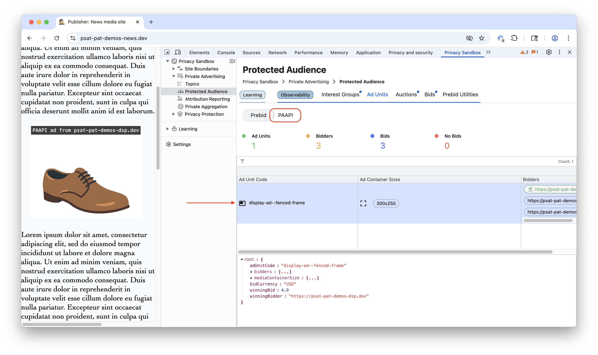

The tab shows a list of ad units along with Ad unit Code, container size, bidders, you can also click on ad unit to focus and get detailed information in a popup. We can also filter ad units based on bidders.

## Auctions

### Prebid

A Prebid auction is a process, managed by the Prebid.js library, that allows a website's ad space to be offered to many advertisers simultaneously in a competitive, real-time marketplace.

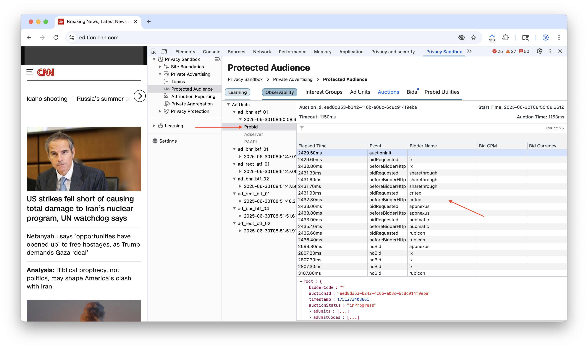

The Auctions->Prebid tab in the PSAT extension provides a granular, real-time log of the entire Prebid auction lifecycle. You can track every ad unit from initialization to completion, monitoring key events like bid requests and wins.

Powerful filtering options also allow you to instantly sort the data by event type, specific bidders, or bid CPM to quickly debug and analyze auction performance.

### PAAPI

An auction is a process where an ad space seller (like a website publisher) makes ad space available for bidding, and advertisers (buyers) compete to have their ad displayed.
This all happens within the user's browser, preserving privacy.

The Auctions tab gives detailed information for each Ad Unit and for every event, so users can understand the auction process better.

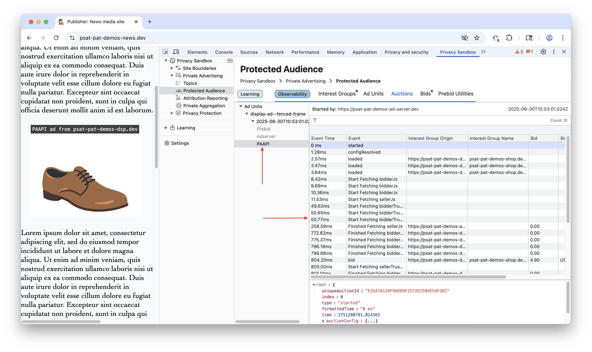

The detailed information includes event time, name, interest group origin, interest group name, bid amount, bid currency, and component seller.

The auctions are listed for each cycle and the auction events are listed as the auction make progresses. 

You can also filter the auction process for particular event, interest group owner, group name, bid (amount), bid currency and component seller.

When you click and peculiar Ad Unit or auction event, you can view raw data in JSON format at footer panel. 

## Bids

### Prebid

A bid is a formal offer from an advertiser (a "bidder") to purchase a specific ad impression. These bids are the fundamental currency of the Prebid auction, allowing publishers to offer their inventory to multiple bidders simultaneously to maximize revenue.

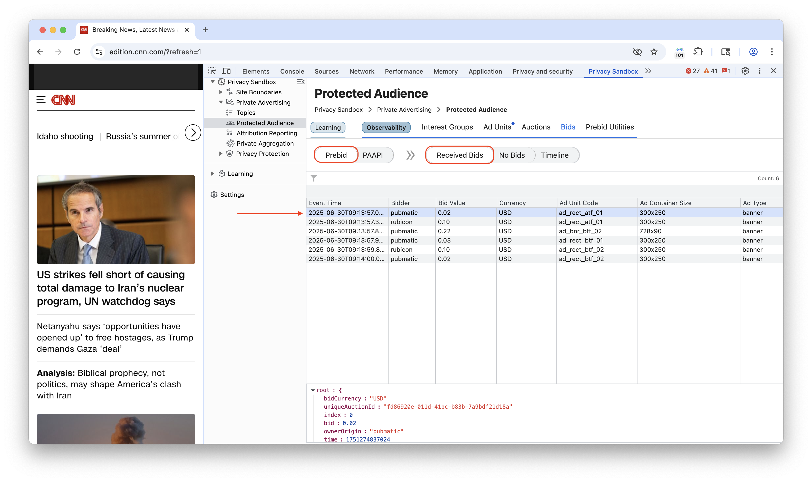

In the extension's Bids->Prebid tab, you can view detailed information for each bid, including the event time, bidder name, bid value (CPM), currency, ad unit code, and ad size.

You can also identify bidders who did not participate in the auction and filter the results for easier analysis.

### PAAPI

In the Protected Audience API, bids are a crucial component of the ad auction process. Bids in the Protected Audience API are the way advertisers express their interest in showing an ad to a user within a privacy-preserving, on-device auction environment.

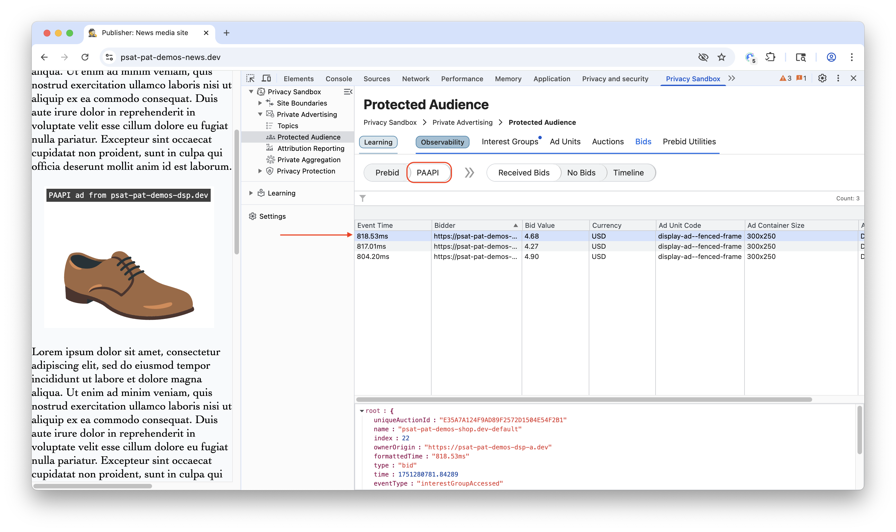

The Bids section contains two subsections, Received Bids and No Bids

The first section of Received Bids show list of bidders along with information such as event time, bid value, currency, Ad Unit, Ad Container Size, Media Type. You can also filter using the bidder using the same information.

The second section, No Bids, shows a list of bidders who did not place a bid.

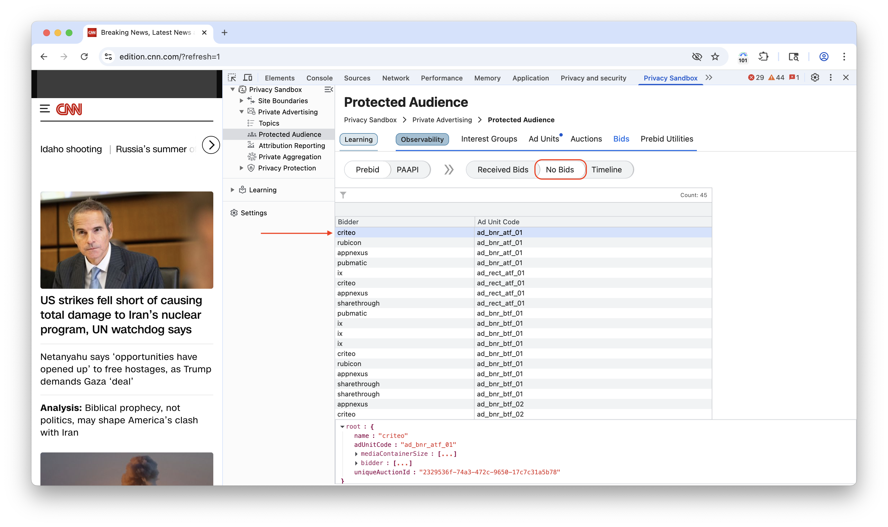

### Timeline

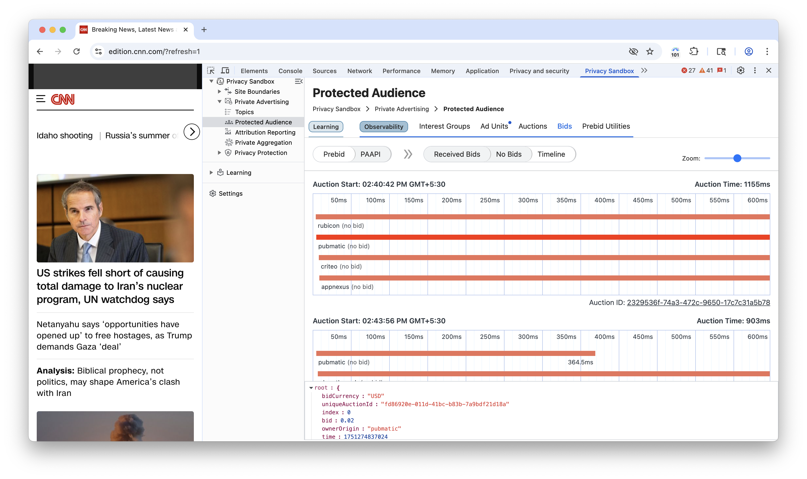

The Timeline is a diagnostic feature that provides a sequential, visual breakdown of events. For Prebid and PAAPI bids, this shows the entire auction lifecycle, from request to render.

## Prebid Utilities

Prebid Utilities are the fundamental concepts and tools within the Prebid.js ecosystem that AdOps professionals and developers use to configure, debug, and manage header bidding.

### Config

This refers to the central configuration object in Prebid.js, managed primarily through the `pbjs.setConfig()` function. It controls the overall behavior of the Prebid auction.

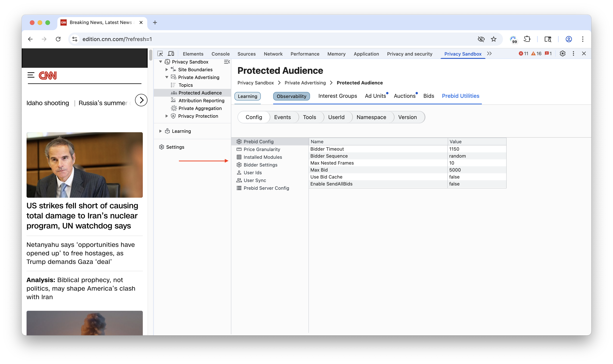

#### General Configuration (`pbjs.setConfig`)

This single, powerful function sets a wide range of auction options. Key configurations include:
-   **`priceGranularity`**: Defines the increments of bid prices (e.g., "0.10 increments"), which is crucial for how bids are passed to the ad server.

-   **`bidderTimeout`**: Sets the maximum time (in milliseconds) Prebid will wait for bidders to respond before closing the auction.

-   **`enableSendAllBids`**: By default, Prebid sends only the winning bid to the ad server. Setting this to `true` sends all bids, which is useful for analytics.

-   **`debug`**: When set to `true`, it enables verbose logging in the browser's console.

-   **`bidderSequence`**: By default, bid requests are sent asynchronously. This setting allows you to specify a `sequential` order, though this is rarely used as it can reduce the benefits of a parallel auction.

#### Bidder Settings (`pbjs.bidderSettings`)

This object allows you to define rules that apply to all bidders or to specific bidders, providing a powerful way to customize behavior without changing ad units.

#### User ID & User Sync Configuration

This refers to how User ID modules are configured within `setConfig`. These modules fetch user identifiers from various identity providers (like Unified ID 2.0, ID5, etc.) to improve user matching in a post-cookie world. The `userSync` object within `setConfig` controls how and when Prebid.js synchronizes these user IDs with demand partners.

#### Server-to-Server Configuration (`s2sConfig`)

This object configures Server-to-Server (S2S) header bidding, where the auction runs on an external Prebid Server instead of in the user's browser. This reduces the workload on the client-side. The config includes the server's endpoint URL, a timeout, and a list of S2S bidders.

#### Installed Modules

Prebid.js is modular. You can check which modules (e.g., bidder adapters, user ID modules) are currently installed using `pbjs.getConfig('modules')`. This is useful for debugging to ensure all necessary components are loaded.

### Events

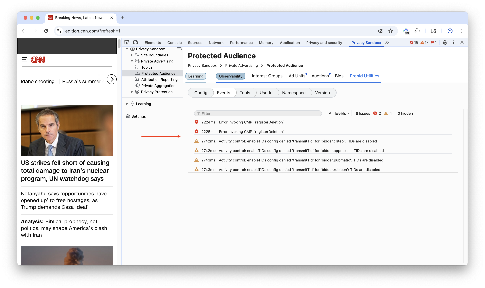

The Events Log is a dedicated tab that serves as a diagnostic tool by providing a clean, searchable, and sortable list of all warnings and errors that occur during a Prebid auction.

It features a prominent count of total issues for a quick health check and allows users to efficiently find and analyze specific problems to debug the auction process.

### Tools

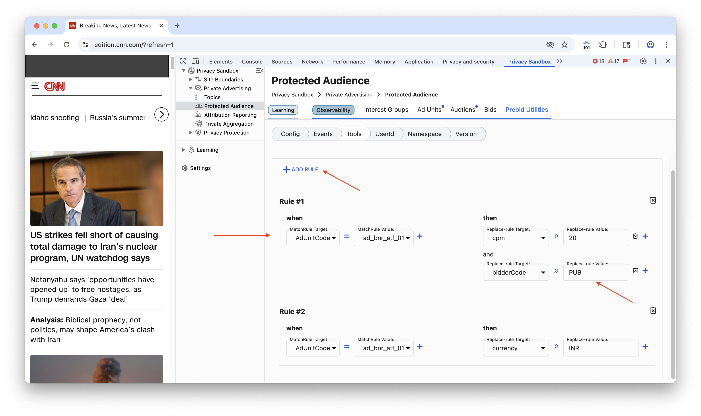

This tab offers centralized features that give you direct control over the auction on a live webpage. Key features often include:

-   **Shortcut to GAM Console**: Provides a direct link to the associated Google Ad Manager (GAM) console.

 -  **Override Tool**: A powerful testing utility that allows you to manually change various attributes of any auction to simulate test scenarios.

### UserID

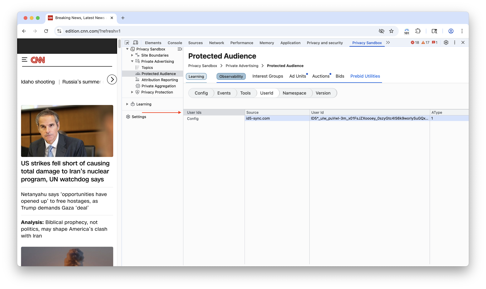

This refers to the UserID Module within Prebid, which allows publishers to integrate various identity solutions.

In a world without third-party cookies, these modules are critical for fetching user identifiers from providers like Unified ID 2.0, RampID, and ID5, allowing bidders to recognize users and bid more accurately.

### Namespace

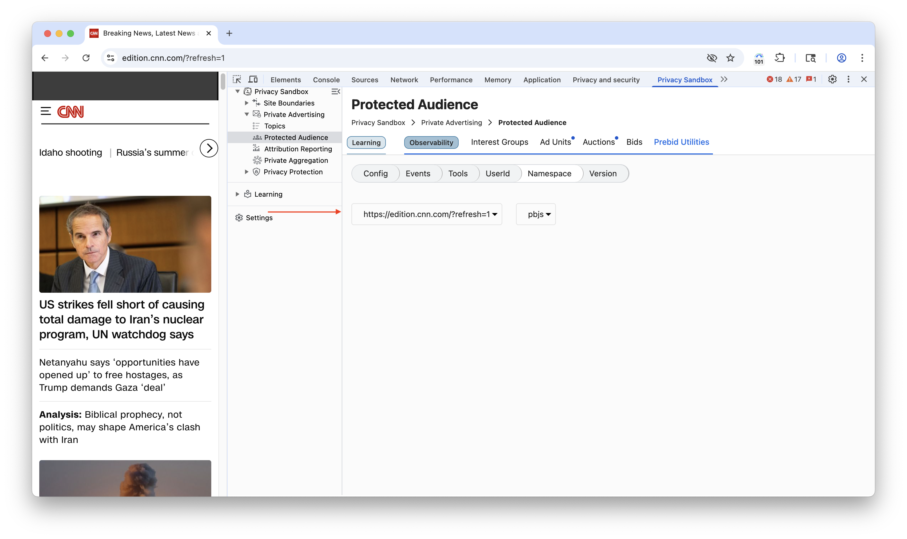

In JavaScript, a namespace is a global variable that holds a library's functions and data to avoid conflicts with other scripts. For Prebid.js, the default namespace is **`pbjs`**.

### Version

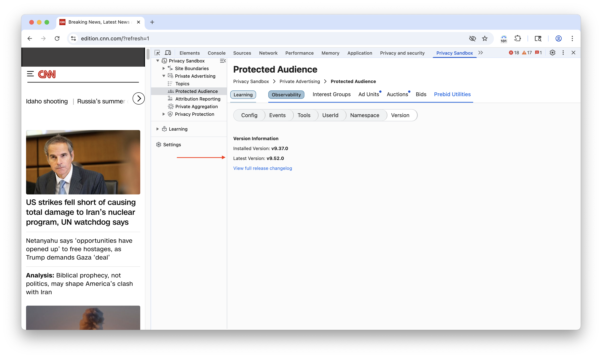

This is the version number of the Prebid.js library running on the page. You can check the version by typing **`pbjs.version`** into the browser console. This is a crucial first step in debugging, as outdated versions can cause many problems.

## Worklet Breakpoints

The Worklet Breakpoints tab will enable you to set breakpoints directly within the Protected Audience API's worklet code, facilitating debugging and a deeper understanding of the auction process. Additionally, you will be able to use event listener breakpoints (located in the DevTools Sources tab under Event Listener) to pause execution within the event handler code after an ad auction event has occurred.

You will be able to set breakpoints for following events:

- Bidder Phase start
- Bidder Reporting Phase Start
- Seller Scoring Phase Start
- Seller Reporting Phase Start

> [!NOTE]
> These PSAT breakpoints are currently just for informational purposes, guiding users to set them using the DevTools interface. They are planned to become fully functional in future PSAT releases.

### References

-   [Google's Privacy Sandbox](https://privacysandbox.com/)
-   [Protected Audience API Documentation](https://developer.chrome.com/docs/privacy-sandbox/protected-audience/)
-   [WebKit's Blog on Privacy-Preserving Advertising](https://webkit.org/blog/12345/privacy-preserving-advertising/)
-   [Mozilla's Privacy-First Advertising Stance](https://www.mozilla.org/en-US/privacy/advertising/)
-   [W3C Privacy Advertising Technology Community Group](https://www.w3.org/groups/wg/paw/)
-   [Prebid.js Documentation](https://docs.prebid.org/prebid/prebidjs.html)
-   [Prebid.js GitHub Repository](https://github.com/prebid/Prebid.js)