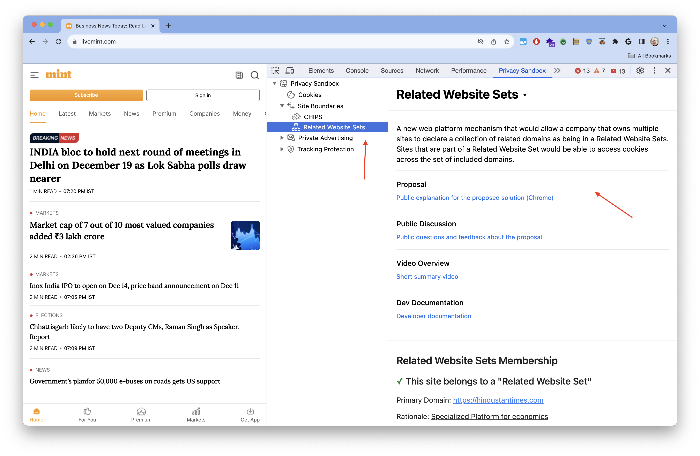
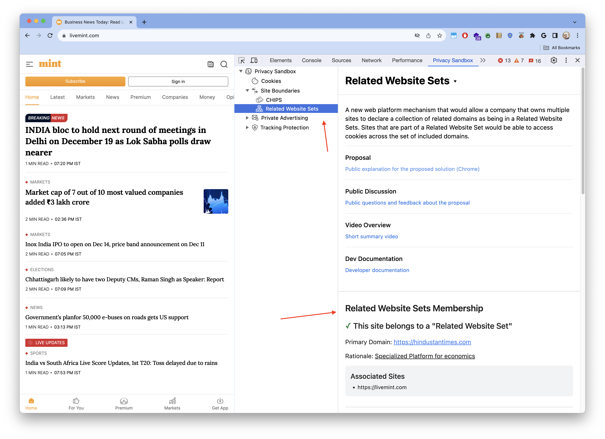
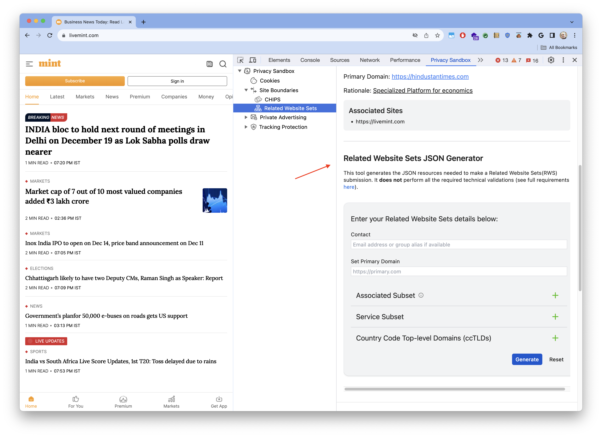

PSAT's Related Website Sets component provides access to information about the API, and guidance on how to generate the JSON resources for registering related websites sets.

The component displays RWS membership information, if the top-level site currently on focus belongs to a registered RWS.

THe component provides a Related Website Sets Generator, to help you create the resources needed for submitting a RWS definition request, as outline in [the documentation](https://github.com/GoogleChrome/related-website-sets/blob/main/RWS-Submission_Guidelines.md).

