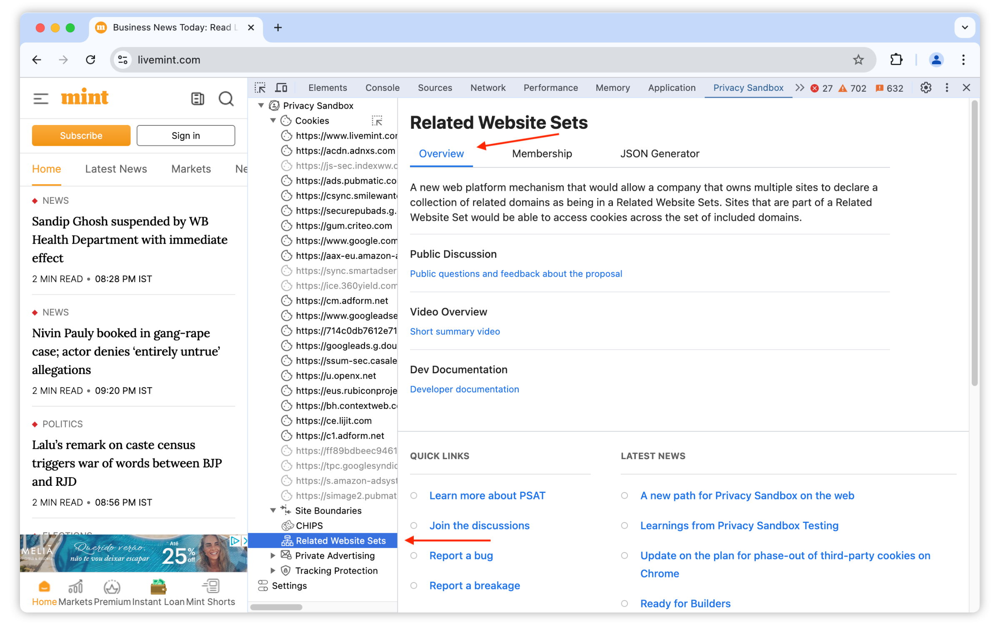
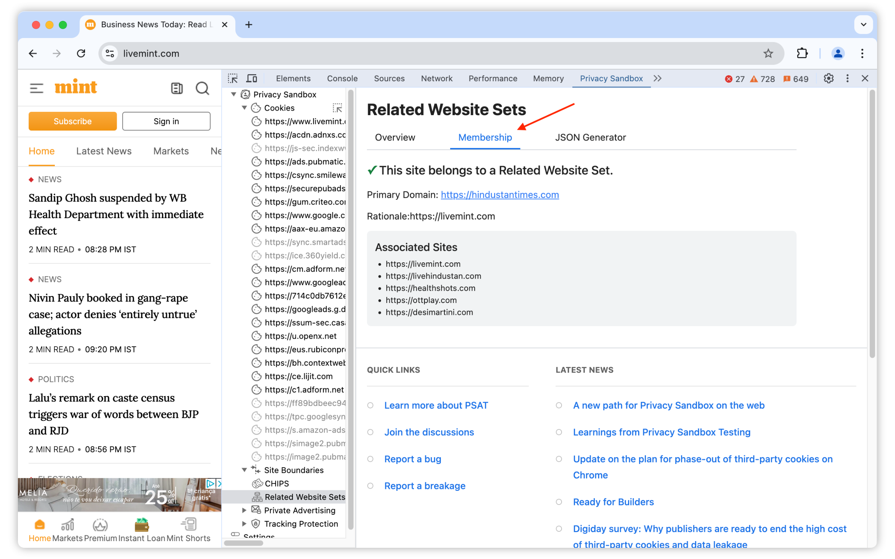
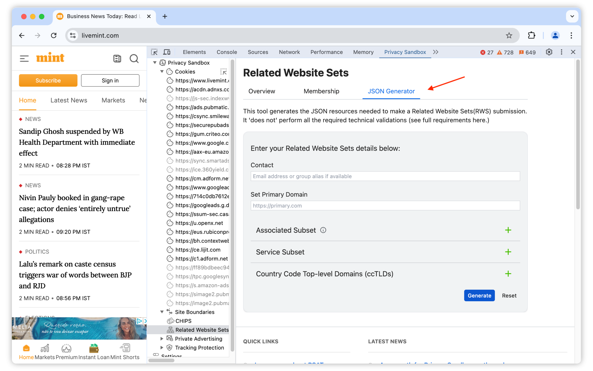
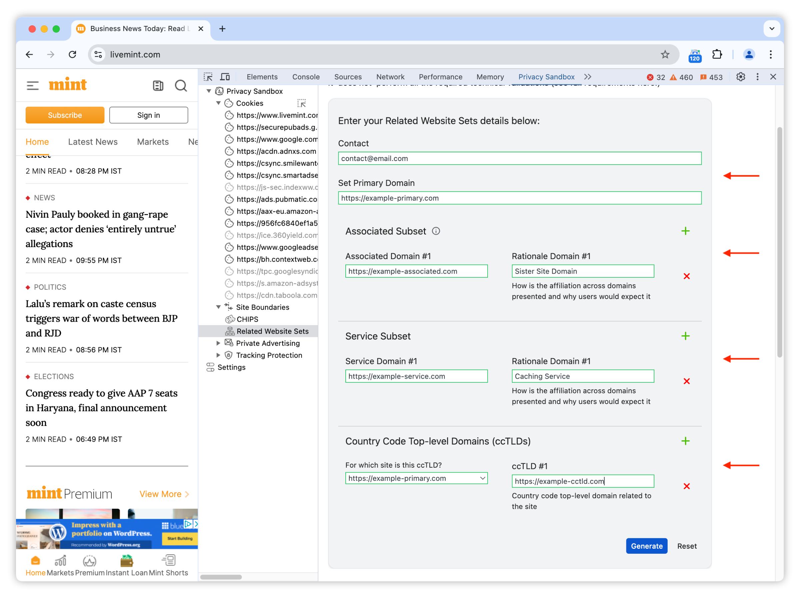
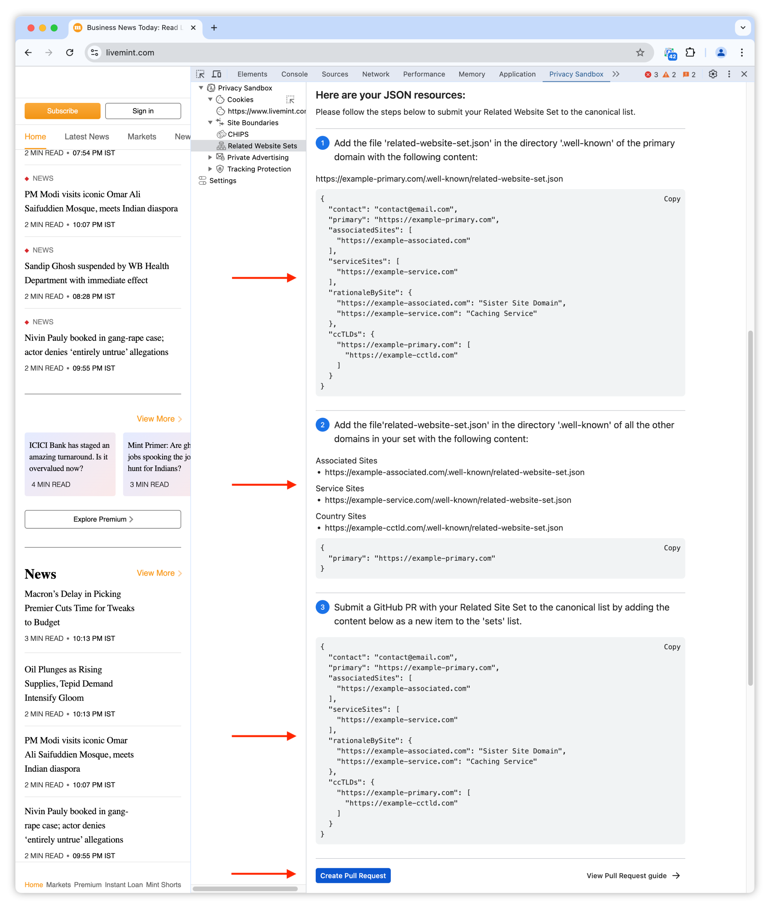

PSAT's Related Website Sets component provides access to information about the API organized by tabs and guidance on generating the JSON resources for registering related website sets.

The second tab on this panel displays RWS membership information, if the top-level site currently on focus belongs to a registered RWS.

The component provides a Related Website Sets Generator, to help you create the resources needed for submitting a RWS definition request, as outlined in [the documentation](https://github.com/GoogleChrome/related-website-sets/blob/main/RWS-Submission_Guidelines.md).

To generate your RWS resources, define your set by providing PSAT with:

1. Your contact information
1. Your primary domain
1. The specific `Associated Subsets` and the rationale for their inclusion.
1. The specific `Service Subsets` and the rationale for their inclusion.
1. The specific `ccTLD Subsets` and the rationale for their inclusion.

and then click on `Generate`.

PSAT generates your JSON resources and displays them for your review. It also provides guidance on submitting your RWS request.

