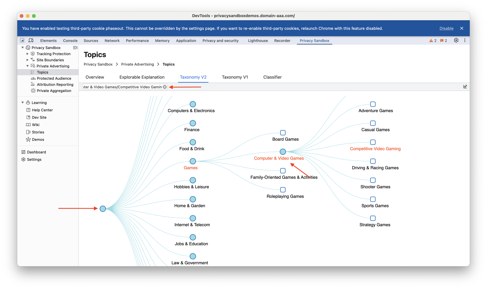

The Topics API is a privacy-preserving alternative to 3rd party cookies for interest-based advertising. It categorizes users into broad interest groups based on their recent browsing history. Websites can then access these topics to show relevant ads with a context without tracking individual users.

### Taxonomy v1 and Taxonomy v2

Taxonomy v1, the first version of the taxonomy used by the Topics API, provides a high-level categorisation of user interests. It's best suited for applications that don't necessitate highly precise targeting and are compatible with older API implementations.

Taxonomy v2 provides more granular category classifications, enabling advertisers to target user interests with greater accuracy. While prioritising user privacy, it leverages newer Topics API implementations to support applications demanding highly targeted advertising.

#### Using Taxonomies Tree

The taxonomy tree for the Topics API offers a hierarchical structure. The top-level categories represent broad topics, such as "Technology," "Arts and Entertainment," or "Health and Fitness." These broad categories are then divided into more specific subcategories. For instance, "Technology" might be divided into "Computer Science," "Mobile Devices," and "Artificial Intelligence."

#### Key Features of the Taxonomy Tree Structure:

- **In-Depth Categorization:**
  - Provides a detailed breakdown of topics.
  - Enables precise targeting of user interests.

- **Searchable Terms:**
  - Allows users to quickly find specific terms within the taxonomy.
  - Facilitates efficient navigation.

- **Expandable Sub-Nodes:**
  - Offers a hierarchical view of categories and subcategories.
  - Enables users to explore topics in more detail.

The Taxonomy Tree offers a comprehensive and intuitive way to understand and navigate the vast array of topics covered by the Topics API.

### Resources
**Proposal**: [Public explanation for the proposed solution (Chrome) &#10548;](https://github.com/patcg-individual-drafts/topics/)

**Public Discussion**: [Public questions and feedback about the proposal &#10548;](https://github.com/patcg-individual-drafts/topics/issues)

**Documentation**: [Developer documentation &#10548;](https://developers.google.com/privacy-sandbox/relevance/topics)
