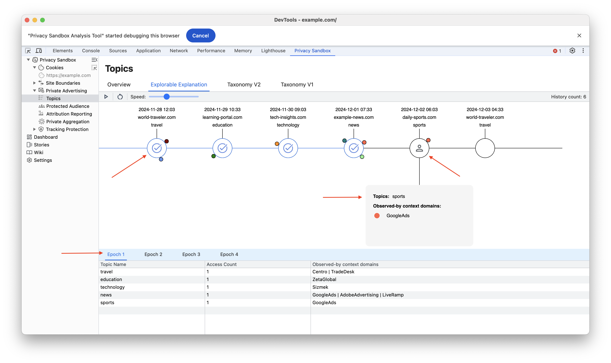
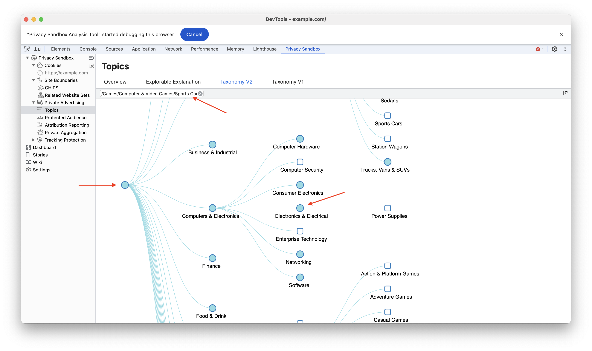

The Topics API is a privacy-preserving alternative to 3rd party cookies for interest-based advertising. It categorizes users into broad interest groups based on their recent browsing history. Websites can then access these topics to show relevant ads with a context without tracking individual users.

**Proposal**: [Public explanation for the proposed solution (Chrome) &#10548;](https://github.com/patcg-individual-drafts/topics/)

**Public Discussion**: [Public questions and feedback about the proposal &#10548;](https://github.com/patcg-individual-drafts/topics/issues)

**Documentation**: [Developer documentation &#10548;](https://developers.google.com/privacy-sandbox/relevance/topics)

### Explorable Explanation: Topics Timeline

The Topics API is a privacy-preserving technology developed by Google as part of its Privacy Sandbox initiative. It aims to replace traditional cookie-based tracking methods, which have raised significant privacy concerns.

The Topics API works by analyzing a user's browsing history and identifying general topics of interest. It then assigns a few of these topics to the user for a week. When the user visits a website, the browser shares one of these assigned topics with the website. This allows the website to show relevant ads without knowing the user's specific browsing history.

#### Taxonomy in Topics API

The Topics API uses a taxonomy, which is essentially a hierarchical classification system, to categorize user interests. This taxonomy consists of a set of predefined topics, such as “Technology,” “Travel,” or “Fitness.”

#### Understanding Topic Assignment in the Explorable Explanations

The Exploreable Explanations provide a visual representation of how the Topics API assigns topics to users based on their browsing behavior.

##### Key Concepts:

- **Epoch:** An epoch represents a specific time period, typically a week. During each epoch, a user is assigned a limited number of topics.
- **Node:** Each node in the visualization represents a website.
- **Colored Circles:** The colored circles attached to a node indicate the topics that are assigned to the user when they visit that particular website during a specific epoch.

#### How Topic Assignment Works:

- **Topic Generation:**

  - The browser periodically analyzes the user's recent browsing history.

  - It identifies general topics or interests based on the visited websites.

  - These topics are categorized into predefined categories like “Fitness,” “Technology,” or “Travel.”

- **Topic Assignment:**

  - A limited number of topics are assigned to the user for a specific epoch.

  - This information is stored locally on the user's device.

- **Topic Sharing with Websites:**

  - When the user visits a website, the browser randomly selects one of the assigned topics for that epoch.

  - The selected topic is shared with the website.

### Visualizing the Process:

The visualization in the Exploreable Explanations helps to understand this process:

- **Node Colors:** The color of a node indicates the topic assigned to the user during a specific epoch.

- **Multiple Colors:** If a node has multiple colors, it means that the user has been assigned to different topics during different epochs, depending on their browsing behavior.

- **Topic Selection:** When the user visits a website, the browser randomly selects one of the colored circles attached to the node. The color of the selected circle represents the topic that is shared with the website.

### Taxonomy v1 and Taxonomy v2

Taxonomies v1, the first version of the taxonomy used by the Topics API, provides a high-level categorization of user interests. It's best suited for applications that don't necessitate highly precise targeting and are compatible with older API implementations.

Taxonomies v2 provides more granular category classifications, enabling advertisers to target user interests with greater accuracy. While prioritizing user privacy, it leverages newer Topics API implementations to support applications demanding highly targeted advertising.

#### Using Taxonomies Tree

The taxonomy tree for Topics API offers a hierarchical structure. The top-level categories represent broad topics, such as “Technology,” “Arts and Entertainment,” or “Health and Fitness.” These broad categories are then divided into more specific subcategories. For instance, “Technology” might be divided into “Computer Science,” “Mobile Devices,” and “Artificial Intelligence.”

#### Key Features of the Taxonomy Tree Structure:

- **In-Depth Categorization:**
  - Provides a detailed breakdown of topics.
  - Enables precise targeting of user interests.

- **Searchable Terms:**
  - Allows users to quickly find specific terms within the taxonomy.
  - Facilitates efficient navigation.

- **Expandable Sub-Nodes:**
  - Offers a hierarchical view of categories and subcategories.
  - Enables users to explore topics in more detail.

Taxonomy Tree offer a comprehensive and intuitive way to understand and navigate the vast array of topics covered by the Topics API
